Method | IL size | # BBs | # Samples | Raw overlap | Smoothed overlap | Instrumented graph | Smoothed graph
--- | --- | --- | --- | --- | --- | --- | ---
Benchstone.BenchF.Whetsto.Test | 1188 | 40 | 193 | 46.57% | 49.11% | 

Expand

 | 

Expand
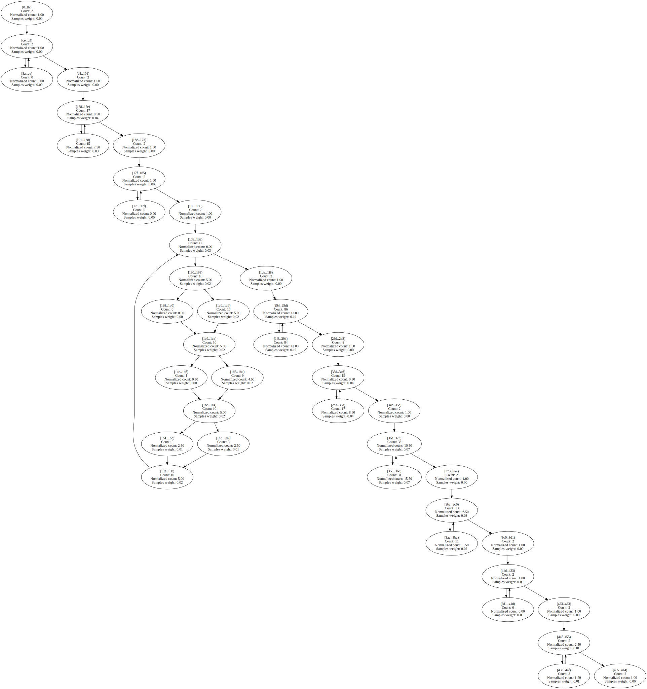

Benchstone.BenchF.LLoops.Main1 | 4385 | 111 | 272 | 49.11% | 50.33% | 

Expand

 | 

Expand

BenchmarksGame.KNucleotide_9.check | 61 | 5 | 196 | 64.33% | 59.35% | 

Expand

 | 

Expand

System.Text.RegularExpressions.RegexInterpreter.MatchString | 190 | 20 | 52 | 36.23% | 60.84% | 

Expand

 | 

Expand

Benchstone.BenchI.NDhrystone.Proc0 | 295 | 12 | 95 | 42.71% | 62.96% | 

Expand

 | 

Expand

AssignRect.second_assignments | 389 | 65 | 362 | 77.69% | 69.34% | 

Expand

 | 

Expand

Benchstone.BenchI.TreeSort.Insert | 86 | 9 | 531 | 51.08% | 69.39% | 

Expand

 | 

Expand

NumericSortJagged.NumHeapSort | 57 | 7 | 132 | 39.39% | 71.15% | 

Expand

 | 

Expand

EMFloat.DivideInternalFPF | 631 | 37 | 568 | 61.49% | 71.18% | 

Expand

 | 

Expand

Benchstone.BenchF.Romber.Test | 666 | 35 | 233 | 43.49% | 71.36% | 

Expand

 | 

Expand

BenchmarksGame.ReverseComplement_6.Reverse | 370 | 28 | 56 | 44.37% | 72.84% | 

Expand

 | 

Expand

BenchmarksGame.Fasta_2.SelectRandom | 62 | 6 | 332 | 61.13% | 73.16% | 

Expand

 | 

Expand

Benchstone.BenchI.Permutate.PermuteArray | 75 | 5 | 391 | 69.24% | 73.33% | 

Expand

 | 

Expand

BenchmarksGame.FannkuchRedux_9.CountFlips | 100 | 7 | 9786 | 60.73% | 73.37% | 

Expand

 | 

Expand

BenchmarksGame.NBodySystem.Advance | 370 | 7 | 1163 | 44.22% | 73.62% | 

Expand

 | 

Expand

SeekUnroll.FindByte | 70 | 5 | 33738 | 63.73% | 73.87% | 

Expand

 | 

Expand

Benchstone.BenchI.NDhrystone.Proc8 | 77 | 4 | 96 | 48.36% | 74.03% | 

Expand

 | 

Expand

EMFloatClass.DivideInternalFPF | 633 | 37 | 103 | 64.31% | 74.15% | 

Expand

 | 

Expand

AssignJagged.first_assignments | 421 | 65 | 1550 | 54.83% | 74.24% | 

Expand

 | 

Expand

SciMark2.Random.nextDouble | 161 | 11 | 846 | 53.58% | 74.41% | 

Expand

 | 

Expand

Benchstone.BenchF.NewtE.Test | 586 | 19 | 163 | 24.14% | 74.81% | 

Expand

 | 

Expand

LUDecomp.lubksb | 146 | 18 | 73 | 57.50% | 75.09% | 

Expand

 | 

Expand

BenchmarksGame.TreeNode.CountNodes | 46 | 3 | 196 | 45.70% | 75.44% | 

Expand

 | 

Expand

BenchmarksGame.MandelBrot_7.GetByte | 224 | 10 | 8925 | 37.27% | 75.54% | 

Expand

 | 

Expand

Benchstone.BenchF.FFT.FastFourierT | 254 | 15 | 190 | 48.33% | 75.55% | 

Expand

 | 

Expand

Benchmarks.SIMD.RayTracer.Sphere.Intersect | 148 | 9 | 50 | 50.53% | 75.67% | 

Expand

 | 

Expand
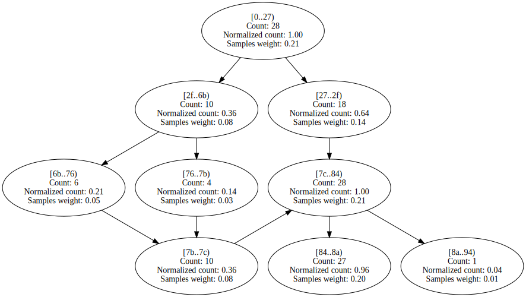

BenchmarksGame.Fasta_1.SelectRandom | 62 | 6 | 266 | 54.65% | 75.95% | 

Expand

 | 

Expand

System.Text.RegularExpressions.RegexInterpreter.Go | 3653 | 181 | 131 | 67.40% | 76.12% | 

Expand

 | 

Expand

Benchstone.BenchF.Whetsto.PA | 108 | 3 | 108 | 75.00% | 78.51% | 

Expand

 | 

Expand
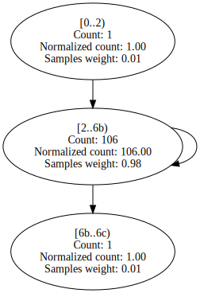

SciMark2.FFT.bitreverse | 115 | 8 | 280 | 50.10% | 79.11% | 

Expand

 | 

Expand

NumericSortRect.NumHeapSort | 79 | 7 | 50 | 57.33% | 79.17% | 

Expand

 | 

Expand

AssignJagged.second_assignments | 376 | 65 | 596 | 62.39% | 79.87% | 

Expand

 | 

Expand

Benchstone.BenchF.Regula.Inner | 301 | 21 | 390 | 42.64% | 79.98% | 

Expand

 | 

Expand

AssignRect.first_assignments | 478 | 65 | 671 | 85.55% | 80.68% | 

Expand

 | 

Expand

Benchstone.BenchI.QuickSort.Test | 91 | 11 | 69 | 64.32% | 80.82% | 

Expand

 | 

Expand

BenchmarksGame.KNucleotide_9.checkEnding | 79 | 8 | 444 | 81.77% | 80.94% | 

Expand
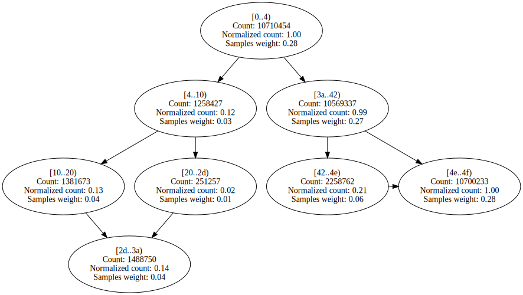
 | 

Expand

SciMark2.MonteCarlo.integrate | 77 | 6 | 288 | 49.33% | 81.58% | 

Expand

 | 

Expand

EMFloatClass.Sub16Bits | 38 | 4 | 66 | 42.42% | 82.48% | 

Expand

 | 

Expand

BenchmarksGame.TreeNode.CreateTree | 36 | 3 | 140 | 72.03% | 82.81% | 

Expand

 | 

Expand

SciMark2.FFT.transform_internal | 450 | 17 | 2388 | 41.38% | 82.86% | 

Expand

 | 

Expand

Benchstone.BenchI.Fib.Fibonacci | 24 | 3 | 622 | 69.21% | 83.29% | 

Expand

 | 

Expand

BenchmarksGame.FannkuchRedux_9.NextPermutation | 95 | 7 | 1796 | 65.99% | 83.73% | 

Expand

 | 

Expand

EMFloat.Sub16Bits | 38 | 4 | 386 | 55.61% | 84.01% | 

Expand

 | 

Expand

BenchmarksGame.FannkuchRedux_2.fannkuch | 366 | 28 | 992 | 67.04% | 84.06% | 

Expand

 | 

Expand

BenchmarksGame.FannkuchRedux_5.countFlips | 100 | 14 | 4987 | 51.89% | 84.46% | 

Expand

 | 

Expand

Benchstone.BenchI.QuickSort.Quick | 103 | 16 | 495 | 71.37% | 84.51% | 

Expand

 | 

Expand

Benchstone.BenchF.LLoops.Init | 598 | 46 | 1100 | 54.44% | 84.75% | 

Expand

 | 

Expand

Benchstone.BenchI.Puzzle.Trial | 101 | 10 | 65 | 52.73% | 84.92% | 

Expand

 | 

Expand

EMFloatClass.Add16Bits | 38 | 4 | 95 | 52.28% | 85.26% | 

Expand

 | 

Expand

Neural.do_mid_forward | 107 | 7 | 81 | 63.22% | 85.79% | 

Expand

 | 

Expand

NeuralJagged.adjust_out_wts | 115 | 7 | 121 | 44.84% | 85.99% | 

Expand

 | 

Expand

Benchstone.BenchI.Midpoint.Inner | 60 | 12 | 351 | 85.00% | 86.52% | 

Expand

 | 

Expand
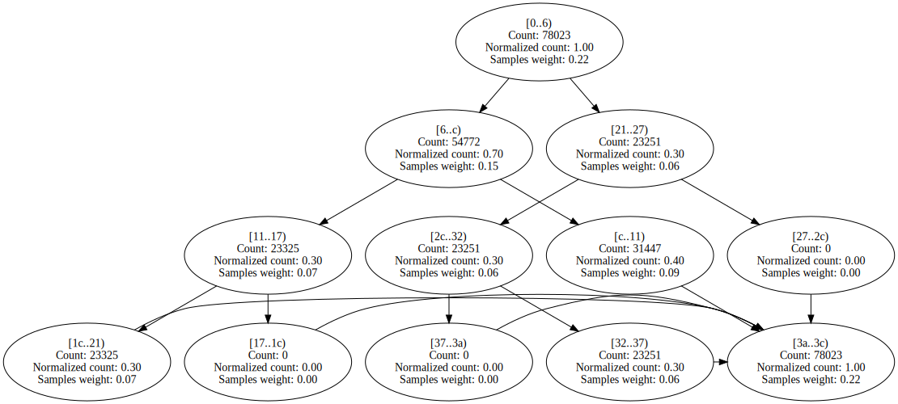

EMFloat.Add16Bits | 38 | 4 | 531 | 60.64% | 86.71% | 

Expand

 | 

Expand

BenchmarksGame.KNucleotide_9.loadThreeData | 463 | 21 | 54 | 61.11% | 87.50% | 

Expand

 | 

Expand

Benchstone.BenchF.DMath.Power | 43 | 4 | 943 | 88.94% | 87.52% | 

Expand

 | 

Expand

Benchstone.BenchI.Array2.Bench | 107 | 13 | 2463 | 48.72% | 87.71% | 

Expand

 | 

Expand

Neural.adjust_out_wts | 116 | 7 | 67 | 47.34% | 87.76% | 

Expand

 | 

Expand

EMFloat.ShiftMantLeft1 | 47 | 6 | 2481 | 60.25% | 87.98% | 

Expand

 | 

Expand

StringSort.strsift | 75 | 9 | 593 | 72.28% | 88.01% | 

Expand

 | 

Expand

EMFloatClass.ShiftMantLeft1 | 47 | 6 | 525 | 59.23% | 88.04% | 

Expand

 | 

Expand

Benchstone.BenchF.Adams.Bench | 419 | 7 | 79 | 47.09% | 88.09% | 

Expand

 | 

Expand

EMFloat.ShiftMantRight1 | 47 | 6 | 2045 | 61.03% | 88.15% | 

Expand

 | 

Expand

IDEAEncryption.mul | 47 | 8 | 1844 | 52.70% | 88.29% | 

Expand

 | 

Expand

Benchstone.BenchI.BubbleSort.SortArray | 48 | 7 | 805 | 58.51% | 88.44% | 

Expand

 | 

Expand

Benchstone.BenchI.HeapSort.Inner | 123 | 17 | 900 | 66.76% | 88.54% | 

Expand

 | 

Expand

Benchstone.BenchI.CSieve.Test | 120 | 15 | 989 | 58.80% | 88.63% | 

Expand

 | 

Expand

SciMark2.SparseCompRow.matmult | 87 | 10 | 1868 | 57.02% | 88.80% | 

Expand

 | 

Expand

Benchstone.BenchI.BubbleSort2.Inner | 57 | 9 | 1062 | 67.65% | 88.88% | 

Expand

 | 

Expand

BenchmarksGame.ReverseComplement_1.Reverse | 208 | 22 | 630 | 58.09% | 89.12% | 

Expand

 | 

Expand
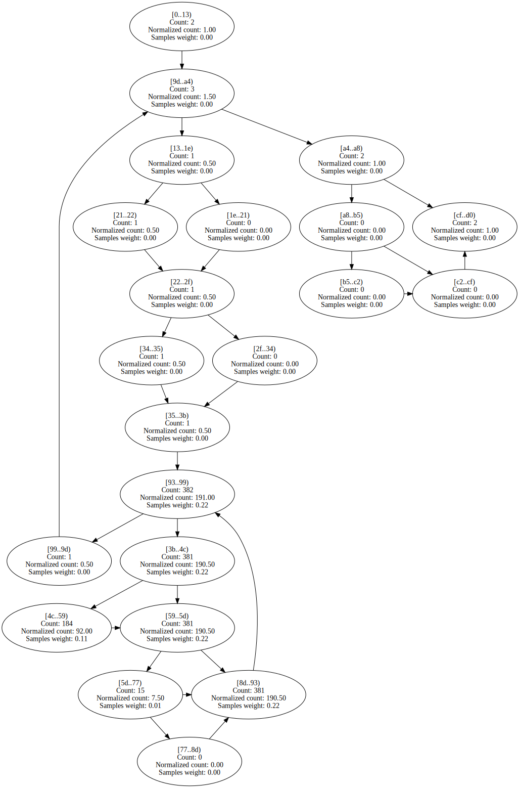

Benchstone.BenchI.Puzzle.Place | 104 | 11 | 154 | 65.92% | 89.37% | 

Expand

 | 

Expand

LUDecomp.DoLUIteration | 144 | 16 | 88 | 55.67% | 89.39% | 

Expand

 | 

Expand

Benchstone.BenchI.LogicArray.Inner | 130 | 17 | 1498 | 86.49% | 89.50% | 

Expand

 | 

Expand

Benchstone.BenchI.AddArray.Test | 231 | 7 | 333 | 54.49% | 89.63% | 

Expand

 | 

Expand

EMFloatClass.ShiftMantRight1 | 47 | 6 | 428 | 62.06% | 89.84% | 

Expand

 | 

Expand

Benchstone.BenchF.Bisect.Inner | 122 | 10 | 778 | 62.92% | 89.84% | 

Expand

 | 

Expand

Benchstone.BenchI.Array1.Test | 95 | 9 | 57 | 72.62% | 90.33% | 

Expand

 | 

Expand

Benchstone.BenchI.Array1.Quick | 89 | 8 | 732 | 86.74% | 90.35% | 

Expand

 | 

Expand

BenchmarksGame.FannkuchRedux_5.nextPermutation | 81 | 7 | 961 | 67.37% | 90.55% | 

Expand

 | 

Expand

BenchmarksGame.FannkuchRedux_9.Copy | 63 | 7 | 1083 | 57.39% | 90.87% | 

Expand

 | 

Expand
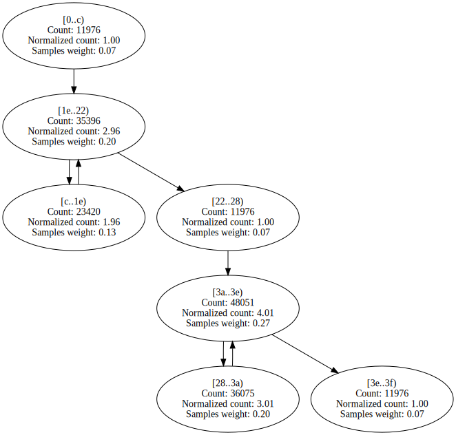

Benchstone.BenchI.EightQueens.TryMe | 127 | 11 | 315 | 70.63% | 90.93% | 

Expand

 | 

Expand

EMFloatClass.MultiplyInternalFPF | 592 | 33 | 100 | 57.64% | 91.22% | 

Expand

 | 

Expand

Benchstone.BenchF.DMath.Bench | 215 | 9 | 604 | 82.69% | 91.74% | 

Expand

 | 

Expand

BenchmarksGame.ByteString.Equals | 69 | 8 | 170 | 65.64% | 91.77% | 

Expand

 | 

Expand

Benchstone.BenchF.DMath.Fact | 43 | 4 | 914 | 72.36% | 92.13% | 

Expand

 | 

Expand
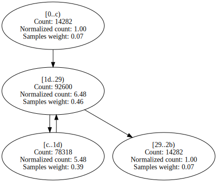

Benchstone.BenchF.Secant.Inner | 105 | 9 | 184 | 47.03% | 92.34% | 

Expand

 | 

Expand

EMFloat.MultiplyInternalFPF | 584 | 33 | 472 | 60.68% | 93.07% | 

Expand

 | 

Expand

LUDecomp.ludcmp | 481 | 42 | 3087 | 56.06% | 93.12% | 

Expand

 | 

Expand

BenchmarksGame.ByteString.GetHashCode | 132 | 10 | 111 | 61.05% | 93.19% | 

Expand

 | 

Expand

Benchstone.BenchI.MulMatrix.Inner | 435 | 61 | 1045 | 55.34% | 93.19% | 

Expand

 | 

Expand

Benchstone.BenchI.IniArray.Test | 44 | 7 | 1049 | 62.75% | 93.65% | 

Expand

 | 

Expand

Benchstone.BenchF.MatInv4.MProd | 107 | 10 | 73 | 50.54% | 93.81% | 

Expand

 | 

Expand

SciMark2.LU.factor | 282 | 24 | 1862 | 59.34% | 94.06% | 

Expand

 | 

Expand

NumericSortRect.NumSift | 103 | 9 | 849 | 72.32% | 94.19% | 

Expand

 | 

Expand

NumericSortJagged.NumSift | 63 | 9 | 2284 | 70.33% | 94.32% | 

Expand

 | 

Expand

Benchstone.BenchI.BenchE.Strsch | 96 | 12 | 1326 | 63.30% | 94.36% | 

Expand

 | 

Expand

Benchstone.BenchI.Puzzle.RemoveLocal | 75 | 6 | 146 | 64.34% | 94.50% | 

Expand

 | 

Expand

Benchstone.BenchI.TreeInsert.BenchInner | 282 | 9 | 908 | 70.08% | 94.51% | 

Expand

 | 

Expand
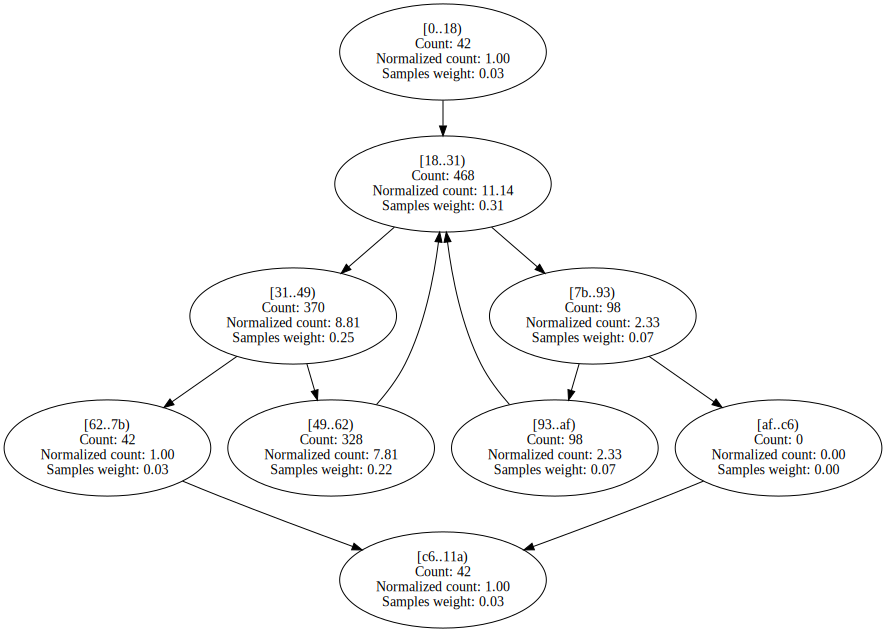

Benchstone.BenchF.Simpsn.Test | 310 | 11 | 60 | 41.56% | 94.67% | 

Expand

 | 

Expand

Benchstone.BenchI.NDhrystone.Func2 | 81 | 15 | 313 | 72.61% | 95.06% | 

Expand

 | 

Expand

NeuralJagged.move_wt_changes | 137 | 13 | 375 | 53.04% | 95.62% | 

Expand

 | 

Expand

NeuralJagged.adjust_mid_wts | 120 | 7 | 582 | 52.38% | 96.27% | 

Expand

 | 

Expand

Neural.move_wt_changes | 155 | 13 | 135 | 65.89% | 96.45% | 

Expand

 | 

Expand

BenchmarksGame.Mandelbrot_2.DoBench | 323 | 19 | 2484 | 56.45% | 96.53% | 

Expand
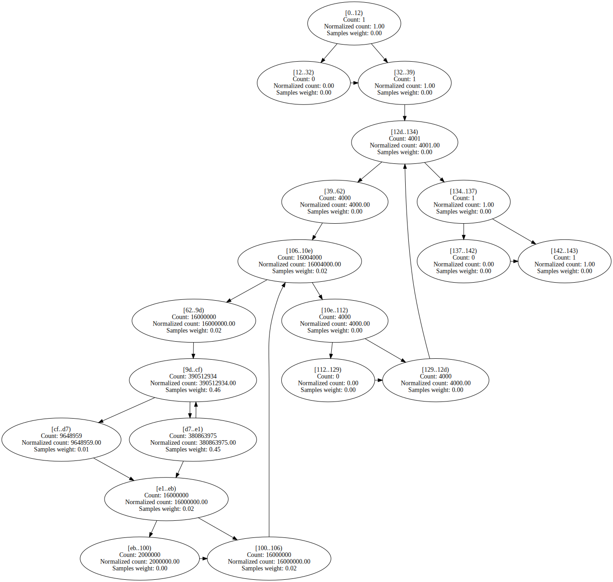
 | 

Expand

BenchmarksGame.Fasta_2.MakeRandomFasta | 221 | 14 | 110 | 48.91% | 96.59% | 

Expand

 | 

Expand

IDEAEncryption.cipher_idea | 396 | 3 | 1025 | 92.88% | 96.62% | 

Expand

 | 

Expand

BenchmarksGame.Fasta_1.SelectNucleotides | 114 | 9 | 126 | 55.31% | 96.66% | 

Expand

 | 

Expand

System.Numerics.BigIntegerCalculator.Subtract | 87 | 7 | 140 | 61.36% | 97.01% | 

Expand

 | 

Expand

BenchmarksGame.SpectralNorm_1.MultiplyAtv | 60 | 7 | 102 | 54.89% | 97.03% | 

Expand

 | 

Expand

Neural.adjust_mid_wts | 124 | 7 | 287 | 51.41% | 97.05% | 

Expand

 | 

Expand

Benchstone.BenchF.NewtR.Test | 144 | 7 | 86 | 81.01% | 97.16% | 

Expand

 | 

Expand

Algorithms.VectorFloatRenderer.RenderSingleThreadedWithADT | 421 | 12 | 439 | 99.59% | 97.22% | 

Expand

 | 

Expand

BenchmarksGame.SpectralNorm_1.MultiplyAv | 60 | 7 | 115 | 55.10% | 97.41% | 

Expand

 | 

Expand

Benchstone.BenchI.XposMatrix.Test | 69 | 11 | 265 | 61.05% | 97.55% | 

Expand

 | 

Expand

SciMark2.FFT.inverse | 53 | 4 | 95 | 61.54% | 97.75% | 

Expand
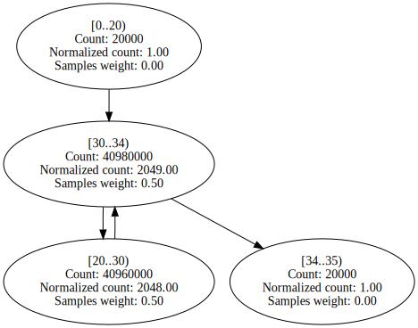
 | 

Expand

BenchmarksGame.KNucleotide.KFrequency | 91 | 7 | 130 | 50.53% | 98.09% | 

Expand

 | 

Expand

Benchstone.BenchI.AddArray2.BenchInner2 | 75 | 10 | 492 | 55.80% | 98.35% | 

Expand

 | 

Expand

Benchstone.BenchF.InProd.Test | 158 | 12 | 1659 | 54.11% | 98.37% | 

Expand
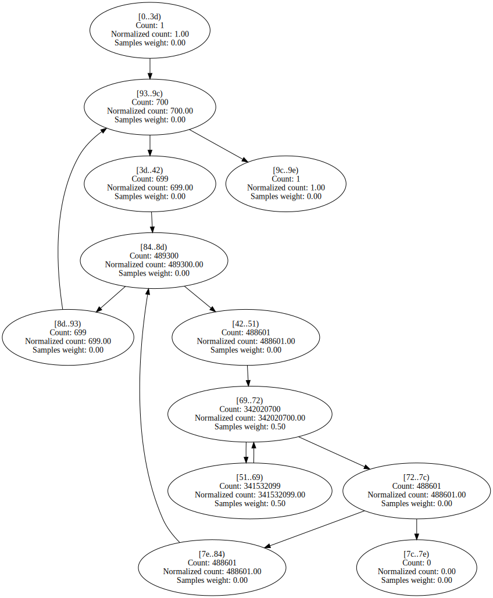
 | 

Expand

BenchmarksGame.Approximate.MultiplyAv | 66 | 7 | 212 | 60.14% | 98.41% | 

Expand

 | 

Expand

System.Numerics.BigIntegerCalculator.Add | 97 | 7 | 139 | 57.15% | 98.58% | 

Expand

 | 

Expand

BenchmarksGame.Approximate.MultiplyAtv | 66 | 7 | 225 | 62.01% | 98.61% | 

Expand

 | 

Expand

Algorithms.VectorDoubleRenderer.RenderSingleThreadedWithADT | 440 | 12 | 832 | 99.68% | 98.73% | 

Expand

 | 

Expand

Algorithms.VectorDoubleRenderer.RenderSingleThreadedNoADT | 504 | 12 | 1241 | 99.66% | 98.73% | 

Expand

 | 

Expand

Benchstone.BenchI.AddArray2.BenchInner1 | 75 | 10 | 419 | 56.43% | 98.74% | 

Expand

 | 

Expand

NeuralJagged.do_mid_forward | 101 | 7 | 183 | 59.33% | 98.87% | 

Expand

 | 

Expand

Benchstone.BenchF.Lorenz.Test | 597 | 8 | 357 | 51.40% | 98.88% | 

Expand

 | 

Expand
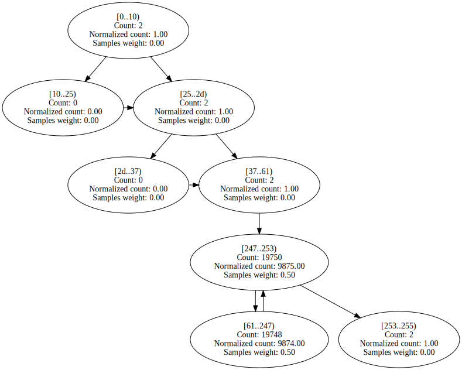

Benchstone.BenchF.SqMtx.Inner | 73 | 10 | 1409 | 54.78% | 98.88% | 

Expand
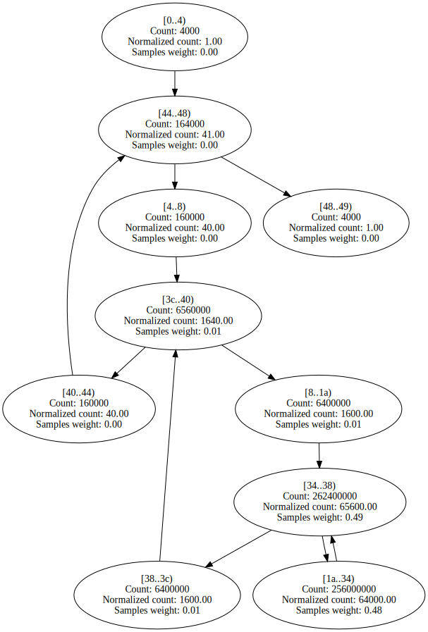
 | 

Expand

BenchmarksGame.KNucleotide_9.countEnding | 213 | 16 | 905 | 69.82% | 98.91% | 

Expand

 | 

Expand

BenchmarksGame.FannkuchRedux_5.run | 114 | 5 | 230 | 70.95% | 98.92% | 

Expand

 | 

Expand

Algorithms.VectorFloatRenderer.RenderSingleThreadedNoADT | 485 | 12 | 981 | 99.57% | 98.94% | 

Expand

 | 

Expand

Benchstone.BenchI.Puzzle.Fit | 47 | 7 | 685 | 63.81% | 99.00% | 

Expand

 | 

Expand

BenchmarksGame.FannkuchRedux_9.Run | 174 | 12 | 456 | 55.33% | 99.07% | 

Expand

 | 

Expand

Benchstone.BenchI.Midpoint.Test | 195 | 10 | 849 | 53.74% | 99.10% | 

Expand

 | 

Expand

System.Numerics.BigIntegerCalculator.SubtractDivisor | 71 | 6 | 446 | 72.74% | 99.13% | 

Expand

 | 

Expand

SciMark2.SOR.execute | 155 | 10 | 1264 | 52.55% | 99.14% | 

Expand

 | 

Expand

Benchstone.BenchI.Pi.ComputePi | 200 | 10 | 980 | 52.22% | 99.26% | 

Expand

 | 

Expand

Algorithms.ScalarFloatRenderer.RenderSingleThreadedWithADT | 142 | 11 | 1243 | 55.53% | 99.27% | 

Expand

 | 

Expand

Burgers.GetCalculated1 | 282 | 7 | 681 | 54.10% | 99.33% | 

Expand

 | 

Expand

Burgers.GetCalculated0 | 288 | 7 | 680 | 53.23% | 99.34% | 

Expand

 | 

Expand

BenchmarksGame.Fasta_1.FillRandom | 51 | 4 | 365 | 54.08% | 99.48% | 

Expand

 | 

Expand

System.Numerics.BigIntegerCalculator.Add | 69 | 4 | 253 | 59.87% | 99.62% | 

Expand

 | 

Expand

Algorithms.ScalarDoubleRenderer.RenderSingleThreadedNoADT | 206 | 11 | 1701 | 53.86% | 99.63% | 

Expand

 | 

Expand

Algorithms.ScalarFloatRenderer.RenderSingleThreadedNoADT | 156 | 11 | 1708 | 53.49% | 99.64% | 

Expand

 | 

Expand

Algorithms.ScalarDoubleRenderer.RenderSingleThreadedWithADT | 183 | 11 | 1530 | 54.75% | 99.64% | 

Expand

 | 

Expand

Burgers.GetCalculated2 | 258 | 7 | 1382 | 53.25% | 99.68% | 

Expand

 | 

Expand
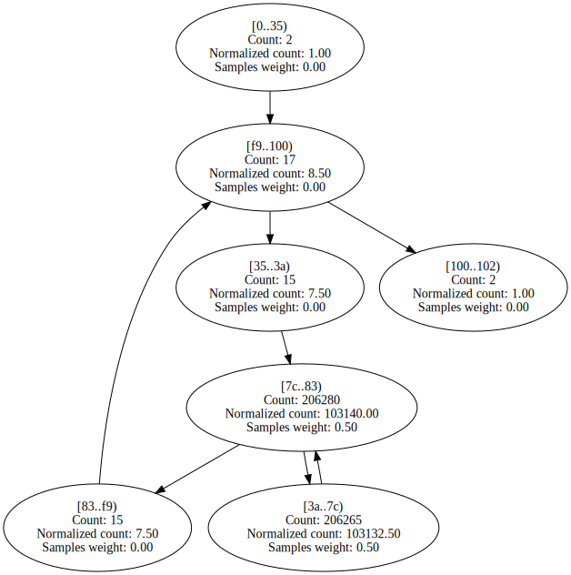

Burgers.GetCalculated3 | 353 | 7 | 1345 | 52.88% | 99.72% | 

Expand

 | 

Expand

System.Numerics.BigIntegerCalculator.Multiply | 55 | 4 | 627 | 57.48% | 99.88% | 

Expand

 | 

Expand

SeekUnroll.InnerLoop | 25 | 4 | 3954 | 83.76% | 99.92% | 

Expand

 | 

Expand

Benchstone.BenchF.InProd.InnerProduct | 45 | 4 | 2489 | 55.32% | 99.94% | 

Expand

 | 

Expand
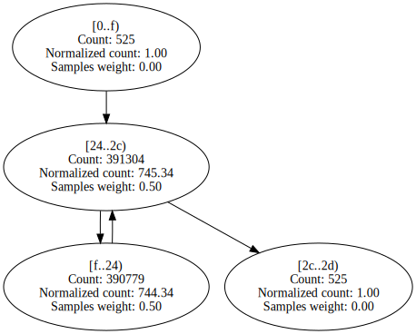

ByteMark.randnum | 80 | 3 | 56 | 58.93% | 100.00% | 

Expand

 | 

Expand

Benchstone.BenchF.NewtR.Inner | 77 | 7 | 180 | 51.11% | 100.00% | 

Expand

 | 

Expand

Benchstone.BenchI.NDhrystone.Proc1 | 191 | 3 | 141 | 91.13% | 100.00% | 

Expand

 | 

Expand

