Method | IL size | # BBs | # Samples | Raw overlap | Smoothed overlap | Instrumented graph | Smoothed graph
--- | --- | --- | --- | --- | --- | --- | ---
Benchstone.BenchF.MatInv4.Test | 340 | 22 | 179 | 64.52% | 64.24% | 

Expand

 | 

Expand
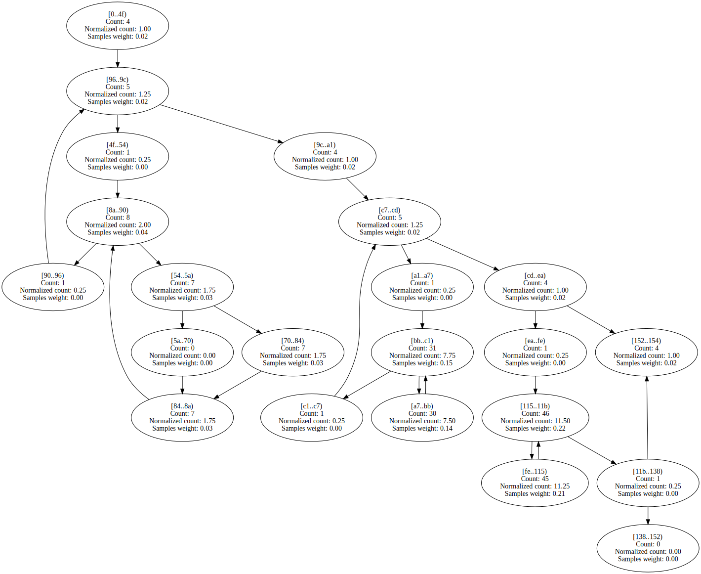

EMFloatClass.AddSubInternalFPF | 804 | 39 | 1505 | 83.30% | 69.78% | 

Expand

 | 

Expand

Benchstone.BenchF.LLoops.Main1 | 4385 | 111 | 116934 | 71.00% | 70.71% | 

Expand

 | 

Expand

Benchstone.BenchI.NDhrystone.Proc0 | 295 | 12 | 43826 | 67.07% | 74.68% | 

Expand

 | 

Expand

EMFloatClass.DivideInternalFPF | 633 | 37 | 41647 | 83.16% | 74.79% | 

Expand

 | 

Expand

EMFloat.DivideInternalFPF | 631 | 37 | 209817 | 83.55% | 75.33% | 

Expand

 | 

Expand

Benchstone.BenchI.NDhrystone.Proc1 | 191 | 3 | 9468 | 83.99% | 75.74% | 

Expand

 | 

Expand
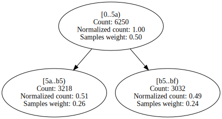

BenchmarksGame.FannkuchRedux_5.countFlips | 100 | 14 | 727751 | 76.04% | 75.99% | 

Expand

 | 

Expand

EMFloat.AddSubInternalFPF | 800 | 39 | 7910 | 85.74% | 77.09% | 

Expand

 | 

Expand

Benchstone.BenchF.DMath.Bench | 215 | 9 | 71699 | 77.28% | 77.43% | 

Expand

 | 

Expand

PgoBench.Program.Main | 1303 | 71 | 125 | 84.37% | 77.51% | 

Expand

 | 

Expand

Benchstone.BenchI.NDhrystone.Proc6 | 72 | 11 | 7679 | 59.89% | 77.64% | 

Expand

 | 

Expand

EMFloatClass.MultiplyInternalFPF | 592 | 33 | 29108 | 83.61% | 78.99% | 

Expand

 | 

Expand

EMFloat.MultiplyInternalFPF | 584 | 33 | 144050 | 83.77% | 79.41% | 

Expand

 | 

Expand

NeuralJagged.zero_changes | 137 | 13 | 60 | 78.34% | 79.92% | 

Expand

 | 

Expand

EMFloatClass.denormalize | 82 | 7 | 385 | 88.14% | 80.03% | 

Expand

 | 

Expand
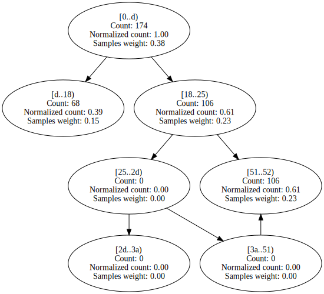

Benchstone.BenchF.NewtE.Test | 586 | 19 | 10742 | 56.87% | 80.79% | 

Expand

 | 

Expand

Utility.sscanf | 383 | 25 | 175 | 71.42% | 81.63% | 

Expand

 | 

Expand

Benchstone.BenchF.FFT.FastFourierT | 254 | 15 | 23856 | 83.93% | 81.89% | 

Expand

 | 

Expand

EMFloat.Sub16Bits | 38 | 4 | 53849 | 66.67% | 81.90% | 

Expand

 | 

Expand

EMFloatClass.Sub16Bits | 38 | 4 | 10527 | 66.67% | 81.93% | 

Expand

 | 

Expand

BenchmarksGame.TreeNode.CreateTree | 36 | 3 | 14515 | 66.97% | 82.62% | 

Expand

 | 

Expand
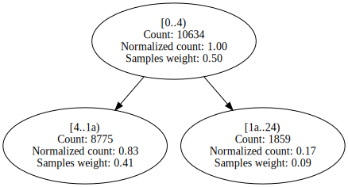

BenchmarksGame.NBodySystem.Advance | 370 | 7 | 55851 | 75.00% | 82.98% | 

Expand

 | 

Expand

EMFloatClass.Add16Bits | 38 | 4 | 13021 | 66.67% | 83.09% | 

Expand

 | 

Expand
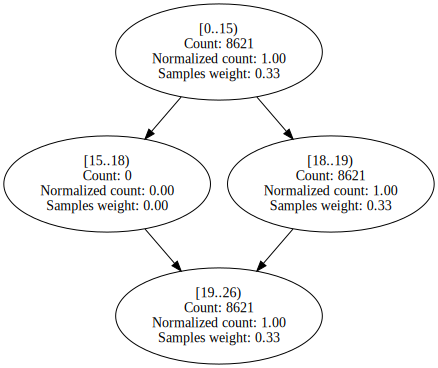

EMFloat.Add16Bits | 38 | 4 | 63922 | 66.67% | 83.17% | 

Expand

 | 

Expand

EMFloat.denormalize | 79 | 7 | 2146 | 89.76% | 83.37% | 

Expand

 | 

Expand

Benchstone.BenchI.BubbleSort2.Test | 139 | 8 | 83 | 91.93% | 83.54% | 

Expand

 | 

Expand

BenchmarksGame.MandelBrot_7.GetByte | 224 | 10 | 289362 | 83.57% | 84.27% | 

Expand

 | 

Expand

IDEAEncryption.mul | 47 | 8 | 222577 | 60.00% | 84.94% | 

Expand

 | 

Expand

IDEAEncryption.Run | 346 | 19 | 193 | 80.76% | 85.18% | 

Expand
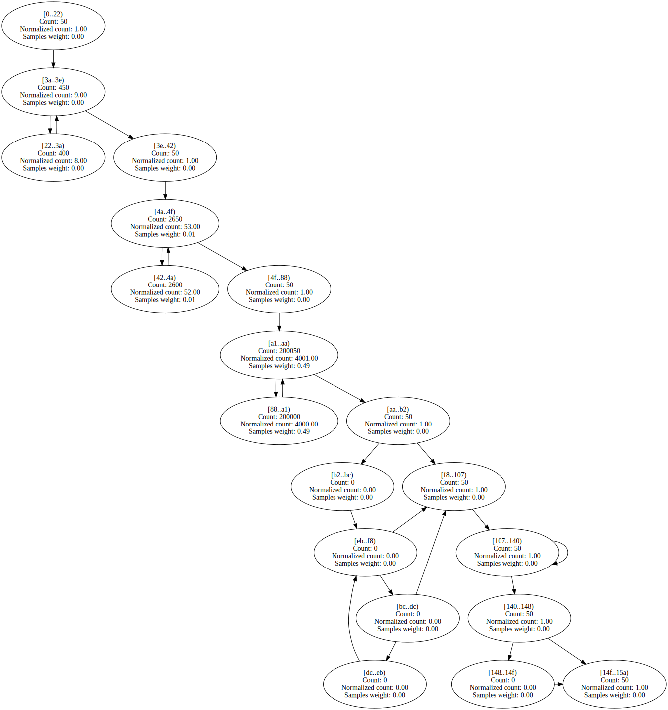
 | 

Expand

EMFloatClass.LongToInternalFPF | 129 | 9 | 84 | 92.86% | 85.65% | 

Expand

 | 

Expand

Benchstone.BenchI.BubbleSort.Test | 81 | 10 | 1780 | 76.25% | 85.83% | 

Expand

 | 

Expand

Benchstone.BenchI.Ackermann.Acker | 38 | 5 | 56460 | 77.15% | 86.45% | 

Expand

 | 

Expand

BenchmarksGame.KNucleotide_1.Bench | 267 | 16 | 69 | 88.39% | 86.81% | 

Expand

 | 

Expand

NumericSortJagged.NumHeapSort | 57 | 7 | 61004 | 80.41% | 87.06% | 

Expand

 | 

Expand

BenchmarksGame.TreeNode.CountNodes | 46 | 3 | 11890 | 75.58% | 87.24% | 

Expand

 | 

Expand

Benchstone.BenchF.LLoops.Init | 598 | 46 | 677803 | 87.59% | 87.31% | 

Expand

 | 

Expand

LUDecomp.build_problem | 194 | 21 | 2084 | 87.03% | 87.92% | 

Expand

 | 

Expand

BenchmarksGame.FannkuchRedux_9.CountFlips | 100 | 7 | 403495 | 87.71% | 88.07% | 

Expand

 | 

Expand

EMFloat.StickyShiftRightMant | 93 | 12 | 2774 | 88.74% | 88.08% | 

Expand

 | 

Expand

Benchstone.BenchI.Fib.Fibonacci | 24 | 3 | 156462 | 74.65% | 88.39% | 

Expand
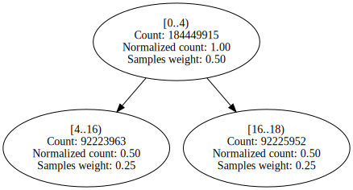
 | 

Expand

EMFloat.LongToInternalFPF | 129 | 9 | 630 | 94.76% | 88.78% | 

Expand

 | 

Expand

System.Text.ASCIIUtility.NarrowUtf16ToAscii | 530 | 31 | 128 | 86.55% | 89.20% | 

Expand

 | 

Expand
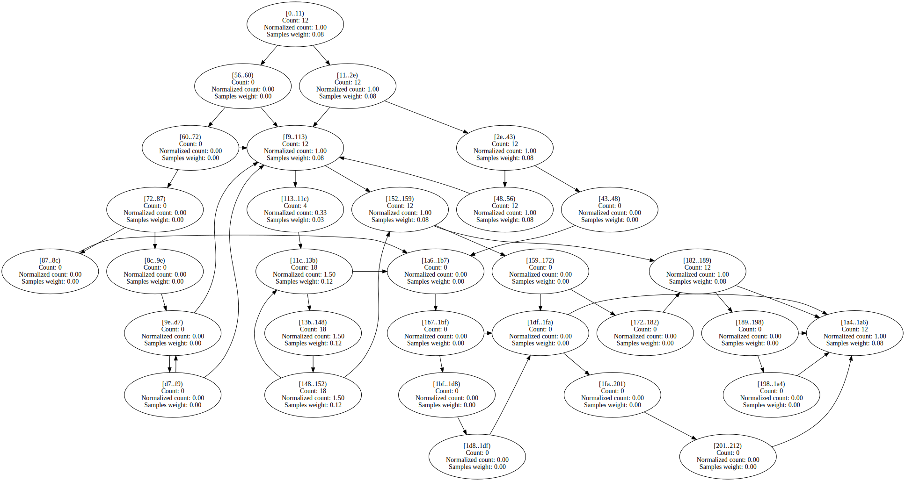

BenchmarksGame.BinaryTrees_2.Bench | 206 | 13 | 77 | 70.77% | 89.80% | 

Expand

 | 

Expand
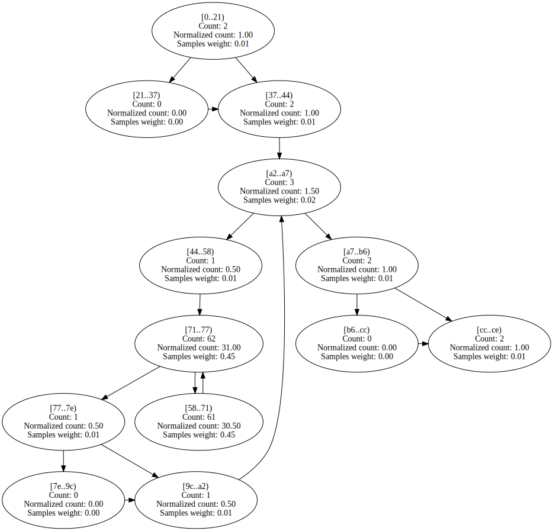

AssignRect.LoadAssign | 55 | 7 | 51 | 82.36% | 89.93% | 

Expand

 | 

Expand

EMFloatClass.RoundInternalFPF | 85 | 6 | 496 | 86.49% | 90.11% | 

Expand

 | 

Expand

AssignJagged.calc_minimum_costs | 156 | 24 | 2568 | 89.83% | 90.19% | 

Expand

 | 

Expand

NeuralJagged.do_out_forward | 99 | 7 | 19095 | 93.53% | 90.30% | 

Expand

 | 

Expand

EMFloat.normalize | 46 | 4 | 2483 | 78.68% | 90.57% | 

Expand

 | 

Expand

EMFloat.RoundInternalFPF | 85 | 6 | 2733 | 86.51% | 90.88% | 

Expand

 | 

Expand

SciMark2.MonteCarlo.integrate | 77 | 6 | 65093 | 84.81% | 91.00% | 

Expand

 | 

Expand

EMFloatClass.normalize | 49 | 4 | 510 | 79.31% | 91.13% | 

Expand

 | 

Expand

StringSort.LoadStringArray | 131 | 13 | 12463 | 86.55% | 91.43% | 

Expand

 | 

Expand

EMFloatClass.StickyShiftRightMant | 93 | 12 | 531 | 90.53% | 91.77% | 

Expand

 | 

Expand

ByteMark.abs_randwc | 17 | 3 | 5636 | 85.33% | 92.20% | 

Expand

 | 

Expand

BenchmarksGame.ByteString.GetHashCode | 132 | 10 | 39045 | 94.01% | 92.46% | 

Expand

 | 

Expand

Benchstone.BenchI.EightQueens.TryMe | 127 | 11 | 118139 | 95.90% | 92.51% | 

Expand

 | 

Expand

NumericSortRect.NumSift | 103 | 9 | 281086 | 88.36% | 92.56% | 

Expand

 | 

Expand

BenchmarksGame.KNucleotide_9.checkEnding | 79 | 8 | 103060 | 91.93% | 92.56% | 

Expand

 | 

Expand

BenchmarksGame.KNucleotide_9.check | 61 | 5 | 56951 | 96.03% | 92.82% | 

Expand

 | 

Expand

Neural.do_out_error | 132 | 9 | 2762 | 95.03% | 93.07% | 

Expand

 | 

Expand

NeuralJagged.DoNNetIteration | 154 | 9 | 1113 | 69.24% | 93.36% | 

Expand

 | 

Expand

Benchstone.BenchI.Array1.Test | 95 | 9 | 6107 | 85.07% | 93.66% | 

Expand

 | 

Expand

NumericSortRect.NumHeapSort | 79 | 7 | 14325 | 78.90% | 93.69% | 

Expand

 | 

Expand

BenchmarksGame.Fasta_2.SelectRandom | 62 | 6 | 51550 | 96.74% | 93.73% | 

Expand

 | 

Expand

LUDecomp.Run | 478 | 34 | 299 | 91.13% | 93.81% | 

Expand

 | 

Expand

Neural.check_out_error | 91 | 10 | 348 | 97.07% | 93.99% | 

Expand

 | 

Expand

NeuralJagged.worst_pass_error | 84 | 6 | 378 | 94.65% | 94.08% | 

Expand

 | 

Expand

NeuralJagged.check_out_error | 91 | 10 | 773 | 97.07% | 94.23% | 

Expand

 | 

Expand

Benchstone.BenchI.NDhrystone.Func2 | 81 | 15 | 226396 | 95.33% | 94.28% | 

Expand

 | 

Expand

Benchstone.BenchI.Array1.Quick | 89 | 8 | 84519 | 95.22% | 94.44% | 

Expand

 | 

Expand

Benchstone.BenchF.MatInv4.MinV2 | 723 | 52 | 15991 | 88.11% | 94.46% | 

Expand

 | 

Expand

SciMark2.FFT.transform_internal | 450 | 17 | 890969 | 93.93% | 94.46% | 

Expand

 | 

Expand

Benchstone.BenchI.HeapSort.Inner | 123 | 17 | 349069 | 94.65% | 94.66% | 

Expand

 | 

Expand

LUDecomp.ludcmp | 481 | 42 | 2099661 | 94.40% | 94.69% | 

Expand

 | 

Expand

Benchstone.BenchI.BubbleSort.SortArray | 48 | 7 | 406992 | 94.61% | 94.75% | 

Expand

 | 

Expand

Neural.DoNNetIteration | 154 | 9 | 329 | 70.22% | 95.03% | 

Expand

 | 

Expand

Neural.do_mid_error | 100 | 7 | 10744 | 92.31% | 95.32% | 

Expand

 | 

Expand

Neural.adjust_out_wts | 116 | 7 | 12458 | 88.89% | 95.44% | 

Expand

 | 

Expand

SciMark2.FFT.log2 | 52 | 6 | 558 | 96.42% | 95.56% | 

Expand

 | 

Expand

AssignJagged.second_assignments | 376 | 65 | 403269 | 95.39% | 95.59% | 

Expand

 | 

Expand

Benchstone.BenchI.NDhrystone.Proc3 | 51 | 4 | 10055 | 95.28% | 95.60% | 

Expand

 | 

Expand

Neural.do_out_forward | 102 | 7 | 10260 | 92.70% | 95.79% | 

Expand

 | 

Expand

Benchstone.BenchI.HeapSort.Test | 76 | 9 | 9123 | 94.95% | 95.97% | 

Expand

 | 

Expand

Benchstone.BenchF.MatInv4.CompM | 76 | 9 | 92 | 76.45% | 96.02% | 

Expand

 | 

Expand

IDEAEncryption.cipher_idea | 396 | 3 | 61535 | 91.10% | 96.21% | 

Expand

 | 

Expand

EMFloatClass.DoEmFloatIteration | 151 | 12 | 522 | 88.90% | 96.27% | 

Expand

 | 

Expand

StringSort.strsift | 75 | 9 | 198498 | 86.81% | 96.29% | 

Expand

 | 

Expand

Neural.worst_pass_error | 84 | 6 | 254 | 96.66% | 96.31% | 

Expand

 | 

Expand

BenchmarksGame.Fasta_1.SelectNucleotides | 114 | 9 | 11730 | 90.05% | 96.46% | 

Expand

 | 

Expand

StringSort.StrHeapSort | 57 | 7 | 9638 | 79.95% | 96.58% | 

Expand

 | 

Expand

EMFloat.SetupCPUEmFloatArrays | 116 | 4 | 63 | 57.91% | 96.75% | 

Expand

 | 

Expand

AssignRect.calc_minimum_costs | 166 | 24 | 1638 | 94.88% | 96.81% | 

Expand

 | 

Expand

Benchstone.BenchI.Midpoint.Inner | 60 | 12 | 348813 | 97.41% | 96.88% | 

Expand

 | 

Expand

AssignJagged.first_assignments | 421 | 65 | 963324 | 96.63% | 96.95% | 

Expand

 | 

Expand

BenchmarksGame.FannkuchRedux_5.nextPermutation | 81 | 7 | 75598 | 96.52% | 96.98% | 

Expand

 | 

Expand

BenchmarksGame.Fasta_1.SelectRandom | 62 | 6 | 29684 | 97.40% | 97.04% | 

Expand

 | 

Expand

Benchstone.BenchI.AddArray.Test | 231 | 7 | 107134 | 97.07% | 97.06% | 

Expand

 | 

Expand

Benchstone.BenchI.CSieve.Test | 120 | 15 | 195409 | 96.71% | 97.08% | 

Expand

 | 

Expand

Benchstone.BenchI.EightQueens.Test | 79 | 11 | 3378 | 97.66% | 97.11% | 

Expand

 | 

Expand

EMFloat.DoEmFloatIteration | 211 | 12 | 2513 | 84.84% | 97.13% | 

Expand

 | 

Expand

Benchstone.BenchF.MatInv4.MinV1 | 711 | 51 | 13094 | 89.34% | 97.19% | 

Expand

 | 

Expand

NeuralJagged.move_wt_changes | 137 | 13 | 262313 | 96.70% | 97.23% | 

Expand

 | 

Expand

Benchstone.BenchF.Adams.Bench | 419 | 7 | 2417 | 86.96% | 97.24% | 

Expand

 | 

Expand
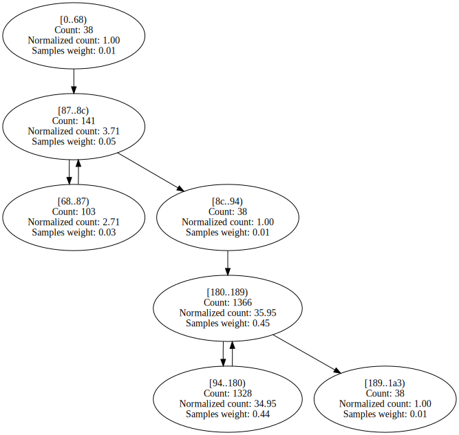

Benchstone.BenchI.LogicArray.Inner | 130 | 17 | 253383 | 97.24% | 97.25% | 

Expand

 | 

Expand

BenchmarksGame.FannkuchRedux_9.NextPermutation | 95 | 7 | 98497 | 97.73% | 97.31% | 

Expand

 | 

Expand

Benchstone.BenchF.Bisect.Inner | 122 | 10 | 123416 | 93.78% | 97.33% | 

Expand

 | 

Expand

Benchstone.BenchI.BubbleSort2.Inner | 57 | 9 | 503265 | 97.29% | 97.36% | 

Expand

 | 

Expand

Benchstone.BenchF.Bisect.Test | 238 | 13 | 2955 | 88.35% | 97.40% | 

Expand

 | 

Expand

NeuralJagged.do_out_error | 129 | 9 | 6056 | 97.92% | 97.83% | 

Expand

 | 

Expand

Neural.adjust_mid_wts | 124 | 7 | 47325 | 84.61% | 97.87% | 

Expand

 | 

Expand

EMFloat.ShiftMantRight1 | 47 | 6 | 625066 | 98.37% | 97.91% | 

Expand

 | 

Expand

EMFloatClass.ShiftMantRight1 | 47 | 6 | 126318 | 98.38% | 97.94% | 

Expand

 | 

Expand

BenchmarksGame.FannkuchRedux_9.Copy | 63 | 7 | 177713 | 98.01% | 97.98% | 

Expand

 | 

Expand

BenchmarksGame.Fasta_2.MakeRandomFasta | 221 | 14 | 21747 | 86.59% | 98.00% | 

Expand

 | 

Expand

Benchstone.BenchI.BenchE.Strsch | 96 | 12 | 734821 | 96.99% | 98.05% | 

Expand

 | 

Expand

BenchmarksGame.ByteString.Equals | 69 | 8 | 69516 | 96.57% | 98.09% | 

Expand

 | 

Expand

Benchstone.BenchF.DMath.Power | 43 | 4 | 335916 | 98.98% | 98.11% | 

Expand

 | 

Expand

AssignRect.second_assignments | 389 | 65 | 299420 | 93.83% | 98.15% | 

Expand

 | 

Expand

ByteMark.BenchBitOps | 37 | 4 | 162 | 84.57% | 98.17% | 

Expand

 | 

Expand
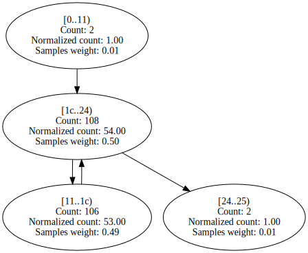

NumericSortJagged.NumSift | 63 | 9 | 1216968 | 97.38% | 98.25% | 

Expand

 | 

Expand

Benchstone.BenchI.NDhrystone.Func3 | 8 | 3 | 3076 | 99.12% | 98.27% | 

Expand

 | 

Expand

EMFloatClass.memmove | 65 | 4 | 1952 | 98.40% | 98.32% | 

Expand

 | 

Expand

Neural.move_wt_changes | 155 | 13 | 57535 | 88.92% | 98.37% | 

Expand

 | 

Expand

Benchstone.BenchF.DMath.Fact | 43 | 4 | 197379 | 99.08% | 98.46% | 

Expand

 | 

Expand

EMFloat.memmove | 65 | 4 | 11072 | 98.43% | 98.47% | 

Expand

 | 

Expand
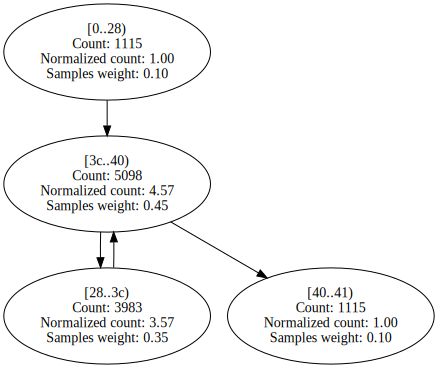

Benchstone.BenchI.IniArray.Test | 44 | 7 | 320024 | 98.62% | 98.53% | 

Expand

 | 

Expand

BenchmarksGame.FannkuchRedux_2.fannkuch | 366 | 28 | 341715 | 97.93% | 98.57% | 

Expand

 | 

Expand

EMFloatClass.ShiftMantLeft1 | 47 | 6 | 179606 | 98.77% | 98.64% | 

Expand

 | 

Expand

IDEAEncryption.DoIDEAIteration | 128 | 15 | 6522 | 83.11% | 98.65% | 

Expand

 | 

Expand
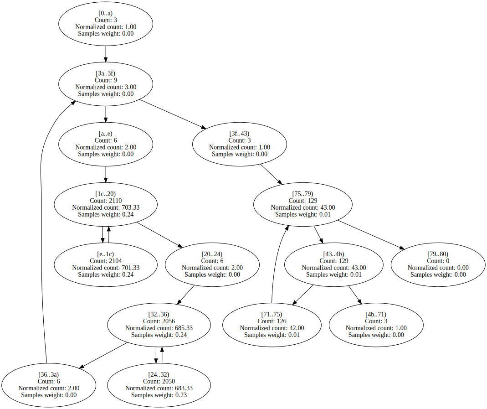

NeuralJagged.do_mid_error | 97 | 7 | 34283 | 98.31% | 98.70% | 

Expand

 | 

Expand

SciMark2.kernel.CopyMatrix | 131 | 10 | 21858 | 99.62% | 98.71% | 

Expand

 | 

Expand

EMFloat.ShiftMantLeft1 | 47 | 6 | 898745 | 98.85% | 98.76% | 

Expand

 | 

Expand

AssignRect.first_assignments | 478 | 65 | 696244 | 94.46% | 98.79% | 

Expand

 | 

Expand

AssignRect.CopyToAssign | 45 | 7 | 394 | 90.62% | 98.81% | 

Expand

 | 

Expand

BenchmarksGame.NBody_3.Bench | 139 | 13 | 638 | 82.60% | 98.85% | 

Expand

 | 

Expand

NeuralJagged.do_mid_forward | 101 | 7 | 137140 | 99.46% | 98.91% | 

Expand

 | 

Expand

Benchstone.BenchF.InProd.InitMatrix | 52 | 7 | 621 | 92.85% | 98.96% | 

Expand

 | 

Expand

SciMark2.FFT.bitreverse | 115 | 8 | 171987 | 98.52% | 98.99% | 

Expand

 | 

Expand

Benchstone.BenchI.Array2.Bench | 107 | 13 | 1660114 | 99.08% | 99.03% | 

Expand

 | 

Expand

BenchmarksGame.Mandelbrot_2.DoBench | 323 | 19 | 201941 | 97.22% | 99.05% | 

Expand

 | 

Expand

SciMark2.SparseCompRow.matmult | 87 | 10 | 1173787 | 99.03% | 99.09% | 

Expand

 | 

Expand

Neural.do_mid_forward | 107 | 7 | 39447 | 90.85% | 99.10% | 

Expand

 | 

Expand

NeuralJagged.adjust_out_wts | 115 | 7 | 64704 | 99.18% | 99.11% | 

Expand

 | 

Expand

EMFloatClass.IsMantissaZero | 25 | 4 | 3475 | 99.08% | 99.14% | 

Expand

 | 

Expand

Benchstone.BenchF.FFT.Test | 122 | 7 | 9895 | 74.97% | 99.19% | 

Expand

 | 

Expand

Benchstone.BenchI.AddArray2.Bench | 62 | 7 | 660 | 99.71% | 99.20% | 

Expand

 | 

Expand

SciMark2.Random.nextDouble | 161 | 11 | 209921 | 99.10% | 99.26% | 

Expand

 | 

Expand

Benchstone.BenchI.MulMatrix.Inner | 435 | 61 | 819625 | 99.15% | 99.36% | 

Expand

 | 

Expand

Fourier.thefunction | 102 | 6 | 14480 | 74.18% | 99.38% | 

Expand

 | 

Expand

Algorithms.VectorFloatRenderer.RenderSingleThreadedNoADT | 485 | 12 | 18994 | 99.69% | 99.47% | 

Expand

 | 

Expand
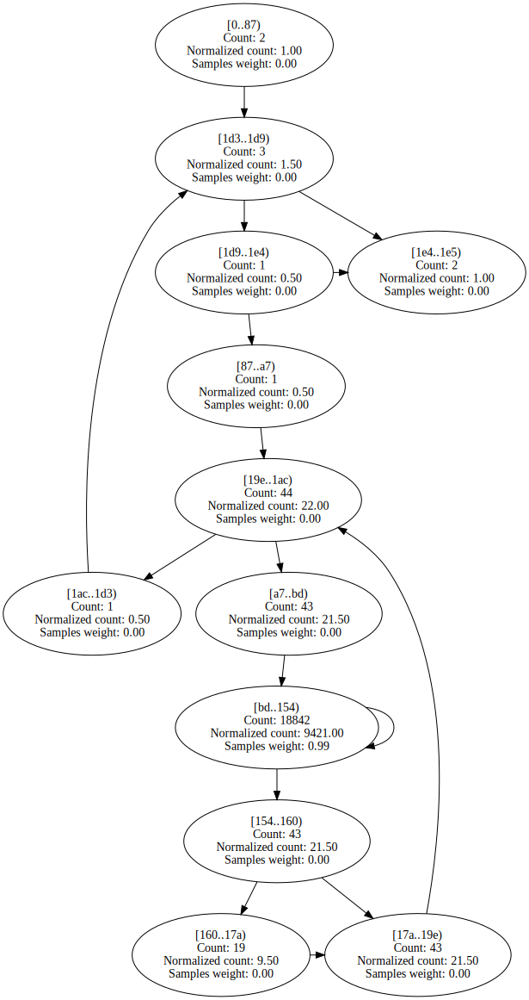

AssignJagged.CopyToAssign | 39 | 7 | 1109 | 99.34% | 99.48% | 

Expand

 | 

Expand

BenchmarksGame.FannkuchRedux_9.Run | 174 | 12 | 64458 | 87.06% | 99.49% | 

Expand

 | 

Expand

EMFloat.IsMantissaZero | 25 | 4 | 16850 | 99.14% | 99.51% | 

Expand

 | 

Expand

LUDecomp.DoLUIteration | 144 | 16 | 58958 | 99.47% | 99.53% | 

Expand

 | 

Expand

Benchstone.BenchI.BubbleSort.VerifySort | 26 | 6 | 1719 | 97.63% | 99.56% | 

Expand

 | 

Expand
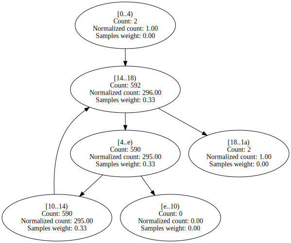

Algorithms.VectorDoubleRenderer.RenderSingleThreadedNoADT | 504 | 12 | 17301 | 99.82% | 99.61% | 

Expand

 | 

Expand

BenchmarksGame.Fasta_2.MakeRepeatFasta | 241 | 16 | 8398 | 97.26% | 99.61% | 

Expand

 | 

Expand

SciMark2.LU.factor | 282 | 24 | 959543 | 99.06% | 99.63% | 

Expand

 | 

Expand
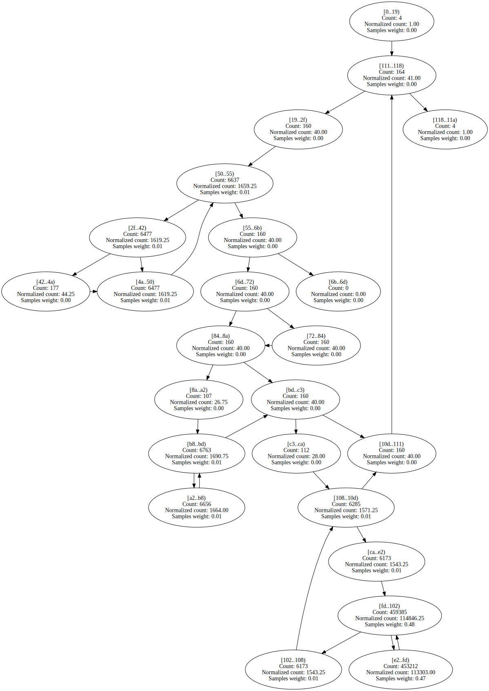

NeuralJagged.adjust_mid_wts | 120 | 7 | 304386 | 99.55% | 99.64% | 

Expand

 | 

Expand

NumericSortRect.LoadNumArrayWithRand | 78 | 9 | 6932 | 90.54% | 99.65% | 

Expand

 | 

Expand

Benchstone.BenchI.NDhrystone.Proc8 | 77 | 4 | 24442 | 97.75% | 99.66% | 

Expand

 | 

Expand

Benchstone.BenchF.InProd.Inner | 68 | 7 | 1333 | 83.90% | 99.68% | 

Expand

 | 

Expand

BitOps.Run | 187 | 10 | 372 | 85.48% | 99.69% | 

Expand

 | 

Expand

Fourier.TrapezoidIntegrate | 90 | 5 | 11860 | 84.05% | 99.75% | 

Expand

 | 

Expand

BenchmarksGame.KNucleotide.KFrequency | 91 | 7 | 10893 | 85.23% | 99.76% | 

Expand

 | 

Expand

Algorithms.VectorDoubleRenderer.RenderSingleThreadedWithADT | 440 | 12 | 36130 | 99.71% | 99.79% | 

Expand

 | 

Expand

BenchmarksGame.Fasta_1.MakeRepeatFastaBuffer | 127 | 16 | 7086 | 97.22% | 99.82% | 

Expand

 | 

Expand

NumericSortJagged.LoadNumArrayWithRand | 66 | 10 | 37131 | 99.80% | 99.84% | 

Expand

 | 

Expand

Algorithms.VectorFloatRenderer.RenderSingleThreadedWithADT | 421 | 12 | 19876 | 99.79% | 99.86% | 

Expand

 | 

Expand

BenchmarksGame.KNucleotide_9.loadThreeData | 463 | 21 | 11640 | 100.00% | 99.88% | 

Expand

 | 

Expand

Algorithms.ScalarDoubleRenderer.RenderSingleThreadedWithADT | 183 | 11 | 297433 | 76.93% | 99.88% | 

Expand

 | 

Expand

BenchmarksGame.KNucleotide_9.countEnding | 213 | 16 | 80671 | 94.42% | 99.88% | 

Expand

 | 

Expand

Algorithms.ScalarFloatRenderer.RenderSingleThreadedWithADT | 142 | 11 | 196211 | 83.34% | 99.90% | 

Expand

 | 

Expand

BenchmarksGame.FannkuchRedux_5.run | 114 | 5 | 31163 | 79.56% | 99.90% | 

Expand

 | 

Expand

SciMark2.SOR.execute | 155 | 10 | 621063 | 99.93% | 99.90% | 

Expand

 | 

Expand

LUDecomp.lubksb | 146 | 18 | 49057 | 99.38% | 99.91% | 

Expand

 | 

Expand

Benchstone.BenchF.MatInv4.MProd | 107 | 10 | 11943 | 99.64% | 99.92% | 

Expand

 | 

Expand

BenchmarksGame.Fasta_1.FillRandom | 51 | 4 | 10944 | 99.95% | 99.92% | 

Expand

 | 

Expand

Algorithms.ScalarDoubleRenderer.RenderSingleThreadedNoADT | 206 | 11 | 229931 | 99.98% | 99.95% | 

Expand

 | 

Expand

Benchstone.BenchI.AddArray2.BenchInner1 | 75 | 10 | 140954 | 99.94% | 99.96% | 

Expand

 | 

Expand

Benchstone.BenchI.BenchE.Test | 71 | 4 | 8989 | 83.18% | 99.97% | 

Expand

 | 

Expand

Benchstone.BenchI.Midpoint.Test | 195 | 10 | 180849 | 93.99% | 99.98% | 

Expand

 | 

Expand

Benchstone.BenchI.AddArray2.BenchInner2 | 75 | 10 | 140821 | 99.88% | 99.98% | 

Expand

 | 

Expand

Benchstone.BenchF.Lorenz.Test | 597 | 8 | 22245 | 61.22% | 99.98% | 

Expand

 | 

Expand

Algorithms.ScalarFloatRenderer.RenderSingleThreadedNoADT | 156 | 11 | 230760 | 99.98% | 99.98% | 

Expand

 | 

Expand

Benchstone.BenchF.InProd.Test | 158 | 12 | 783809 | 99.96% | 99.98% | 

Expand

 | 

Expand

Benchstone.BenchF.BenchMrk.Test | 239 | 4 | 12510 | 55.20% | 99.98% | 

Expand

 | 

Expand

Benchstone.BenchF.BenchMk2.Test | 235 | 4 | 12630 | 54.05% | 99.98% | 

Expand

 | 

Expand

Burgers.GetCalculated0 | 288 | 7 | 114015 | 86.10% | 99.99% | 

Expand

 | 

Expand

SciMark2.FFT.inverse | 53 | 4 | 38044 | 99.98% | 99.99% | 

Expand

 | 

Expand

Benchstone.BenchF.InProd.InnerProduct | 45 | 4 | 783008 | 99.98% | 99.99% | 

Expand

 | 

Expand

Burgers.GetCalculated1 | 282 | 7 | 116631 | 85.50% | 100.00% | 

Expand

 | 

Expand

Burgers.GetCalculated2 | 258 | 7 | 412589 | 100.00% | 100.00% | 

Expand

 | 

Expand

Burgers.GetCalculated3 | 353 | 7 | 206304 | 100.00% | 100.00% | 

Expand

 | 

Expand

ByteMark.randnum | 80 | 3 | 4079 | 97.00% | 100.00% | 

Expand

 | 

Expand
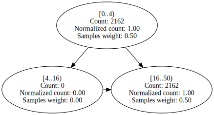

BitOps.DoBitfieldIteration | 168 | 12 | 277 | 79.71% | 100.00% | 

Expand

 | 

Expand

Benchstone.BenchI.NDhrystone.Func1 | 8 | 3 | 14889 | 100.00% | 100.00% | 

Expand

 | 

Expand

Benchstone.BenchI.NDhrystone.Proc2 | 37 | 5 | 7415 | 100.00% | 100.00% | 

Expand

 | 

Expand

