Method | IL size | # BBs | # Samples | Raw overlap | Smoothed overlap | Instrumented graph | Smoothed graph
--- | --- | --- | --- | --- | --- | --- | ---
BenchmarksGame.ByteString.GetHashCode | 132 | 10 | 109 | 11.01% | 18.87% | 

Expand

 | 

Expand

Benchstone.BenchF.Whetsto.Test | 1188 | 40 | 196 | 33.08% | 36.67% | 

Expand

 | 

Expand

Benchstone.BenchF.LLoops.Main1 | 4385 | 111 | 232 | 48.35% | 51.39% | 

Expand

 | 

Expand

BenchmarksGame.KNucleotide_9.countEnding | 213 | 16 | 683 | 65.13% | 56.77% | 

Expand

 | 

Expand

AssignRect.second_assignments | 389 | 65 | 340 | 57.29% | 57.28% | 

Expand

 | 

Expand

AssignRect.first_assignments | 478 | 65 | 660 | 64.45% | 59.05% | 

Expand

 | 

Expand

BenchmarksGame.KNucleotide_9.checkEnding | 79 | 8 | 428 | 41.67% | 60.01% | 

Expand

 | 

Expand

Benchstone.BenchI.NDhrystone.Func2 | 81 | 15 | 268 | 46.75% | 61.92% | 

Expand

 | 

Expand

Benchstone.BenchI.NDhrystone.Proc0 | 295 | 12 | 125 | 40.63% | 64.01% | 

Expand

 | 

Expand

System.Text.RegularExpressions.RegexInterpreter.MatchString | 190 | 20 | 75 | 53.37% | 65.52% | 

Expand

 | 

Expand

Benchstone.BenchI.QuickSort.Quick | 103 | 16 | 508 | 61.80% | 67.53% | 

Expand

 | 

Expand

Benchstone.BenchI.NDhrystone.Proc8 | 77 | 4 | 104 | 43.96% | 69.86% | 

Expand

 | 

Expand

NumericSortJagged.NumHeapSort | 57 | 7 | 129 | 38.76% | 70.23% | 

Expand

 | 

Expand

EMFloatClass.DivideInternalFPF | 633 | 37 | 105 | 52.33% | 70.51% | 

Expand

 | 

Expand

Benchstone.BenchI.Midpoint.Inner | 60 | 12 | 382 | 53.38% | 70.68% | 

Expand

 | 

Expand

SeekUnroll.InnerLoop | 25 | 4 | 3865 | 50.96% | 71.74% | 

Expand

 | 

Expand

LUDecomp.lubksb | 146 | 18 | 66 | 54.87% | 71.78% | 

Expand
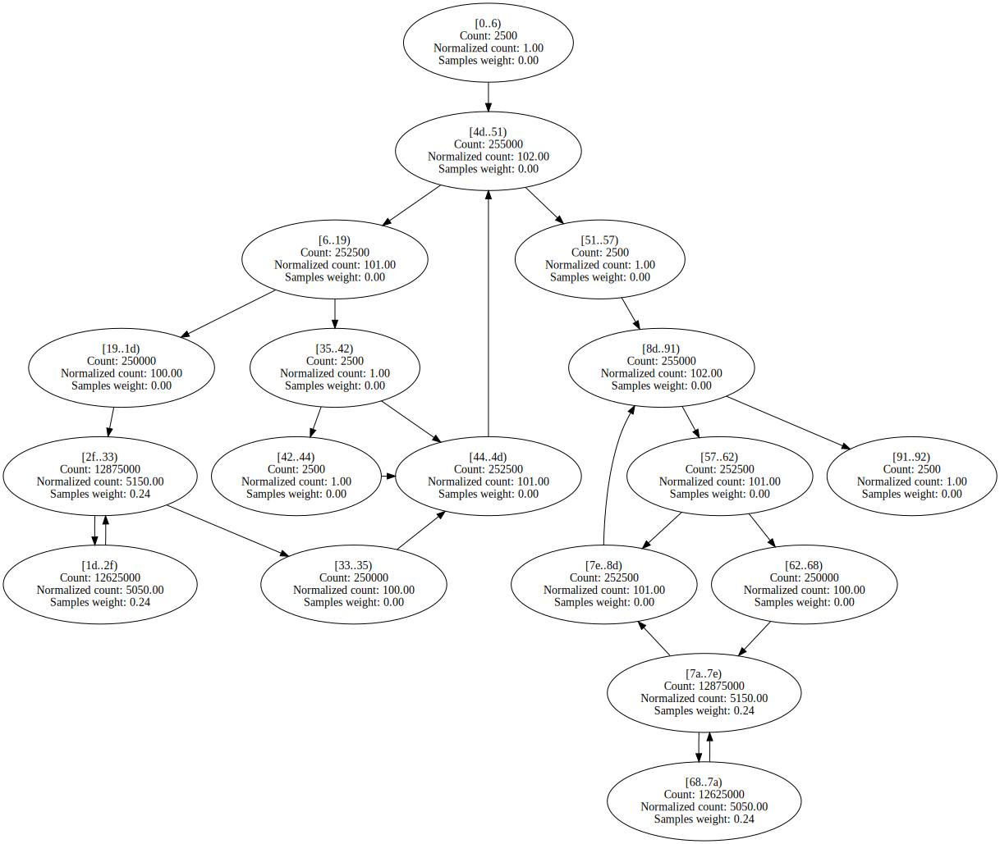
 | 

Expand

Benchstone.BenchI.QuickSort.Test | 91 | 11 | 69 | 55.70% | 72.10% | 

Expand

 | 

Expand

BenchmarksGame.ReverseComplement_6.Reverse | 370 | 28 | 56 | 39.77% | 72.29% | 

Expand

 | 

Expand

BenchmarksGame.MandelBrot_7.GetByte | 224 | 10 | 7485 | 37.27% | 72.64% | 

Expand

 | 

Expand

BenchmarksGame.NBodySystem.Advance | 370 | 7 | 1174 | 41.60% | 72.79% | 

Expand

 | 

Expand

SciMark2.Random.nextDouble | 161 | 11 | 867 | 43.32% | 73.00% | 

Expand

 | 

Expand

Benchmarks.SIMD.RayTracer.RayTracer.GetNaturalColor | 365 | 15 | 60 | 43.27% | 73.35% | 

Expand

 | 

Expand

System.Text.RegularExpressions.RegexInterpreter.Go | 3653 | 181 | 254 | 61.60% | 73.57% | 

Expand

 | 

Expand

EMFloat.DivideInternalFPF | 631 | 37 | 559 | 62.16% | 73.90% | 

Expand

 | 

Expand

BenchmarksGame.TreeNode.CountNodes | 46 | 3 | 279 | 39.93% | 74.57% | 

Expand

 | 

Expand

Benchstone.BenchF.NewtE.Test | 586 | 19 | 172 | 26.21% | 74.60% | 

Expand

 | 

Expand

Benchstone.BenchI.Fib.Fibonacci | 24 | 3 | 623 | 69.94% | 75.00% | 

Expand

 | 

Expand

BenchmarksGame.FannkuchRedux_9.CountFlips | 100 | 7 | 4758 | 60.68% | 75.38% | 

Expand

 | 

Expand
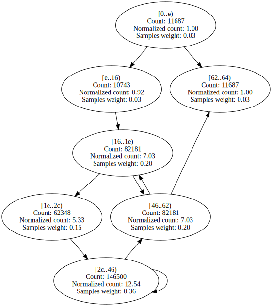

BenchmarksGame.ByteString.Equals | 69 | 8 | 136 | 31.93% | 75.67% | 

Expand

 | 

Expand

SciMark2.FFT.bitreverse | 115 | 8 | 257 | 40.87% | 75.86% | 

Expand

 | 

Expand

Benchstone.BenchF.Romber.Test | 666 | 35 | 251 | 39.74% | 75.95% | 

Expand

 | 

Expand

BenchmarksGame.FannkuchRedux_5.countFlips | 100 | 14 | 3456 | 61.71% | 76.36% | 

Expand

 | 

Expand

Benchstone.BenchI.HeapSort.Test | 76 | 9 | 50 | 49.99% | 76.45% | 

Expand

 | 

Expand

EMFloat.Sub16Bits | 38 | 4 | 327 | 48.32% | 77.50% | 

Expand

 | 

Expand

System.Text.RegularExpressions.RegexInterpreter.Backtrack | 91 | 5 | 96 | 59.96% | 78.01% | 

Expand

 | 

Expand

Benchstone.BenchF.FFT.FastFourierT | 254 | 15 | 185 | 49.61% | 78.27% | 

Expand

 | 

Expand

Benchstone.BenchF.Whetsto.PA | 108 | 3 | 106 | 75.00% | 78.57% | 

Expand

 | 

Expand

EMFloatClass.Sub16Bits | 38 | 4 | 66 | 46.97% | 78.57% | 

Expand

 | 

Expand

BenchmarksGame.Fasta_2.SelectRandom | 62 | 6 | 278 | 56.93% | 79.08% | 

Expand

 | 

Expand

Benchstone.BenchI.TreeSort.CheckTree | 94 | 9 | 58 | 52.06% | 79.42% | 

Expand

 | 

Expand

BenchmarksGame.TreeNode.CreateTree | 36 | 3 | 185 | 56.90% | 79.49% | 

Expand
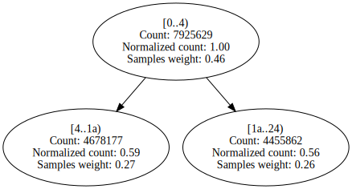
 | 

Expand

Benchstone.BenchI.Permutate.PermuteArray | 75 | 5 | 386 | 69.56% | 80.96% | 

Expand

 | 

Expand

BenchmarksGame.KNucleotide_9.check | 61 | 5 | 158 | 70.28% | 81.86% | 

Expand

 | 

Expand

Benchstone.BenchF.LLoops.Init | 598 | 46 | 1039 | 55.53% | 81.99% | 

Expand

 | 

Expand

EMFloatClass.MultiplyInternalFPF | 592 | 33 | 100 | 57.27% | 82.47% | 

Expand

 | 

Expand

BenchmarksGame.Fasta_1.SelectRandom | 62 | 6 | 201 | 63.88% | 82.49% | 

Expand

 | 

Expand

Benchstone.BenchF.Regula.Inner | 301 | 21 | 422 | 46.00% | 83.15% | 

Expand

 | 

Expand

Benchstone.BenchF.NewtR.Test | 144 | 7 | 96 | 53.12% | 83.41% | 

Expand

 | 

Expand

NumericSortJagged.LoadNumArrayWithRand | 66 | 10 | 50 | 57.99% | 83.54% | 

Expand

 | 

Expand

EMFloat.Add16Bits | 38 | 4 | 474 | 52.11% | 83.68% | 

Expand

 | 

Expand

EMFloatClass.Add16Bits | 38 | 4 | 109 | 50.76% | 83.75% | 

Expand

 | 

Expand

Benchstone.BenchI.BenchE.Strsch | 96 | 12 | 1128 | 38.78% | 84.11% | 

Expand

 | 

Expand

SciMark2.MonteCarlo.integrate | 77 | 6 | 313 | 49.74% | 84.14% | 

Expand

 | 

Expand

SciMark2.FFT.transform_internal | 450 | 17 | 2397 | 40.90% | 84.38% | 

Expand

 | 

Expand

BenchmarksGame.FannkuchRedux_2.fannkuch | 366 | 28 | 1074 | 64.81% | 84.98% | 

Expand
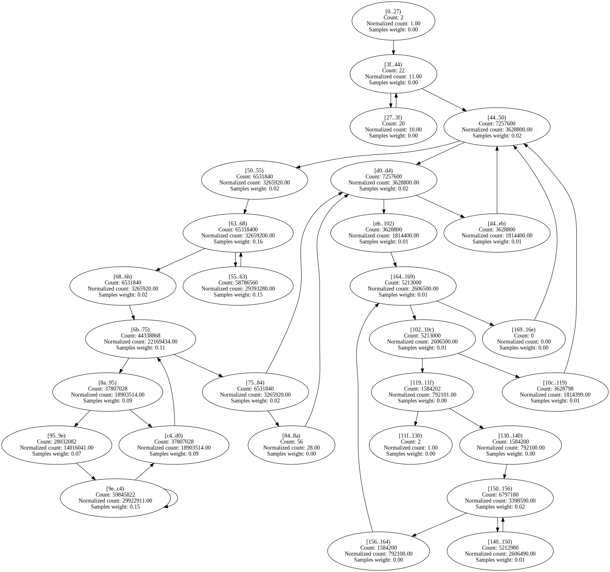
 | 

Expand

Algorithms.VectorFloatRenderer.RenderSingleThreadedNoADT | 485 | 12 | 960 | 96.17% | 85.82% | 

Expand

 | 

Expand

Benchstone.BenchI.TreeSort.Insert | 86 | 9 | 463 | 76.79% | 85.87% | 

Expand

 | 

Expand

Benchstone.BenchI.EightQueens.TryMe | 127 | 11 | 292 | 57.61% | 86.61% | 

Expand

 | 

Expand

NeuralJagged.adjust_out_wts | 115 | 7 | 119 | 40.10% | 86.70% | 

Expand

 | 

Expand

Benchstone.BenchI.BubbleSort2.Inner | 57 | 9 | 1016 | 52.54% | 86.70% | 

Expand

 | 

Expand

LUDecomp.DoLUIteration | 144 | 16 | 79 | 55.83% | 86.90% | 

Expand

 | 

Expand

IDEAEncryption.mul | 47 | 8 | 1809 | 45.00% | 86.92% | 

Expand

 | 

Expand
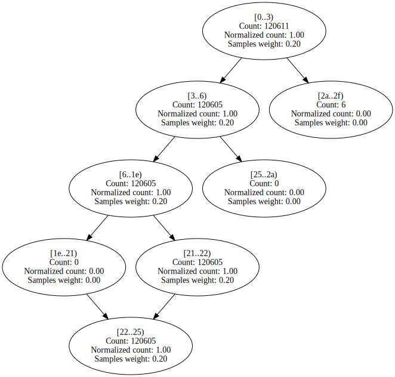

BenchmarksGame.ReverseComplement_1.Reverse | 208 | 22 | 664 | 49.03% | 86.99% | 

Expand

 | 

Expand

AssignJagged.second_assignments | 376 | 65 | 552 | 49.13% | 86.99% | 

Expand

 | 

Expand

Benchstone.BenchI.Puzzle.Trial | 101 | 10 | 76 | 61.22% | 87.62% | 

Expand

 | 

Expand

Algorithms.VectorDoubleRenderer.RenderSingleThreadedWithADT | 440 | 12 | 787 | 96.96% | 87.84% | 

Expand

 | 

Expand

Benchstone.BenchI.Array1.Quick | 89 | 8 | 823 | 80.84% | 88.14% | 

Expand

 | 

Expand

Benchstone.BenchI.Puzzle.Place | 104 | 11 | 186 | 55.41% | 88.37% | 

Expand

 | 

Expand

Benchstone.BenchI.BubbleSort.SortArray | 48 | 7 | 785 | 52.57% | 88.50% | 

Expand

 | 

Expand

Algorithms.VectorDoubleRenderer.RenderSingleThreadedNoADT | 504 | 12 | 1205 | 97.03% | 88.55% | 

Expand

 | 

Expand

EMFloatClass.ShiftMantLeft1 | 47 | 6 | 485 | 61.64% | 88.61% | 

Expand

 | 

Expand

Algorithms.VectorFloatRenderer.RenderSingleThreadedWithADT | 421 | 12 | 479 | 97.41% | 88.62% | 

Expand

 | 

Expand

EMFloat.MultiplyInternalFPF | 584 | 33 | 412 | 59.93% | 88.75% | 

Expand

 | 

Expand

Benchstone.BenchI.LogicArray.Inner | 130 | 17 | 1397 | 86.38% | 88.89% | 

Expand
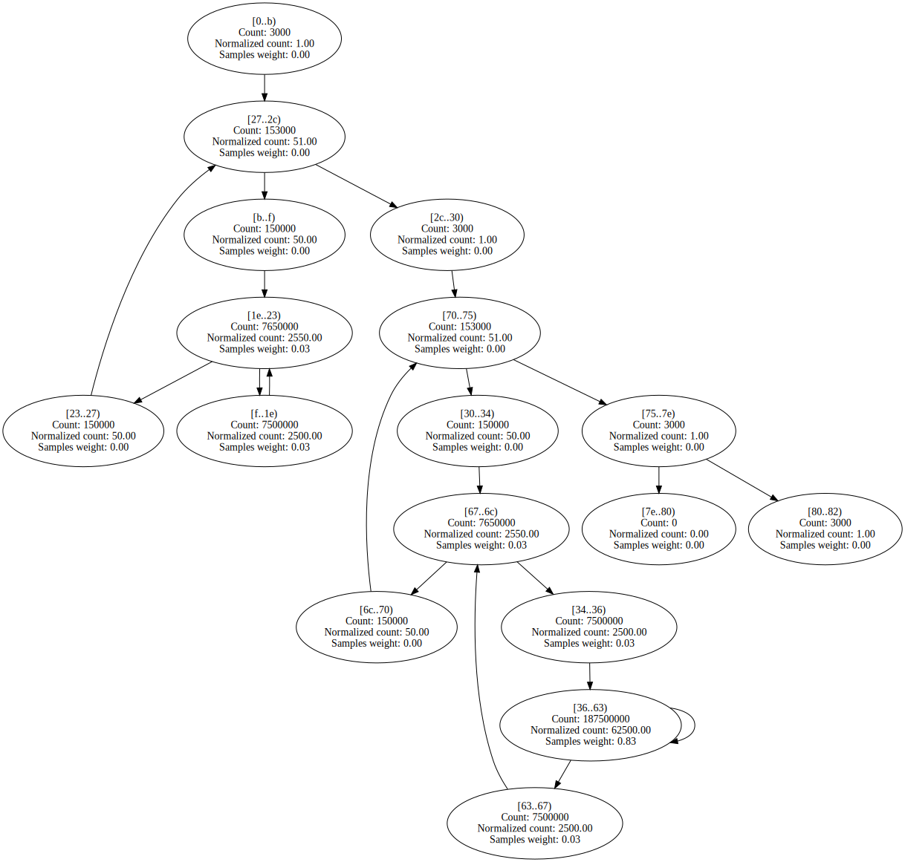
 | 

Expand

Benchstone.BenchI.Array2.Bench | 107 | 13 | 2180 | 49.30% | 88.89% | 

Expand

 | 

Expand

Neural.adjust_out_wts | 116 | 7 | 63 | 45.61% | 89.24% | 

Expand

 | 

Expand

BenchmarksGame.FannkuchRedux_5.nextPermutation | 81 | 7 | 622 | 58.71% | 90.53% | 

Expand

 | 

Expand

EMFloat.ShiftMantLeft1 | 47 | 6 | 2424 | 63.18% | 90.57% | 

Expand

 | 

Expand

AssignJagged.first_assignments | 421 | 65 | 1590 | 45.78% | 90.83% | 

Expand

 | 

Expand

EMFloat.ShiftMantRight1 | 47 | 6 | 2039 | 62.71% | 91.05% | 

Expand

 | 

Expand

NumericSortJagged.NumSift | 63 | 9 | 2255 | 74.33% | 91.16% | 

Expand

 | 

Expand

System.Text.RegularExpressions.RegexInterpreter.FindFirstChar | 1628 | 109 | 84 | 61.36% | 91.21% | 

Expand

 | 

Expand

SciMark2.LU.factor | 282 | 24 | 1885 | 58.58% | 91.23% | 

Expand

 | 

Expand

EMFloatClass.ShiftMantRight1 | 47 | 6 | 416 | 62.69% | 91.24% | 

Expand

 | 

Expand

BenchmarksGame.FannkuchRedux_9.NextPermutation | 95 | 7 | 946 | 59.40% | 91.73% | 

Expand

 | 

Expand

BenchmarksGame.FannkuchRedux_9.Run | 174 | 12 | 222 | 58.11% | 91.75% | 

Expand

 | 

Expand

Benchstone.BenchF.Bisect.Inner | 122 | 10 | 770 | 59.63% | 91.87% | 

Expand

 | 

Expand

StringSort.strsift | 75 | 9 | 655 | 74.27% | 91.94% | 

Expand

 | 

Expand

Benchstone.BenchI.AddArray.Test | 231 | 7 | 583 | 53.25% | 92.19% | 

Expand

 | 

Expand

BenchmarksGame.Fasta_1.SelectNucleotides | 114 | 9 | 119 | 58.93% | 92.42% | 

Expand

 | 

Expand

Benchstone.BenchI.Puzzle.Fit | 47 | 7 | 641 | 58.24% | 92.50% | 

Expand

 | 

Expand

SeekUnroll.FindByte | 70 | 5 | 33853 | 77.40% | 92.53% | 

Expand
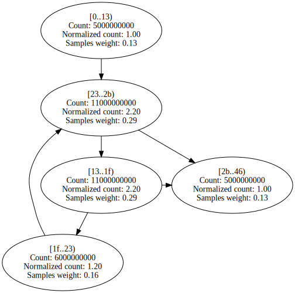
 | 

Expand

NumericSortRect.NumSift | 103 | 9 | 864 | 72.54% | 92.82% | 

Expand

 | 

Expand

Benchstone.BenchF.Adams.Bench | 419 | 7 | 63 | 46.79% | 92.89% | 

Expand

 | 

Expand

Benchstone.BenchI.TreeInsert.BenchInner | 282 | 9 | 917 | 61.28% | 92.89% | 

Expand

 | 

Expand

Benchstone.BenchI.Array1.Test | 95 | 9 | 73 | 68.85% | 93.20% | 

Expand

 | 

Expand

Benchstone.BenchF.DMath.Power | 43 | 4 | 901 | 90.75% | 93.20% | 

Expand

 | 

Expand

Neural.move_wt_changes | 155 | 13 | 139 | 58.36% | 93.25% | 

Expand

 | 

Expand

Benchstone.BenchI.MulMatrix.Inner | 435 | 61 | 1022 | 56.03% | 93.32% | 

Expand

 | 

Expand

BenchmarksGame.FannkuchRedux_9.Copy | 63 | 7 | 565 | 55.51% | 93.42% | 

Expand

 | 

Expand

SciMark2.SparseCompRow.matmult | 87 | 10 | 1916 | 58.98% | 93.45% | 

Expand

 | 

Expand

Benchstone.BenchF.Simpsn.Test | 310 | 11 | 50 | 41.22% | 93.51% | 

Expand

 | 

Expand

Benchstone.BenchF.MatInv4.MProd | 107 | 10 | 73 | 49.99% | 93.81% | 

Expand

 | 

Expand

BenchmarksGame.Fasta_2.MakeRandomFasta | 221 | 14 | 102 | 53.35% | 93.95% | 

Expand

 | 

Expand
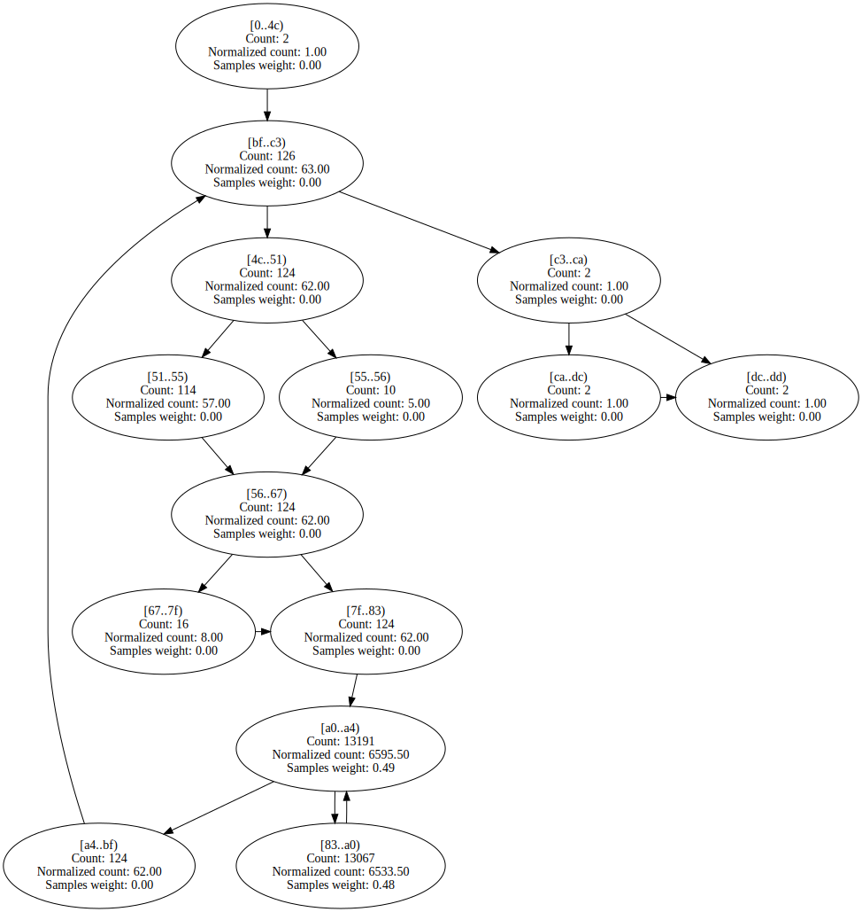

Benchstone.BenchI.HeapSort.Inner | 123 | 17 | 875 | 68.50% | 93.96% | 

Expand

 | 

Expand

Benchstone.BenchI.Puzzle.RemoveLocal | 75 | 6 | 167 | 52.34% | 94.31% | 

Expand

 | 

Expand

LUDecomp.ludcmp | 481 | 42 | 2913 | 56.20% | 94.47% | 

Expand

 | 

Expand

Benchstone.BenchI.CSieve.Test | 120 | 15 | 1008 | 57.70% | 94.60% | 

Expand

 | 

Expand

Benchstone.BenchF.DMath.Bench | 215 | 9 | 665 | 85.49% | 95.42% | 

Expand

 | 

Expand

BenchmarksGame.FannkuchRedux_5.run | 114 | 5 | 138 | 62.94% | 95.87% | 

Expand

 | 

Expand

NeuralJagged.do_mid_forward | 101 | 7 | 200 | 57.90% | 95.99% | 

Expand

 | 

Expand

Benchstone.BenchF.Lorenz.Test | 597 | 8 | 352 | 50.00% | 96.14% | 

Expand

 | 

Expand

NeuralJagged.adjust_mid_wts | 120 | 7 | 534 | 48.00% | 96.27% | 

Expand

 | 

Expand

Benchstone.BenchF.Secant.Inner | 105 | 9 | 231 | 44.94% | 96.37% | 

Expand

 | 

Expand

BenchmarksGame.Mandelbrot_2.DoBench | 323 | 19 | 2464 | 53.39% | 96.47% | 

Expand

 | 

Expand
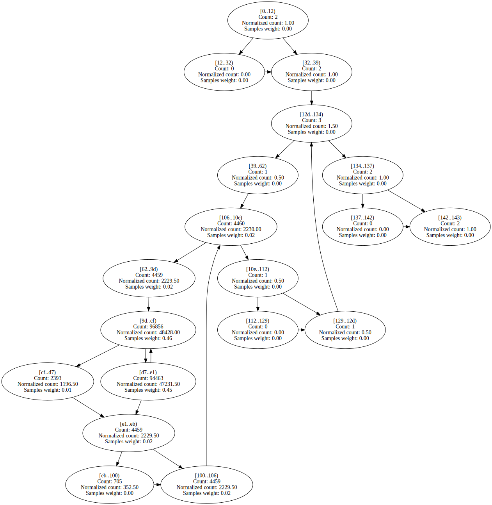

Neural.do_mid_forward | 107 | 7 | 107 | 65.23% | 96.64% | 

Expand

 | 

Expand

NeuralJagged.move_wt_changes | 137 | 13 | 377 | 52.73% | 97.03% | 

Expand

 | 

Expand
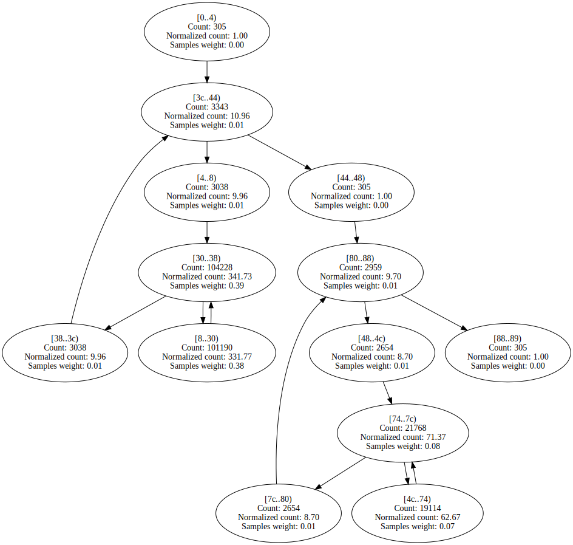

BenchmarksGame.KNucleotide.KFrequency | 91 | 7 | 80 | 53.75% | 97.19% | 

Expand

 | 

Expand

System.Numerics.BigIntegerCalculator.Add | 97 | 7 | 144 | 60.94% | 97.27% | 

Expand

 | 

Expand

Benchstone.BenchF.NewtR.Inner | 77 | 7 | 193 | 61.27% | 97.50% | 

Expand

 | 

Expand

Benchstone.BenchF.InProd.Test | 158 | 12 | 1618 | 55.52% | 97.66% | 

Expand

 | 

Expand

Benchstone.BenchI.XposMatrix.Test | 69 | 11 | 242 | 64.37% | 97.70% | 

Expand

 | 

Expand

SciMark2.FFT.inverse | 53 | 4 | 92 | 59.75% | 97.72% | 

Expand

 | 

Expand
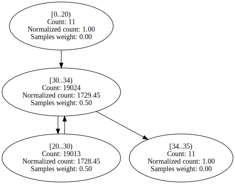

BenchmarksGame.Approximate.MultiplyAv | 66 | 7 | 212 | 55.48% | 97.73% | 

Expand

 | 

Expand

System.Numerics.BigIntegerCalculator.SubtractDivisor | 71 | 6 | 450 | 72.49% | 97.81% | 

Expand

 | 

Expand

BenchmarksGame.SpectralNorm_1.MultiplyAv | 60 | 7 | 160 | 56.51% | 98.22% | 

Expand

 | 

Expand

BenchmarksGame.SpectralNorm_1.MultiplyAtv | 60 | 7 | 164 | 54.38% | 98.32% | 

Expand

 | 

Expand

System.Numerics.BigIntegerCalculator.Add | 69 | 4 | 257 | 59.68% | 98.47% | 

Expand

 | 

Expand

System.Numerics.BigIntegerCalculator.Subtract | 87 | 7 | 122 | 58.10% | 98.51% | 

Expand

 | 

Expand

Benchstone.BenchF.SqMtx.Inner | 73 | 10 | 1544 | 54.70% | 98.60% | 

Expand

 | 

Expand

Benchstone.BenchI.IniArray.Test | 44 | 7 | 1021 | 61.91% | 98.65% | 

Expand

 | 

Expand

SciMark2.SOR.execute | 155 | 10 | 1303 | 52.83% | 98.65% | 

Expand

 | 

Expand

Benchstone.BenchI.Pi.ComputePi | 200 | 10 | 999 | 53.99% | 98.70% | 

Expand

 | 

Expand

BenchmarksGame.Approximate.MultiplyAtv | 66 | 7 | 244 | 56.07% | 98.73% | 

Expand

 | 

Expand

Benchstone.BenchI.AddArray2.BenchInner1 | 75 | 10 | 462 | 56.64% | 98.98% | 

Expand

 | 

Expand

BenchmarksGame.Fasta_1.FillRandom | 51 | 4 | 223 | 53.11% | 99.13% | 

Expand

 | 

Expand

Benchstone.BenchI.AddArray2.BenchInner2 | 75 | 10 | 544 | 53.06% | 99.13% | 

Expand

 | 

Expand
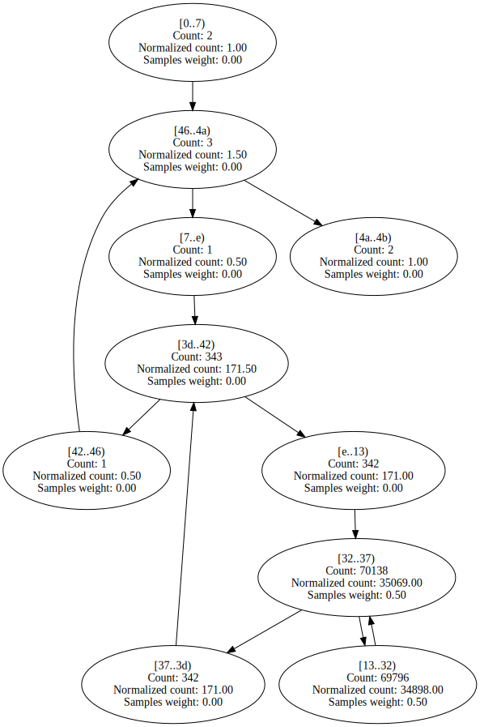

Neural.adjust_mid_wts | 124 | 7 | 255 | 53.50% | 99.19% | 

Expand

 | 

Expand

Benchstone.BenchI.Midpoint.Test | 195 | 10 | 784 | 54.82% | 99.21% | 

Expand

 | 

Expand

Burgers.GetCalculated0 | 288 | 7 | 593 | 53.19% | 99.24% | 

Expand

 | 

Expand

Burgers.GetCalculated1 | 282 | 7 | 626 | 55.26% | 99.26% | 

Expand

 | 

Expand

IDEAEncryption.cipher_idea | 396 | 3 | 992 | 92.62% | 99.27% | 

Expand

 | 

Expand

Algorithms.ScalarFloatRenderer.RenderSingleThreadedWithADT | 142 | 11 | 1213 | 50.14% | 99.30% | 

Expand

 | 

Expand

Algorithms.ScalarDoubleRenderer.RenderSingleThreadedWithADT | 183 | 11 | 1519 | 50.06% | 99.48% | 

Expand

 | 

Expand

System.Numerics.BigIntegerCalculator.Multiply | 55 | 4 | 607 | 61.43% | 99.49% | 

Expand

 | 

Expand

Benchstone.BenchF.DMath.Fact | 43 | 4 | 912 | 80.69% | 99.66% | 

Expand

 | 

Expand

Burgers.GetCalculated2 | 258 | 7 | 1346 | 54.52% | 99.67% | 

Expand

 | 

Expand

Algorithms.ScalarDoubleRenderer.RenderSingleThreadedNoADT | 206 | 11 | 1671 | 49.96% | 99.70% | 

Expand

 | 

Expand

Algorithms.ScalarFloatRenderer.RenderSingleThreadedNoADT | 156 | 11 | 1729 | 49.96% | 99.71% | 

Expand

 | 

Expand

Burgers.GetCalculated3 | 353 | 7 | 1357 | 53.00% | 99.72% | 

Expand

 | 

Expand

Benchstone.BenchF.InProd.InnerProduct | 45 | 4 | 1750 | 54.64% | 99.98% | 

Expand

 | 

Expand

ByteMark.randnum | 80 | 3 | 58 | 50.00% | 99.99% | 

Expand

 | 

Expand

Benchstone.BenchI.NDhrystone.Proc1 | 191 | 3 | 140 | 89.29% | 100.00% | 

Expand

 | 

Expand

