Method | IL size | # BBs | # Samples | Raw overlap | Smoothed overlap | Instrumented graph | Smoothed graph
--- | --- | --- | --- | --- | --- | --- | ---
PgoBench.Program.Main | 1303 | 71 | 122 | 89.87% | 65.08% | 

Expand

 | 

Expand

Benchstone.BenchF.MatInv4.Test | 340 | 22 | 208 | 67.71% | 66.21% | 

Expand

 | 

Expand

Benchstone.BenchF.LLoops.Main1 | 4385 | 111 | 117221 | 71.48% | 71.22% | 

Expand

 | 

Expand

EMFloatClass.AddSubInternalFPF | 804 | 39 | 1596 | 81.93% | 72.77% | 

Expand

 | 

Expand

EMFloatClass.DivideInternalFPF | 633 | 37 | 41751 | 83.40% | 74.81% | 

Expand

 | 

Expand

EMFloat.DivideInternalFPF | 631 | 37 | 210744 | 83.63% | 75.26% | 

Expand

 | 

Expand

EMFloat.AddSubInternalFPF | 800 | 39 | 7937 | 85.65% | 76.12% | 

Expand

 | 

Expand

Benchstone.BenchF.DMath.Bench | 215 | 9 | 73237 | 77.10% | 77.35% | 

Expand

 | 

Expand

Utility.sscanf | 383 | 25 | 152 | 81.17% | 77.70% | 

Expand

 | 

Expand

EMFloatClass.MultiplyInternalFPF | 592 | 33 | 28532 | 82.79% | 78.42% | 

Expand

 | 

Expand

IDEAEncryption.Run | 346 | 19 | 219 | 75.61% | 78.89% | 

Expand

 | 

Expand
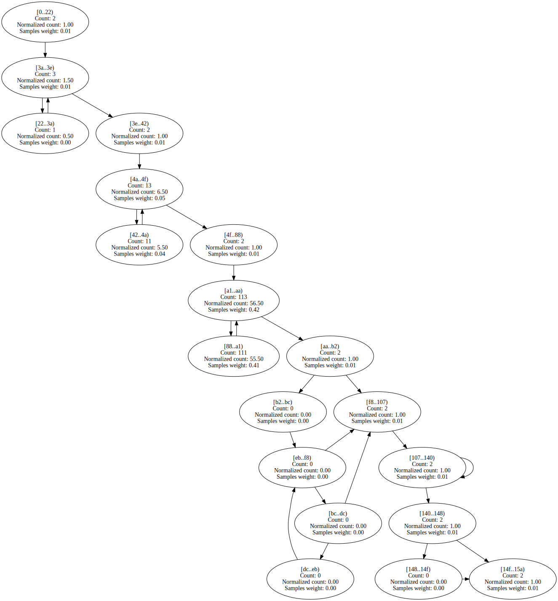

EMFloat.MultiplyInternalFPF | 584 | 33 | 143647 | 83.74% | 79.68% | 

Expand

 | 

Expand

EMFloat.Sub16Bits | 38 | 4 | 52991 | 66.67% | 81.90% | 

Expand

 | 

Expand

EMFloatClass.Sub16Bits | 38 | 4 | 10148 | 66.67% | 81.93% | 

Expand

 | 

Expand

BenchmarksGame.TreeNode.CreateTree | 36 | 3 | 28116 | 66.70% | 82.17% | 

Expand

 | 

Expand

Benchstone.BenchF.FFT.FastFourierT | 254 | 15 | 22763 | 83.60% | 82.45% | 

Expand

 | 

Expand

BenchmarksGame.MandelBrot_7.GetByte | 224 | 10 | 289367 | 81.88% | 82.54% | 

Expand

 | 

Expand

EMFloatClass.Add16Bits | 38 | 4 | 12160 | 66.67% | 83.09% | 

Expand

 | 

Expand

EMFloat.Add16Bits | 38 | 4 | 64001 | 66.67% | 83.17% | 

Expand

 | 

Expand

System.Text.ASCIIUtility.NarrowUtf16ToAscii | 530 | 31 | 124 | 83.17% | 83.79% | 

Expand

 | 

Expand

BenchmarksGame.FannkuchRedux_5.countFlips | 100 | 14 | 870788 | 84.17% | 84.11% | 

Expand

 | 

Expand

BenchmarksGame.NBodySystem.Advance | 370 | 7 | 58059 | 75.97% | 84.15% | 

Expand

 | 

Expand

BenchmarksGame.FannkuchRedux_9.CountFlips | 100 | 7 | 402102 | 84.29% | 84.65% | 

Expand

 | 

Expand

IDEAEncryption.mul | 47 | 8 | 222429 | 60.00% | 84.93% | 

Expand

 | 

Expand

EMFloat.LongToInternalFPF | 129 | 9 | 471 | 93.90% | 85.43% | 

Expand

 | 

Expand

Benchstone.BenchI.BubbleSort.Test | 81 | 10 | 2532 | 76.74% | 85.53% | 

Expand

 | 

Expand
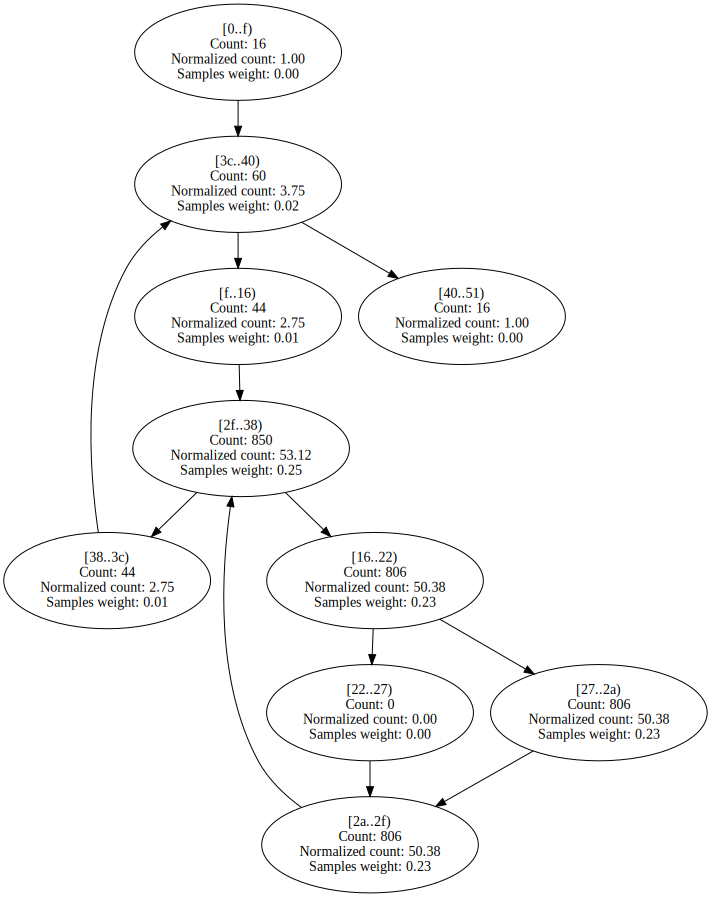

Benchstone.BenchI.Ackermann.Acker | 38 | 5 | 59591 | 77.21% | 86.54% | 

Expand

 | 

Expand

BenchmarksGame.TreeNode.CountNodes | 46 | 3 | 24498 | 75.20% | 86.98% | 

Expand

 | 

Expand

NumericSortJagged.NumHeapSort | 57 | 7 | 60669 | 80.50% | 87.18% | 

Expand

 | 

Expand

Benchstone.BenchF.LLoops.Init | 598 | 46 | 676789 | 87.64% | 87.36% | 

Expand

 | 

Expand

BenchmarksGame.KNucleotide_1.Bench | 267 | 16 | 86 | 89.52% | 87.44% | 

Expand

 | 

Expand

EMFloatClass.LongToInternalFPF | 129 | 9 | 113 | 95.64% | 87.94% | 

Expand

 | 

Expand

EMFloat.Run | 300 | 16 | 66 | 74.18% | 88.05% | 

Expand

 | 

Expand

LUDecomp.build_problem | 194 | 21 | 1906 | 86.87% | 88.56% | 

Expand

 | 

Expand

Benchstone.BenchI.Fib.Fibonacci | 24 | 3 | 157593 | 74.90% | 88.58% | 

Expand

 | 

Expand
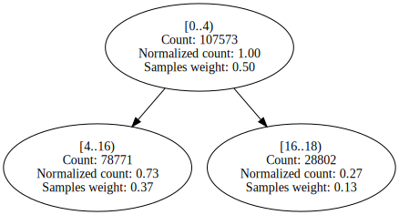

AssignRect.LoadAssign | 55 | 7 | 55 | 83.21% | 89.93% | 

Expand

 | 

Expand

EMFloatClass.RoundInternalFPF | 85 | 6 | 529 | 86.44% | 90.00% | 

Expand

 | 

Expand
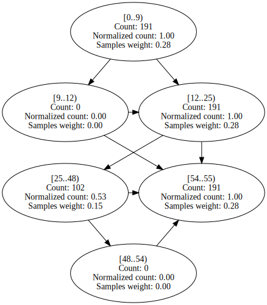

EMFloat.StickyShiftRightMant | 93 | 12 | 2781 | 90.03% | 90.12% | 

Expand

 | 

Expand

NeuralJagged.do_out_forward | 99 | 7 | 19104 | 94.12% | 90.78% | 

Expand

 | 

Expand

SciMark2.MonteCarlo.integrate | 77 | 6 | 65047 | 84.78% | 90.96% | 

Expand

 | 

Expand

AssignJagged.calc_minimum_costs | 156 | 24 | 2536 | 91.05% | 91.53% | 

Expand

 | 

Expand

NeuralJagged.check_out_error | 91 | 10 | 585 | 96.16% | 91.76% | 

Expand

 | 

Expand

EMFloat.normalize | 46 | 4 | 2519 | 79.40% | 91.83% | 

Expand

 | 

Expand

BenchmarksGame.KNucleotide_9.check | 61 | 5 | 57180 | 94.63% | 91.85% | 

Expand

 | 

Expand

EMFloat.RoundInternalFPF | 85 | 6 | 2646 | 87.09% | 91.95% | 

Expand

 | 

Expand

ByteMark.abs_randwc | 17 | 3 | 5950 | 84.88% | 92.01% | 

Expand

 | 

Expand

Benchstone.BenchI.EightQueens.TryMe | 127 | 11 | 124670 | 95.65% | 92.27% | 

Expand

 | 

Expand

BenchmarksGame.KNucleotide_9.checkEnding | 79 | 8 | 101891 | 91.85% | 92.40% | 

Expand

 | 

Expand

NeuralJagged.worst_pass_error | 84 | 6 | 397 | 93.59% | 92.44% | 

Expand

 | 

Expand

NumericSortRect.NumSift | 103 | 9 | 281193 | 88.38% | 92.63% | 

Expand

 | 

Expand

Neural.check_out_error | 91 | 10 | 293 | 96.29% | 92.81% | 

Expand

 | 

Expand

StringSort.LoadStringArray | 131 | 13 | 12690 | 87.29% | 92.86% | 

Expand

 | 

Expand

Neural.do_out_error | 132 | 9 | 2639 | 95.65% | 93.13% | 

Expand

 | 

Expand

Benchstone.BenchI.Array1.Test | 95 | 9 | 6057 | 84.84% | 93.34% | 

Expand

 | 

Expand

LUDecomp.Run | 478 | 34 | 358 | 91.45% | 93.34% | 

Expand

 | 

Expand

NumericSortRect.NumHeapSort | 79 | 7 | 14536 | 78.90% | 93.49% | 

Expand

 | 

Expand

EMFloatClass.StickyShiftRightMant | 93 | 12 | 560 | 86.82% | 93.52% | 

Expand

 | 

Expand

BenchmarksGame.Fasta_2.SelectRandom | 62 | 6 | 51717 | 96.84% | 93.91% | 

Expand

 | 

Expand

EMFloatClass.normalize | 49 | 4 | 542 | 81.64% | 93.94% | 

Expand

 | 

Expand

Benchstone.BenchI.Array1.Quick | 89 | 8 | 87736 | 95.45% | 94.04% | 

Expand

 | 

Expand

NeuralJagged.DoNNetIteration | 154 | 9 | 1089 | 70.58% | 94.23% | 

Expand

 | 

Expand
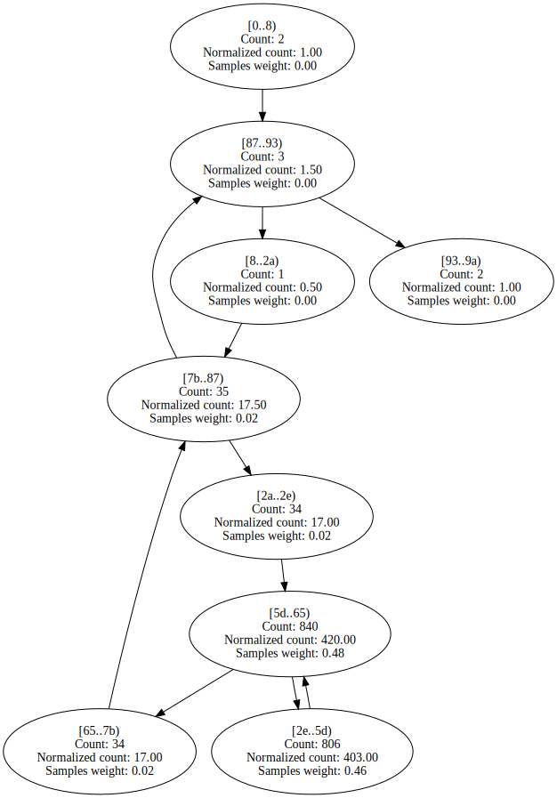

Benchstone.BenchI.BubbleSort.SortArray | 48 | 7 | 435755 | 94.45% | 94.58% | 

Expand

 | 

Expand

SciMark2.FFT.transform_internal | 450 | 17 | 887090 | 94.18% | 94.70% | 

Expand

 | 

Expand

Benchstone.BenchI.HeapSort.Inner | 123 | 17 | 362456 | 94.72% | 94.72% | 

Expand

 | 

Expand

ByteMark.BenchBitOps | 37 | 4 | 51 | 81.37% | 94.74% | 

Expand

 | 

Expand

LUDecomp.ludcmp | 481 | 42 | 2098100 | 94.53% | 94.84% | 

Expand

 | 

Expand

SciMark2.FFT.log2 | 52 | 6 | 641 | 96.16% | 94.88% | 

Expand

 | 

Expand
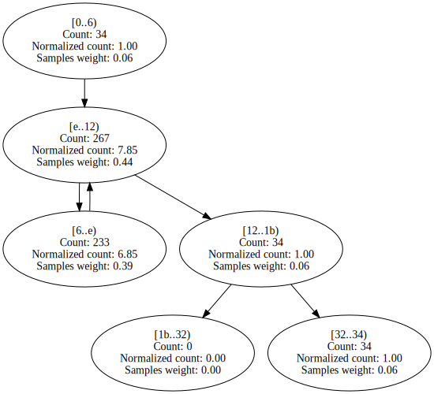

AssignJagged.second_assignments | 376 | 65 | 403997 | 94.72% | 94.92% | 

Expand

 | 

Expand

Benchstone.BenchI.Array1.VerifySort | 30 | 6 | 69 | 97.07% | 95.03% | 

Expand

 | 

Expand

Neural.do_out_forward | 102 | 7 | 10633 | 93.04% | 95.15% | 

Expand

 | 

Expand

Neural.do_mid_error | 100 | 7 | 10436 | 91.99% | 95.16% | 

Expand

 | 

Expand

BenchmarksGame.BinaryTrees_2.Bench | 206 | 13 | 193 | 73.82% | 95.49% | 

Expand

 | 

Expand

Neural.adjust_out_wts | 116 | 7 | 12272 | 89.19% | 95.62% | 

Expand

 | 

Expand

BenchmarksGame.Fasta_1.SelectNucleotides | 114 | 9 | 13968 | 89.63% | 95.67% | 

Expand

 | 

Expand

Benchstone.BenchF.MatInv4.MinV2 | 723 | 52 | 18383 | 88.96% | 95.96% | 

Expand

 | 

Expand

Benchstone.BenchF.Adams.Bench | 419 | 7 | 2995 | 85.05% | 95.98% | 

Expand

 | 

Expand

BenchmarksGame.ByteString.GetHashCode | 132 | 10 | 37873 | 97.04% | 96.08% | 

Expand

 | 

Expand

StringSort.StrHeapSort | 57 | 7 | 9356 | 79.94% | 96.16% | 

Expand

 | 

Expand

Benchstone.BenchI.HeapSort.Test | 76 | 9 | 9036 | 95.16% | 96.17% | 

Expand
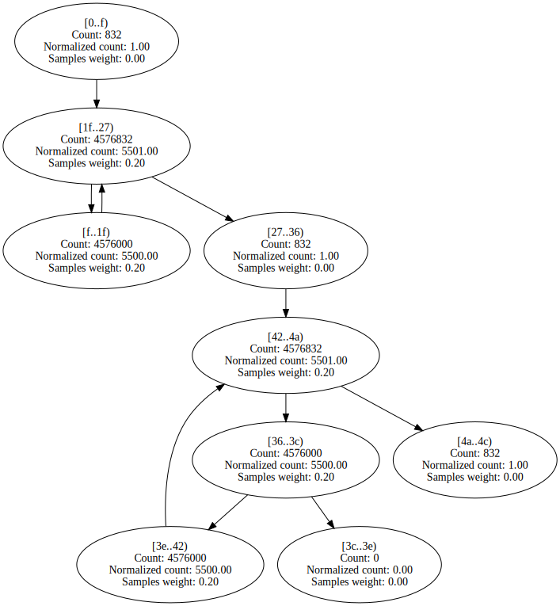
 | 

Expand

StringSort.strsift | 75 | 9 | 197898 | 86.69% | 96.23% | 

Expand

 | 

Expand

IDEAEncryption.DoIDEAIteration | 128 | 15 | 6404 | 81.26% | 96.26% | 

Expand

 | 

Expand

Benchstone.BenchI.Midpoint.Inner | 60 | 12 | 348596 | 96.86% | 96.32% | 

Expand

 | 

Expand

Neural.worst_pass_error | 84 | 6 | 219 | 96.98% | 96.34% | 

Expand

 | 

Expand

AssignJagged.first_assignments | 421 | 65 | 964119 | 96.08% | 96.36% | 

Expand

 | 

Expand
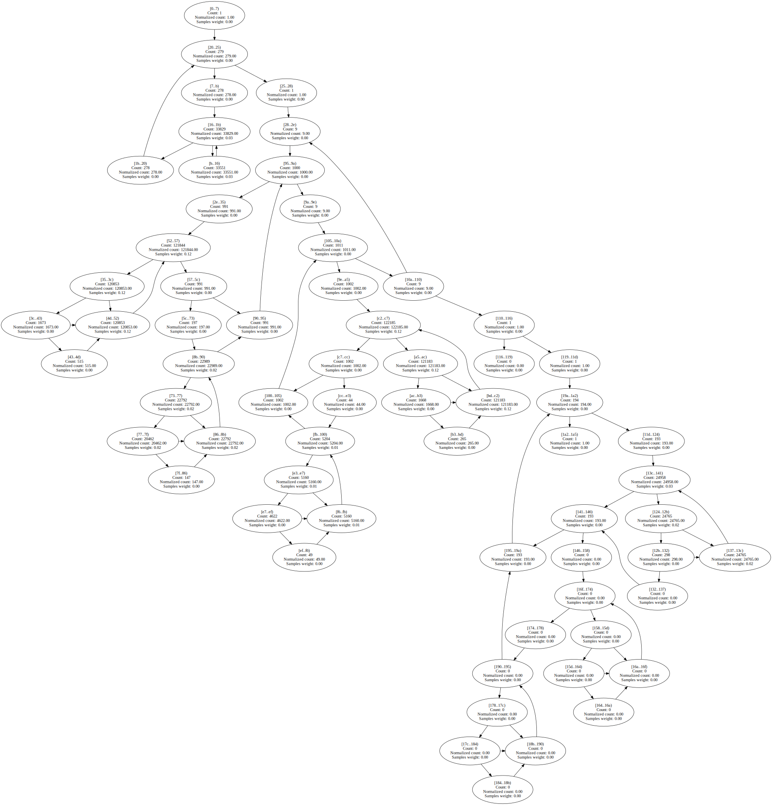

Neural.DoNNetIteration | 154 | 9 | 242 | 67.31% | 96.46% | 

Expand

 | 

Expand

IDEAEncryption.cipher_idea | 396 | 3 | 61510 | 91.24% | 96.52% | 

Expand

 | 

Expand

BenchmarksGame.FannkuchRedux_9.NextPermutation | 95 | 7 | 98298 | 97.28% | 96.73% | 

Expand

 | 

Expand

BitOps.Run | 187 | 10 | 194 | 76.63% | 96.73% | 

Expand

 | 

Expand

Benchstone.BenchF.MatInv4.CompM | 76 | 9 | 102 | 73.81% | 96.78% | 

Expand

 | 

Expand
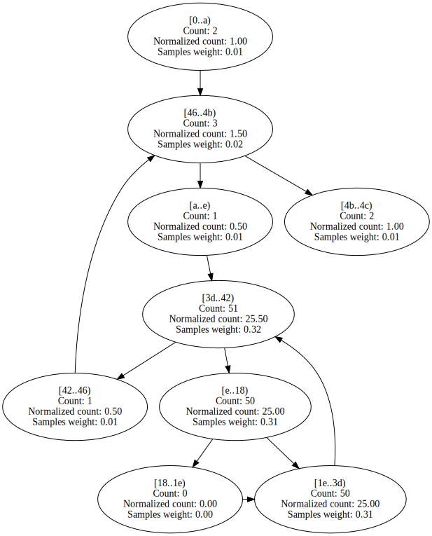

Benchstone.BenchI.CSieve.Test | 120 | 15 | 202124 | 96.55% | 96.90% | 

Expand

 | 

Expand

Benchstone.BenchF.Bisect.Inner | 122 | 10 | 119679 | 91.64% | 96.92% | 

Expand

 | 

Expand

NeuralJagged.move_wt_changes | 137 | 13 | 264688 | 96.46% | 96.97% | 

Expand

 | 

Expand

EMFloatClass.DoEmFloatIteration | 151 | 12 | 546 | 90.28% | 96.98% | 

Expand

 | 

Expand

Benchstone.BenchF.FFT.Test | 122 | 7 | 10988 | 74.67% | 97.00% | 

Expand

 | 

Expand

EMFloat.DoEmFloatIteration | 211 | 12 | 2516 | 85.50% | 97.01% | 

Expand

 | 

Expand

BenchmarksGame.FannkuchRedux_5.nextPermutation | 81 | 7 | 89612 | 96.47% | 97.03% | 

Expand

 | 

Expand

Neural.move_wt_changes | 155 | 13 | 57729 | 88.37% | 97.12% | 

Expand

 | 

Expand

Benchstone.BenchI.LogicArray.Inner | 130 | 17 | 253102 | 97.15% | 97.17% | 

Expand

 | 

Expand

Benchstone.BenchI.AddArray.Test | 231 | 7 | 137423 | 97.26% | 97.26% | 

Expand

 | 

Expand

Benchstone.BenchI.BubbleSort2.Inner | 57 | 9 | 503702 | 97.25% | 97.32% | 

Expand

 | 

Expand

EMFloat.SetupCPUEmFloatArrays | 116 | 4 | 86 | 58.11% | 97.59% | 

Expand

 | 

Expand

BenchmarksGame.Fasta_1.SelectRandom | 62 | 6 | 35400 | 97.79% | 97.69% | 

Expand

 | 

Expand

Benchstone.BenchF.Bisect.Test | 238 | 13 | 1172 | 88.66% | 97.70% | 

Expand

 | 

Expand

Neural.adjust_mid_wts | 124 | 7 | 48286 | 85.17% | 97.79% | 

Expand

 | 

Expand

Benchstone.BenchF.DMath.Power | 43 | 4 | 345317 | 98.75% | 97.79% | 

Expand

 | 

Expand

BenchmarksGame.FannkuchRedux_9.Run | 174 | 12 | 64332 | 88.11% | 97.85% | 

Expand

 | 

Expand

AssignRect.second_assignments | 389 | 65 | 299317 | 93.78% | 97.87% | 

Expand

 | 

Expand

EMFloatClass.ShiftMantRight1 | 47 | 6 | 125858 | 98.40% | 97.95% | 

Expand

 | 

Expand

EMFloat.ShiftMantRight1 | 47 | 6 | 624315 | 98.38% | 97.97% | 

Expand

 | 

Expand

Benchstone.BenchI.BenchE.Strsch | 96 | 12 | 732808 | 96.39% | 98.11% | 

Expand

 | 

Expand

EMFloat.memmove | 65 | 4 | 10192 | 98.06% | 98.11% | 

Expand

 | 

Expand

AssignRect.calc_minimum_costs | 166 | 24 | 1643 | 93.69% | 98.18% | 

Expand

 | 

Expand

NumericSortJagged.NumSift | 63 | 9 | 1217431 | 97.37% | 98.18% | 

Expand

 | 

Expand

Benchstone.BenchF.MatInv4.MinV1 | 711 | 51 | 14728 | 89.81% | 98.24% | 

Expand

 | 

Expand

BenchmarksGame.ByteString.Equals | 69 | 8 | 71883 | 96.57% | 98.26% | 

Expand

 | 

Expand

BenchmarksGame.NBody_3.Bench | 139 | 13 | 426 | 83.10% | 98.28% | 

Expand

 | 

Expand

Benchstone.BenchI.Array2.Bench | 107 | 13 | 1653327 | 98.88% | 98.39% | 

Expand

 | 

Expand

Benchstone.BenchI.IniArray.Test | 44 | 7 | 320423 | 98.53% | 98.47% | 

Expand

 | 

Expand

NeuralJagged.do_mid_error | 97 | 7 | 34164 | 98.10% | 98.53% | 

Expand

 | 

Expand

BenchmarksGame.Fasta_2.MakeRandomFasta | 221 | 14 | 22032 | 86.92% | 98.56% | 

Expand

 | 

Expand

AssignRect.first_assignments | 478 | 65 | 697015 | 94.18% | 98.57% | 

Expand

 | 

Expand

EMFloatClass.memmove | 65 | 4 | 2283 | 98.61% | 98.58% | 

Expand

 | 

Expand

BenchmarksGame.FannkuchRedux_2.fannkuch | 366 | 28 | 341534 | 97.84% | 98.60% | 

Expand

 | 

Expand

NeuralJagged.do_out_error | 129 | 9 | 6095 | 98.47% | 98.60% | 

Expand

 | 

Expand

Benchstone.BenchI.EightQueens.Test | 79 | 11 | 4560 | 98.06% | 98.66% | 

Expand

 | 

Expand

NeuralJagged.do_mid_forward | 101 | 7 | 137614 | 99.31% | 98.72% | 

Expand

 | 

Expand

EMFloatClass.ShiftMantLeft1 | 47 | 6 | 181432 | 98.86% | 98.79% | 

Expand

 | 

Expand

Benchstone.BenchI.MulMatrix.Inner | 435 | 61 | 818841 | 98.69% | 98.81% | 

Expand

 | 

Expand

Benchstone.BenchF.DMath.Fact | 43 | 4 | 211109 | 99.31% | 98.84% | 

Expand

 | 

Expand

BenchmarksGame.FannkuchRedux_9.Copy | 63 | 7 | 179358 | 98.96% | 98.84% | 

Expand

 | 

Expand

EMFloat.ShiftMantLeft1 | 47 | 6 | 901017 | 98.85% | 98.86% | 

Expand

 | 

Expand

Benchstone.BenchI.AddArray2.Bench | 62 | 7 | 630 | 99.79% | 98.86% | 

Expand

 | 

Expand

NeuralJagged.adjust_out_wts | 115 | 7 | 64571 | 99.18% | 98.95% | 

Expand

 | 

Expand

AssignRect.CopyToAssign | 45 | 7 | 388 | 89.49% | 99.02% | 

Expand

 | 

Expand

Benchstone.BenchF.InProd.InitMatrix | 52 | 7 | 652 | 92.96% | 99.02% | 

Expand

 | 

Expand

SciMark2.SparseCompRow.matmult | 87 | 10 | 1173681 | 99.01% | 99.03% | 

Expand

 | 

Expand

BenchmarksGame.Mandelbrot_2.DoBench | 323 | 19 | 201095 | 97.20% | 99.07% | 

Expand

 | 

Expand

Neural.do_mid_forward | 107 | 7 | 39701 | 91.02% | 99.08% | 

Expand

 | 

Expand

SciMark2.Random.nextDouble | 161 | 11 | 209345 | 99.07% | 99.14% | 

Expand

 | 

Expand

LUDecomp.lubksb | 146 | 18 | 48375 | 98.95% | 99.15% | 

Expand

 | 

Expand

SciMark2.FFT.bitreverse | 115 | 8 | 172921 | 98.62% | 99.15% | 

Expand

 | 

Expand

Algorithms.VectorDoubleRenderer.RenderSingleThreadedNoADT | 504 | 12 | 17335 | 99.60% | 99.29% | 

Expand

 | 

Expand

Algorithms.VectorFloatRenderer.RenderSingleThreadedNoADT | 485 | 12 | 18985 | 99.64% | 99.35% | 

Expand

 | 

Expand

BenchmarksGame.Fasta_1.MakeRepeatFastaBuffer | 127 | 16 | 8595 | 97.25% | 99.50% | 

Expand

 | 

Expand

LUDecomp.DoLUIteration | 144 | 16 | 59105 | 99.48% | 99.56% | 

Expand

 | 

Expand

BenchmarksGame.KNucleotide.KFrequency | 91 | 7 | 10449 | 85.25% | 99.59% | 

Expand

 | 

Expand

NumericSortRect.LoadNumArrayWithRand | 78 | 9 | 6908 | 90.55% | 99.61% | 

Expand

 | 

Expand

AssignJagged.CopyToAssign | 39 | 7 | 1131 | 99.61% | 99.62% | 

Expand

 | 

Expand

SciMark2.kernel.CopyMatrix | 131 | 10 | 22350 | 99.52% | 99.64% | 

Expand

 | 

Expand

Benchstone.BenchF.InProd.Inner | 68 | 7 | 1338 | 84.23% | 99.68% | 

Expand

 | 

Expand

EMFloatClass.IsMantissaZero | 25 | 4 | 3631 | 99.09% | 99.71% | 

Expand

 | 

Expand

NeuralJagged.adjust_mid_wts | 120 | 7 | 303854 | 99.52% | 99.72% | 

Expand

 | 

Expand

SciMark2.LU.factor | 282 | 24 | 958657 | 99.15% | 99.75% | 

Expand

 | 

Expand

Fourier.thefunction | 102 | 6 | 14355 | 73.84% | 99.76% | 

Expand

 | 

Expand

Algorithms.VectorDoubleRenderer.RenderSingleThreadedWithADT | 440 | 12 | 36222 | 99.71% | 99.77% | 

Expand

 | 

Expand

BenchmarksGame.FannkuchRedux_5.run | 114 | 5 | 37711 | 79.69% | 99.79% | 

Expand

 | 

Expand

Benchstone.BenchI.BubbleSort.VerifySort | 26 | 6 | 1538 | 97.49% | 99.79% | 

Expand
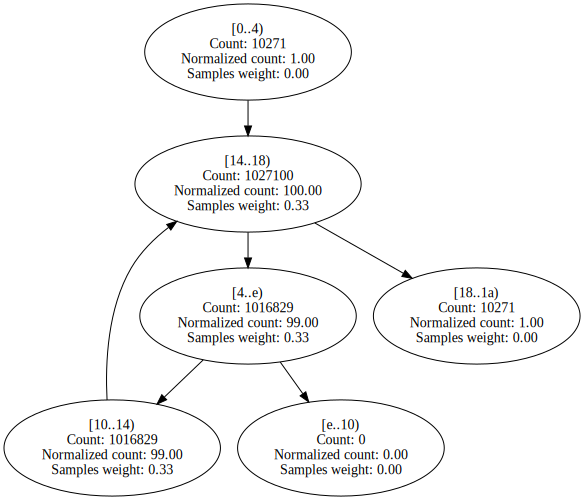
 | 

Expand

Fourier.TrapezoidIntegrate | 90 | 5 | 11668 | 83.86% | 99.80% | 

Expand

 | 

Expand

NumericSortJagged.LoadNumArrayWithRand | 66 | 10 | 37070 | 99.80% | 99.85% | 

Expand

 | 

Expand

BenchmarksGame.Fasta_2.MakeRepeatFasta | 241 | 16 | 8541 | 97.56% | 99.86% | 

Expand

 | 

Expand

Algorithms.ScalarDoubleRenderer.RenderSingleThreadedWithADT | 183 | 11 | 322732 | 78.24% | 99.87% | 

Expand

 | 

Expand

Algorithms.VectorFloatRenderer.RenderSingleThreadedWithADT | 421 | 12 | 20006 | 99.74% | 99.88% | 

Expand

 | 

Expand

BenchmarksGame.KNucleotide_9.loadThreeData | 463 | 21 | 11610 | 100.00% | 99.88% | 

Expand

 | 

Expand

BenchmarksGame.KNucleotide_9.countEnding | 213 | 16 | 81173 | 94.54% | 99.89% | 

Expand

 | 

Expand

Algorithms.ScalarDoubleRenderer.RenderSingleThreadedNoADT | 206 | 11 | 229533 | 99.94% | 99.90% | 

Expand

 | 

Expand

Benchstone.BenchI.AddArray2.BenchInner1 | 75 | 10 | 153714 | 99.84% | 99.91% | 

Expand

 | 

Expand
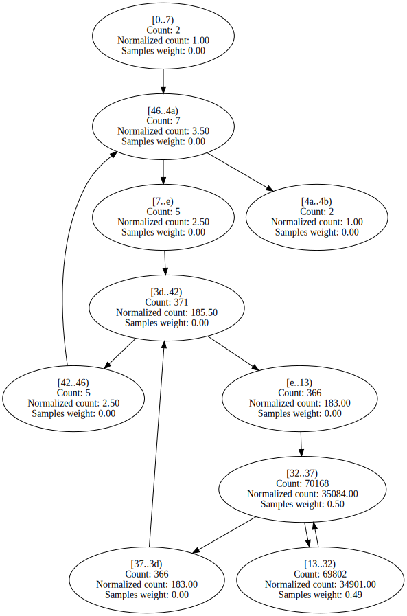

SciMark2.SOR.execute | 155 | 10 | 621098 | 99.95% | 99.91% | 

Expand

 | 

Expand

Algorithms.ScalarFloatRenderer.RenderSingleThreadedWithADT | 142 | 11 | 196010 | 83.34% | 99.92% | 

Expand

 | 

Expand

Algorithms.ScalarFloatRenderer.RenderSingleThreadedNoADT | 156 | 11 | 229594 | 99.95% | 99.92% | 

Expand

 | 

Expand

Benchstone.BenchI.AddArray2.BenchInner2 | 75 | 10 | 153404 | 99.86% | 99.93% | 

Expand

 | 

Expand

Benchstone.BenchF.MatInv4.MProd | 107 | 10 | 14071 | 99.67% | 99.94% | 

Expand

 | 

Expand

EMFloat.IsMantissaZero | 25 | 4 | 16617 | 99.30% | 99.96% | 

Expand

 | 

Expand

SciMark2.FFT.inverse | 53 | 4 | 37176 | 99.98% | 99.96% | 

Expand

 | 

Expand

BenchmarksGame.Fasta_1.FillRandom | 51 | 4 | 13213 | 99.97% | 99.97% | 

Expand

 | 

Expand

Benchstone.BenchI.BenchE.Test | 71 | 4 | 11192 | 83.85% | 99.97% | 

Expand

 | 

Expand

Benchstone.BenchF.Lorenz.Test | 597 | 8 | 17917 | 51.66% | 99.98% | 

Expand

 | 

Expand

Benchstone.BenchF.BenchMrk.Test | 239 | 4 | 10395 | 52.86% | 99.98% | 

Expand

 | 

Expand

Benchstone.BenchI.Midpoint.Test | 195 | 10 | 180730 | 94.16% | 99.98% | 

Expand

 | 

Expand

Burgers.GetCalculated0 | 288 | 7 | 86035 | 85.68% | 99.98% | 

Expand

 | 

Expand

Benchstone.BenchF.BenchMk2.Test | 235 | 4 | 12065 | 52.07% | 99.98% | 

Expand

 | 

Expand

Burgers.GetCalculated1 | 282 | 7 | 88200 | 85.08% | 99.98% | 

Expand

 | 

Expand

Benchstone.BenchF.InProd.InnerProduct | 45 | 4 | 781360 | 99.97% | 99.99% | 

Expand

 | 

Expand

Burgers.GetCalculated3 | 353 | 7 | 412842 | 99.99% | 99.99% | 

Expand

 | 

Expand

Benchstone.BenchF.InProd.Test | 158 | 12 | 783409 | 99.99% | 99.99% | 

Expand

 | 

Expand

Burgers.GetCalculated2 | 258 | 7 | 412102 | 100.00% | 100.00% | 

Expand

 | 

Expand

ByteMark.randnum | 80 | 3 | 4410 | 96.58% | 100.00% | 

Expand

 | 

Expand

BitOps.DoBitfieldIteration | 168 | 12 | 236 | 78.14% | 100.00% | 

Expand

 | 

Expand

EMFloat.denormalize | 79 | 7 | 2155 | 92.03% | 100.00% | 

Expand

 | 

Expand

EMFloatClass.denormalize | 82 | 7 | 403 | 85.44% | 100.00% | 

Expand

 | 

Expand

