Method | IL size | # BBs | # Samples | Raw overlap | Smoothed overlap | Instrumented graph | Smoothed graph
--- | --- | --- | --- | --- | --- | --- | ---
Benchstone.BenchF.Whetsto.Test | 1188 | 40 | 225 | 48.20% | 43.10% | 

Expand

 | 

Expand

Benchstone.BenchF.LLoops.Main1 | 4385 | 111 | 296 | 50.25% | 53.67% | 

Expand

 | 

Expand

System.Text.RegularExpressions.RegexInterpreter.MatchString | 190 | 20 | 53 | 47.21% | 59.55% | 

Expand

 | 

Expand

Benchstone.BenchI.NDhrystone.Proc0 | 295 | 12 | 146 | 46.09% | 63.31% | 

Expand

 | 

Expand

BenchmarksGame.KNucleotide_9.check | 61 | 5 | 211 | 62.66% | 66.81% | 

Expand

 | 

Expand

SeekUnroll.FindByte | 70 | 5 | 38413 | 56.17% | 67.29% | 

Expand

 | 

Expand

AssignRect.second_assignments | 389 | 65 | 416 | 75.01% | 68.87% | 

Expand

 | 

Expand

EMFloatClass.DivideInternalFPF | 633 | 37 | 89 | 58.17% | 68.91% | 

Expand

 | 

Expand

Benchstone.BenchI.TreeSort.Insert | 86 | 9 | 437 | 54.29% | 70.77% | 

Expand

 | 

Expand

EMFloat.DivideInternalFPF | 631 | 37 | 596 | 65.30% | 71.49% | 

Expand

 | 

Expand

BenchmarksGame.KNucleotide_9.checkEnding | 79 | 8 | 482 | 72.73% | 71.85% | 

Expand

 | 

Expand

NumericSortJagged.NumHeapSort | 57 | 7 | 144 | 43.05% | 72.30% | 

Expand

 | 

Expand

BenchmarksGame.Fasta_2.SelectRandom | 62 | 6 | 314 | 59.94% | 72.82% | 

Expand
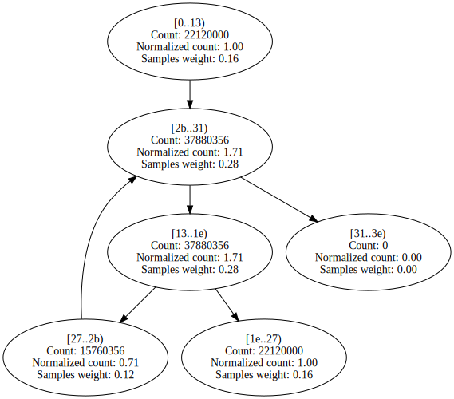
 | 

Expand

BenchmarksGame.NBodySystem.Advance | 370 | 7 | 1428 | 43.84% | 73.92% | 

Expand

 | 

Expand

Benchstone.BenchF.FFT.FastFourierT | 254 | 15 | 224 | 53.02% | 74.04% | 

Expand

 | 

Expand

SciMark2.Random.nextDouble | 161 | 11 | 1023 | 54.26% | 74.63% | 

Expand

 | 

Expand

BenchmarksGame.FannkuchRedux_9.CountFlips | 100 | 7 | 4917 | 61.59% | 74.77% | 

Expand

 | 

Expand

Benchstone.BenchF.NewtE.Test | 586 | 19 | 137 | 32.37% | 74.90% | 

Expand

 | 

Expand

BenchmarksGame.TreeNode.CountNodes | 46 | 3 | 232 | 40.97% | 74.96% | 

Expand

 | 

Expand

BenchmarksGame.ReverseComplement_6.Reverse | 370 | 28 | 50 | 57.81% | 75.27% | 

Expand

 | 

Expand

System.Text.RegularExpressions.RegexInterpreter.Go | 3653 | 181 | 144 | 63.09% | 75.37% | 

Expand
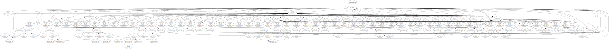
 | 

Expand

BenchmarksGame.Fasta_1.SelectRandom | 62 | 6 | 199 | 57.38% | 75.47% | 

Expand

 | 

Expand

Benchstone.BenchI.TreeSort.CheckTree | 94 | 9 | 56 | 71.15% | 75.80% | 

Expand

 | 

Expand

Benchstone.BenchI.NDhrystone.Proc8 | 77 | 4 | 130 | 52.42% | 76.47% | 

Expand

 | 

Expand

Benchstone.BenchI.Permutate.PermuteArray | 75 | 5 | 459 | 75.55% | 76.58% | 

Expand

 | 

Expand

System.Text.RegularExpressions.RegexInterpreter.Backtrack | 91 | 5 | 50 | 63.83% | 77.29% | 

Expand

 | 

Expand

AssignJagged.first_assignments | 421 | 65 | 1888 | 51.55% | 77.63% | 

Expand

 | 

Expand

Benchstone.BenchF.Whetsto.PA | 108 | 3 | 104 | 75.00% | 78.64% | 

Expand
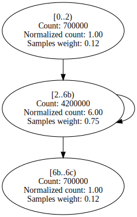
 | 

Expand

BenchmarksGame.MandelBrot_7.GetByte | 224 | 10 | 7543 | 37.91% | 78.79% | 

Expand

 | 

Expand

Benchstone.BenchI.QuickSort.Test | 91 | 11 | 63 | 66.31% | 79.22% | 

Expand

 | 

Expand

Benchstone.BenchF.Regula.Inner | 301 | 21 | 446 | 48.59% | 80.19% | 

Expand

 | 

Expand

Benchstone.BenchF.LLoops.Init | 598 | 46 | 1315 | 55.20% | 80.72% | 

Expand

 | 

Expand

Benchstone.BenchF.Trap.Test | 265 | 14 | 68 | 54.75% | 80.74% | 

Expand

 | 

Expand

Benchstone.BenchI.NDhrystone.Func2 | 81 | 15 | 405 | 70.57% | 80.92% | 

Expand

 | 

Expand

SciMark2.FFT.bitreverse | 115 | 8 | 332 | 58.50% | 81.45% | 

Expand

 | 

Expand

SciMark2.MonteCarlo.integrate | 77 | 6 | 306 | 48.97% | 81.96% | 

Expand

 | 

Expand

BenchmarksGame.FannkuchRedux_5.countFlips | 100 | 14 | 2926 | 52.52% | 82.03% | 

Expand
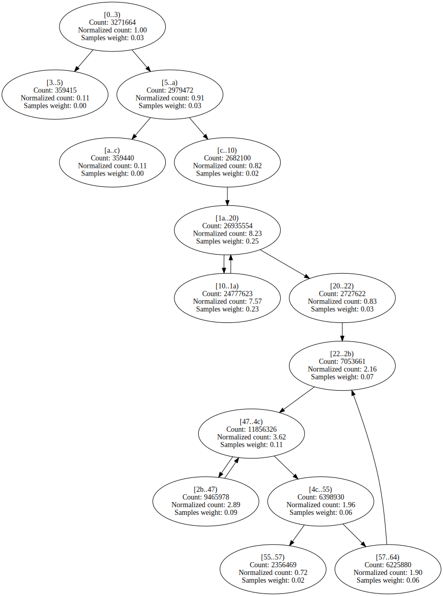
 | 

Expand

Benchstone.BenchF.Romber.Test | 666 | 35 | 316 | 43.20% | 82.21% | 

Expand

 | 

Expand
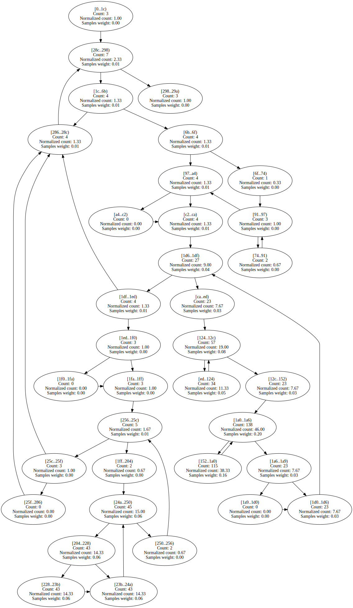

Benchstone.BenchI.Fib.Fibonacci | 24 | 3 | 580 | 70.17% | 82.49% | 

Expand

 | 

Expand

Benchstone.BenchI.QuickSort.Quick | 103 | 16 | 458 | 67.67% | 83.61% | 

Expand

 | 

Expand

EMFloat.Sub16Bits | 38 | 4 | 401 | 53.53% | 83.67% | 

Expand

 | 

Expand

AssignJagged.second_assignments | 376 | 65 | 673 | 61.32% | 83.77% | 

Expand

 | 

Expand

EMFloatClass.Sub16Bits | 38 | 4 | 91 | 55.31% | 83.81% | 

Expand

 | 

Expand

BenchmarksGame.TreeNode.CreateTree | 36 | 3 | 134 | 64.51% | 83.87% | 

Expand

 | 

Expand

BenchmarksGame.FannkuchRedux_2.fannkuch | 366 | 28 | 1172 | 67.02% | 84.22% | 

Expand

 | 

Expand

LUDecomp.lubksb | 146 | 18 | 73 | 54.71% | 84.27% | 

Expand

 | 

Expand

SciMark2.FFT.transform_internal | 450 | 17 | 3092 | 42.96% | 84.96% | 

Expand

 | 

Expand

AssignRect.first_assignments | 478 | 65 | 730 | 83.71% | 85.33% | 

Expand

 | 

Expand

Benchstone.BenchI.Puzzle.Trial | 101 | 10 | 50 | 46.47% | 85.34% | 

Expand

 | 

Expand

EMFloat.Add16Bits | 38 | 4 | 535 | 56.51% | 85.36% | 

Expand

 | 

Expand

NeuralJagged.do_out_forward | 99 | 7 | 63 | 52.72% | 85.53% | 

Expand

 | 

Expand

NeuralJagged.do_mid_error | 97 | 7 | 61 | 57.29% | 85.68% | 

Expand

 | 

Expand

BenchmarksGame.FannkuchRedux_9.NextPermutation | 95 | 7 | 861 | 67.96% | 85.83% | 

Expand

 | 

Expand

EMFloatClass.Add16Bits | 38 | 4 | 94 | 57.80% | 85.91% | 

Expand

 | 

Expand

BenchmarksGame.ByteString.GetHashCode | 132 | 10 | 151 | 60.73% | 85.94% | 

Expand

 | 

Expand

BenchmarksGame.KNucleotide_9.loadThreeData | 463 | 21 | 52 | 65.38% | 86.54% | 

Expand

 | 

Expand

NeuralJagged.adjust_out_wts | 115 | 7 | 132 | 43.05% | 86.56% | 

Expand

 | 

Expand

System.Text.RegularExpressions.RegexInterpreter.FindFirstChar | 1628 | 109 | 50 | 64.69% | 86.58% | 

Expand

 | 

Expand

BenchmarksGame.Fasta_2.MakeRepeatFasta | 241 | 16 | 55 | 45.30% | 86.84% | 

Expand

 | 

Expand

Benchstone.BenchI.CSieve.Test | 120 | 15 | 994 | 59.73% | 86.96% | 

Expand

 | 

Expand

BenchmarksGame.ReverseComplement_1.Reverse | 208 | 22 | 647 | 57.27% | 87.25% | 

Expand

 | 

Expand

EMFloatClass.ShiftMantLeft1 | 47 | 6 | 567 | 62.12% | 87.26% | 

Expand

 | 

Expand

EMFloatClass.ShiftMantRight1 | 47 | 6 | 489 | 61.80% | 87.60% | 

Expand

 | 

Expand

StringSort.strsift | 75 | 9 | 731 | 73.19% | 87.67% | 

Expand

 | 

Expand

Benchstone.BenchI.Array2.Bench | 107 | 13 | 2466 | 48.74% | 87.75% | 

Expand
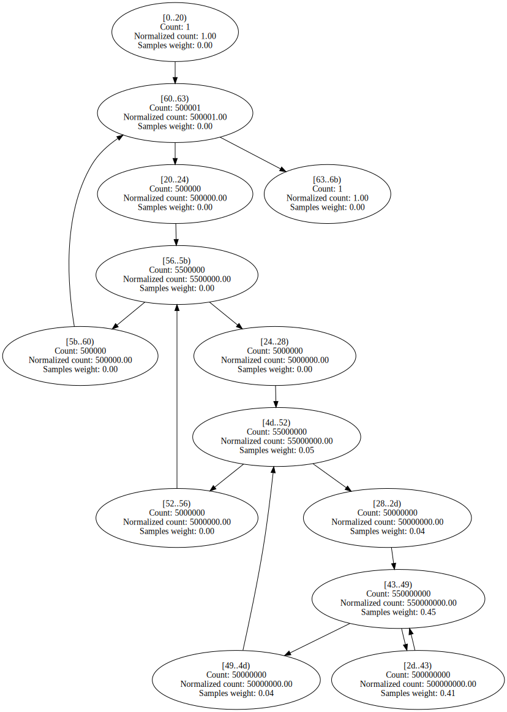
 | 

Expand
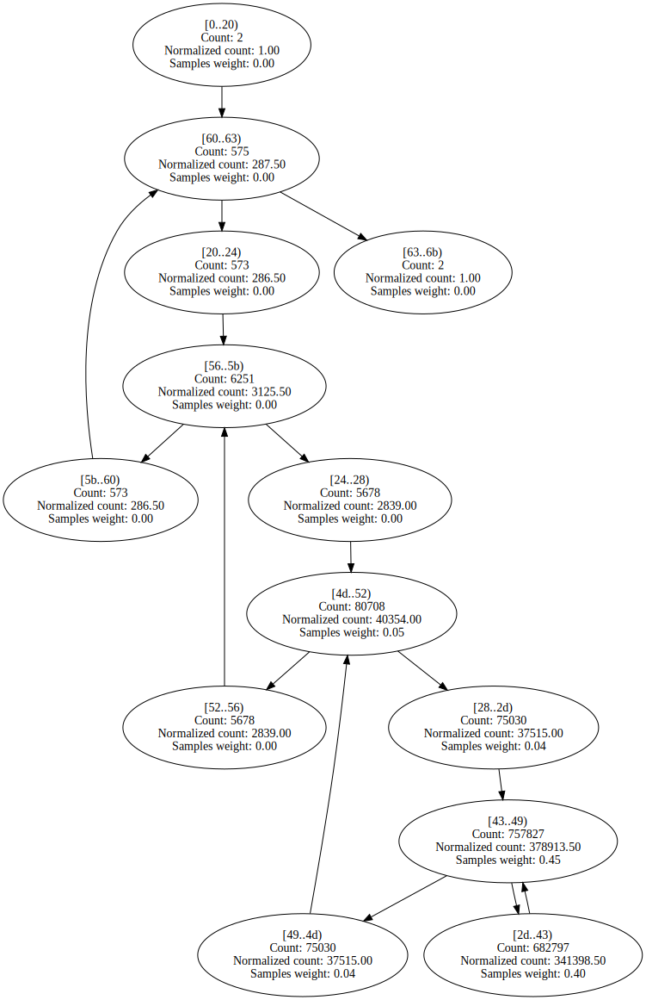

EMFloat.ShiftMantLeft1 | 47 | 6 | 2838 | 60.81% | 87.82% | 

Expand

 | 

Expand

Benchstone.BenchI.HeapSort.Inner | 123 | 17 | 912 | 71.34% | 87.99% | 

Expand

 | 

Expand

Benchstone.BenchI.LogicArray.Inner | 130 | 17 | 1665 | 85.79% | 88.16% | 

Expand

 | 

Expand

Neural.adjust_out_wts | 116 | 7 | 84 | 45.83% | 88.21% | 

Expand

 | 

Expand

IDEAEncryption.mul | 47 | 8 | 2021 | 53.35% | 88.44% | 

Expand

 | 

Expand

EMFloat.ShiftMantRight1 | 47 | 6 | 2314 | 62.29% | 88.45% | 

Expand
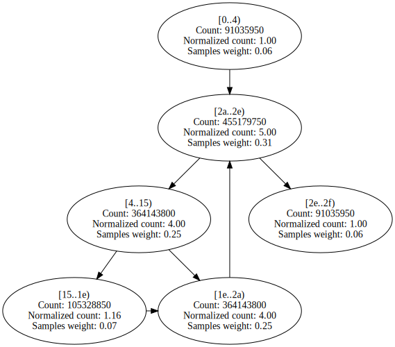
 | 

Expand

Benchstone.BenchI.BubbleSort2.Inner | 57 | 9 | 1087 | 67.99% | 88.89% | 

Expand

 | 

Expand

Benchstone.BenchI.BubbleSort.SortArray | 48 | 7 | 794 | 60.74% | 89.06% | 

Expand

 | 

Expand

NumericSortJagged.LoadNumArrayWithRand | 66 | 10 | 53 | 53.51% | 89.06% | 

Expand

 | 

Expand
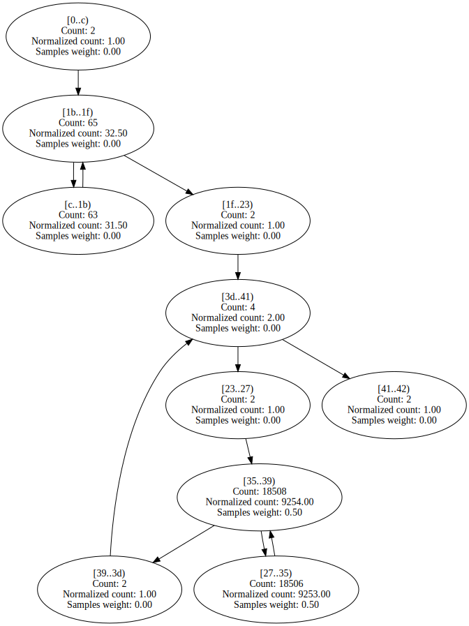

SciMark2.SparseCompRow.matmult | 87 | 10 | 2117 | 55.70% | 89.22% | 

Expand

 | 

Expand

Benchmarks.SIMD.RayTracer.Sphere.Intersect | 148 | 9 | 61 | 60.53% | 89.40% | 

Expand

 | 

Expand

Benchstone.BenchI.Array1.Quick | 89 | 8 | 793 | 83.23% | 89.69% | 

Expand

 | 

Expand

Benchstone.BenchF.DMath.Power | 43 | 4 | 1101 | 81.43% | 90.03% | 

Expand

 | 

Expand

Benchstone.BenchI.Midpoint.Inner | 60 | 12 | 429 | 88.62% | 90.24% | 

Expand

 | 

Expand

Neural.do_mid_forward | 107 | 7 | 132 | 62.80% | 90.25% | 

Expand

 | 

Expand

Benchstone.BenchF.Adams.Bench | 419 | 7 | 80 | 48.28% | 90.54% | 

Expand

 | 

Expand

Benchstone.BenchI.EightQueens.TryMe | 127 | 11 | 290 | 64.05% | 90.66% | 

Expand

 | 

Expand

Benchstone.BenchF.MatInv4.MProd | 107 | 10 | 66 | 56.74% | 90.71% | 

Expand

 | 

Expand

LUDecomp.DoLUIteration | 144 | 16 | 90 | 55.21% | 90.79% | 

Expand

 | 

Expand

System.Numerics.BigInteger..ctor | 217 | 23 | 55 | 71.48% | 90.81% | 

Expand

 | 

Expand
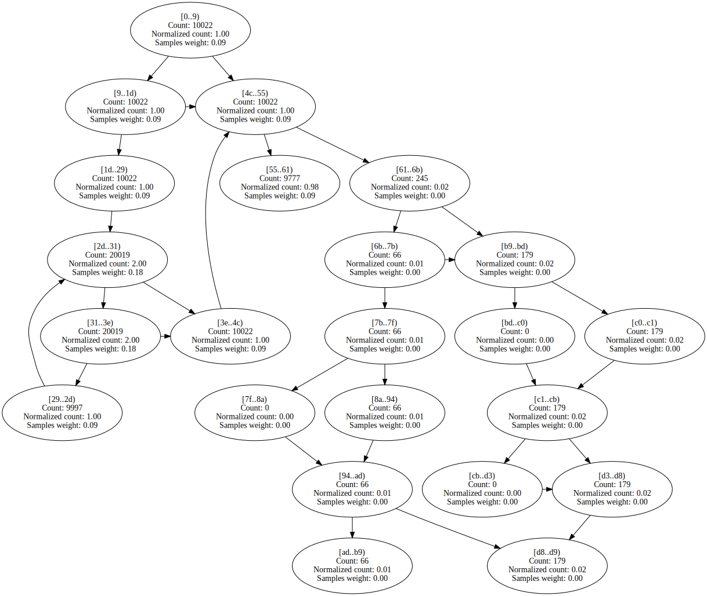

Benchstone.BenchI.AddArray.Test | 231 | 7 | 544 | 54.22% | 90.88% | 

Expand

 | 

Expand

BenchmarksGame.FannkuchRedux_9.Copy | 63 | 7 | 575 | 54.91% | 91.14% | 

Expand

 | 

Expand

Benchstone.BenchF.Bisect.Inner | 122 | 10 | 418 | 65.67% | 91.23% | 

Expand

 | 

Expand

EMFloatClass.MultiplyInternalFPF | 592 | 33 | 108 | 67.89% | 91.38% | 

Expand

 | 

Expand

BenchmarksGame.FannkuchRedux_5.nextPermutation | 81 | 7 | 539 | 66.89% | 91.53% | 

Expand

 | 

Expand

BenchmarksGame.ByteString.Equals | 69 | 8 | 211 | 63.06% | 91.92% | 

Expand

 | 

Expand

Benchstone.BenchI.TreeInsert.BenchInner | 282 | 9 | 892 | 73.71% | 92.83% | 

Expand

 | 

Expand

Benchstone.BenchI.IniArray.Test | 44 | 7 | 964 | 62.70% | 93.15% | 

Expand
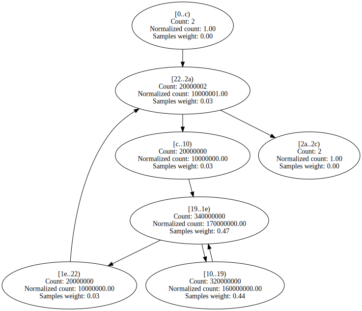
 | 

Expand

Benchstone.BenchF.DMath.Fact | 43 | 4 | 908 | 81.27% | 93.31% | 

Expand

 | 

Expand

Benchstone.BenchI.Puzzle.Place | 104 | 11 | 179 | 60.82% | 93.38% | 

Expand

 | 

Expand

NeuralJagged.move_wt_changes | 137 | 13 | 490 | 54.96% | 93.52% | 

Expand

 | 

Expand

Benchstone.BenchI.BenchE.Strsch | 96 | 12 | 1283 | 59.66% | 93.97% | 

Expand

 | 

Expand

NumericSortRect.NumSift | 103 | 9 | 904 | 71.98% | 93.97% | 

Expand

 | 

Expand

Benchstone.BenchI.Array1.Test | 95 | 9 | 74 | 61.74% | 94.05% | 

Expand

 | 

Expand

SciMark2.LU.factor | 282 | 24 | 2244 | 57.53% | 94.28% | 

Expand

 | 

Expand

BenchmarksGame.Fasta_2.MakeRandomFasta | 221 | 14 | 109 | 49.71% | 94.42% | 

Expand

 | 

Expand

Benchstone.BenchF.Simpsn.Test | 310 | 11 | 90 | 37.67% | 94.68% | 

Expand

 | 

Expand

Neural.move_wt_changes | 155 | 13 | 205 | 57.44% | 95.06% | 

Expand

 | 

Expand

LUDecomp.ludcmp | 481 | 42 | 3482 | 55.15% | 95.08% | 

Expand

 | 

Expand

Benchstone.BenchI.NDhrystone.Proc1 | 191 | 3 | 139 | 97.48% | 95.21% | 

Expand

 | 

Expand

System.Numerics.BigIntegerCalculator.SubtractDivisor | 71 | 6 | 497 | 72.20% | 95.45% | 

Expand

 | 

Expand

NeuralJagged.do_mid_forward | 101 | 7 | 255 | 56.64% | 95.54% | 

Expand

 | 

Expand

Benchstone.BenchI.MulMatrix.Inner | 435 | 61 | 1388 | 54.63% | 95.61% | 

Expand

 | 

Expand

NeuralJagged.adjust_mid_wts | 120 | 7 | 741 | 50.57% | 95.88% | 

Expand

 | 

Expand

Benchstone.BenchF.BenchMrk.Test | 239 | 4 | 51 | 51.96% | 96.23% | 

Expand

 | 

Expand

Benchstone.BenchI.Puzzle.RemoveLocal | 75 | 6 | 161 | 65.34% | 96.41% | 

Expand

 | 

Expand

EMFloat.MultiplyInternalFPF | 584 | 33 | 506 | 67.51% | 96.44% | 

Expand

 | 

Expand

System.Numerics.BigIntegerCalculator.Add | 97 | 7 | 127 | 60.96% | 96.72% | 

Expand
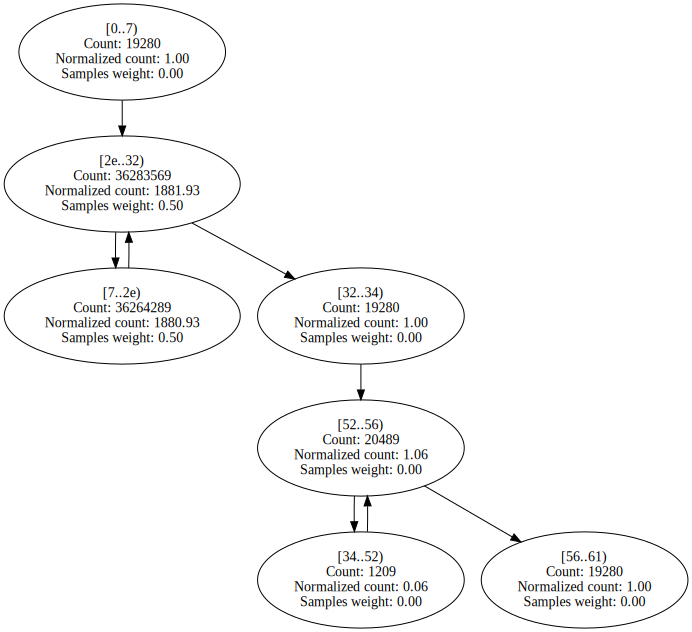
 | 

Expand

BenchmarksGame.Approximate.MultiplyAv | 66 | 7 | 187 | 60.30% | 96.78% | 

Expand

 | 

Expand

System.Numerics.BigIntegerCalculator.Subtract | 87 | 7 | 128 | 58.53% | 96.83% | 

Expand

 | 

Expand

Benchstone.BenchF.BenchMk2.Test | 235 | 4 | 66 | 56.06% | 96.92% | 

Expand

 | 

Expand

Benchstone.BenchI.XposMatrix.Test | 69 | 11 | 231 | 62.92% | 96.93% | 

Expand

 | 

Expand

BenchmarksGame.Fasta_1.SelectNucleotides | 114 | 9 | 84 | 53.81% | 96.94% | 

Expand

 | 

Expand

NumericSortJagged.NumSift | 63 | 9 | 2491 | 72.88% | 96.99% | 

Expand

 | 

Expand

BenchmarksGame.Approximate.MultiplyAtv | 66 | 7 | 172 | 59.90% | 97.02% | 

Expand

 | 

Expand

Algorithms.VectorFloatRenderer.RenderSingleThreadedWithADT | 421 | 12 | 487 | 99.59% | 97.53% | 

Expand

 | 

Expand

BenchmarksGame.FannkuchRedux_5.run | 114 | 5 | 120 | 64.29% | 98.11% | 

Expand

 | 

Expand

Benchstone.BenchI.Puzzle.Fit | 47 | 7 | 775 | 66.36% | 98.15% | 

Expand

 | 

Expand

Benchstone.BenchF.SqMtx.Inner | 73 | 10 | 1880 | 54.00% | 98.17% | 

Expand

 | 

Expand

Benchstone.BenchI.AddArray2.BenchInner2 | 75 | 10 | 553 | 55.17% | 98.20% | 

Expand

 | 

Expand

Benchstone.BenchI.AddArray2.BenchInner1 | 75 | 10 | 469 | 55.04% | 98.27% | 

Expand

 | 

Expand

BenchmarksGame.Mandelbrot_2.DoBench | 323 | 19 | 2562 | 57.55% | 98.32% | 

Expand

 | 

Expand

BenchmarksGame.FannkuchRedux_9.Run | 174 | 12 | 212 | 63.02% | 98.33% | 

Expand

 | 

Expand

Benchstone.BenchF.NewtR.Test | 144 | 7 | 142 | 74.18% | 98.45% | 

Expand

 | 

Expand

BenchmarksGame.KNucleotide.KFrequency | 91 | 7 | 122 | 50.00% | 98.49% | 

Expand

 | 

Expand

Benchstone.BenchF.DMath.Bench | 215 | 9 | 709 | 84.41% | 98.58% | 

Expand

 | 

Expand

BenchmarksGame.SpectralNorm_1.MultiplyAv | 60 | 7 | 194 | 55.69% | 98.62% | 

Expand

 | 

Expand

BenchmarksGame.SpectralNorm_1.MultiplyAtv | 60 | 7 | 196 | 54.59% | 98.66% | 

Expand

 | 

Expand

Algorithms.VectorDoubleRenderer.RenderSingleThreadedWithADT | 440 | 12 | 806 | 99.57% | 98.69% | 

Expand

 | 

Expand

IDEAEncryption.cipher_idea | 396 | 3 | 1084 | 93.47% | 98.72% | 

Expand
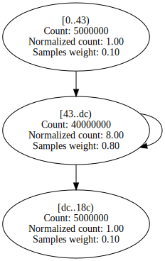
 | 

Expand

Neural.adjust_mid_wts | 124 | 7 | 374 | 52.58% | 98.74% | 

Expand

 | 

Expand

BenchmarksGame.KNucleotide_9.countEnding | 213 | 16 | 936 | 69.69% | 98.95% | 

Expand

 | 

Expand
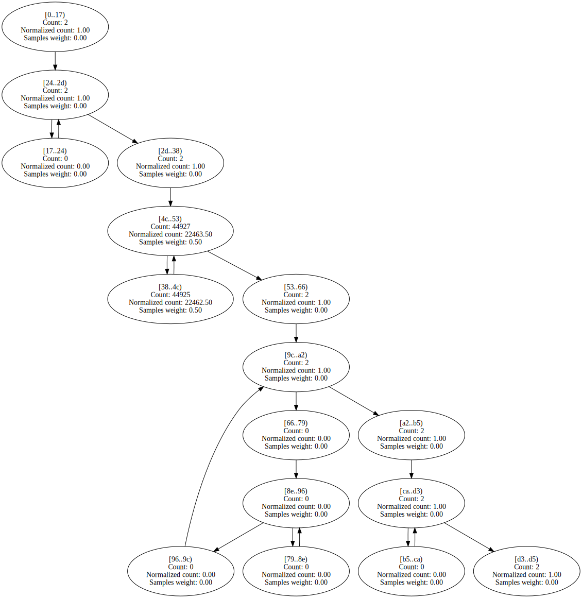

Benchstone.BenchF.Lorenz.Test | 597 | 8 | 392 | 53.57% | 98.96% | 

Expand

 | 

Expand

Algorithms.VectorFloatRenderer.RenderSingleThreadedNoADT | 485 | 12 | 1052 | 99.47% | 99.03% | 

Expand

 | 

Expand

SciMark2.FFT.inverse | 53 | 4 | 111 | 60.80% | 99.04% | 

Expand

 | 

Expand

Algorithms.VectorDoubleRenderer.RenderSingleThreadedNoADT | 504 | 12 | 1321 | 99.58% | 99.13% | 

Expand

 | 

Expand

SciMark2.SOR.execute | 155 | 10 | 1482 | 54.46% | 99.17% | 

Expand

 | 

Expand

Burgers.GetCalculated3 | 353 | 7 | 1059 | 51.40% | 99.20% | 

Expand

 | 

Expand

Benchstone.BenchF.Secant.Inner | 105 | 9 | 241 | 56.10% | 99.22% | 

Expand

 | 

Expand

System.Numerics.BigIntegerCalculator.Add | 69 | 4 | 271 | 59.55% | 99.25% | 

Expand

 | 

Expand

Algorithms.ScalarDoubleRenderer.RenderSingleThreadedWithADT | 183 | 11 | 1537 | 53.25% | 99.27% | 

Expand

 | 

Expand

BenchmarksGame.Fasta_1.FillRandom | 51 | 4 | 263 | 51.87% | 99.28% | 

Expand
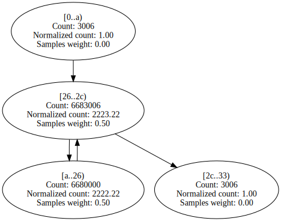
 | 

Expand

Benchstone.BenchI.Midpoint.Test | 195 | 10 | 934 | 55.97% | 99.34% | 

Expand

 | 

Expand

Benchstone.BenchF.InProd.Test | 158 | 12 | 3423 | 52.49% | 99.36% | 

Expand

 | 

Expand

Algorithms.ScalarFloatRenderer.RenderSingleThreadedWithADT | 142 | 11 | 1241 | 54.09% | 99.40% | 

Expand

 | 

Expand

Benchstone.BenchI.Pi.ComputePi | 200 | 10 | 998 | 52.98% | 99.48% | 

Expand

 | 

Expand

Burgers.GetCalculated1 | 282 | 7 | 897 | 52.78% | 99.50% | 

Expand

 | 

Expand

Burgers.GetCalculated0 | 288 | 7 | 905 | 52.86% | 99.51% | 

Expand

 | 

Expand
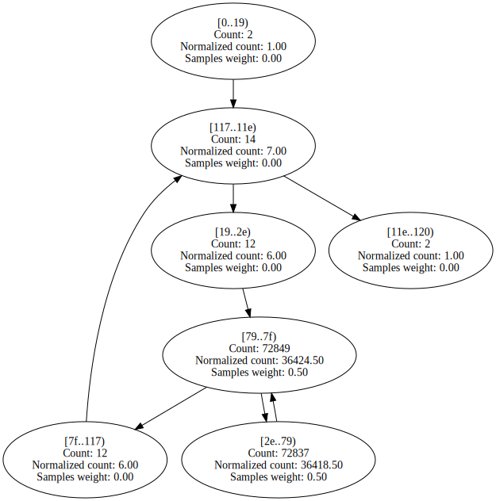

Burgers.GetCalculated2 | 258 | 7 | 1659 | 53.43% | 99.64% | 

Expand

 | 

Expand

Algorithms.ScalarFloatRenderer.RenderSingleThreadedNoADT | 156 | 11 | 1720 | 53.12% | 99.64% | 

Expand

 | 

Expand

Algorithms.ScalarDoubleRenderer.RenderSingleThreadedNoADT | 206 | 11 | 1753 | 53.00% | 99.70% | 

Expand

 | 

Expand

Benchstone.BenchF.InProd.InnerProduct | 45 | 4 | 6471 | 51.38% | 99.87% | 

Expand

 | 

Expand

System.Numerics.BigIntegerCalculator.Multiply | 55 | 4 | 687 | 59.88% | 99.89% | 

Expand

 | 

Expand

SeekUnroll.InnerLoop | 25 | 4 | 4404 | 82.72% | 99.93% | 

Expand

 | 

Expand

ByteMark.randnum | 80 | 3 | 68 | 52.94% | 100.00% | 

Expand

 | 

Expand

Benchstone.BenchF.NewtR.Inner | 77 | 7 | 281 | 68.06% | 100.00% | 

Expand

 | 

Expand
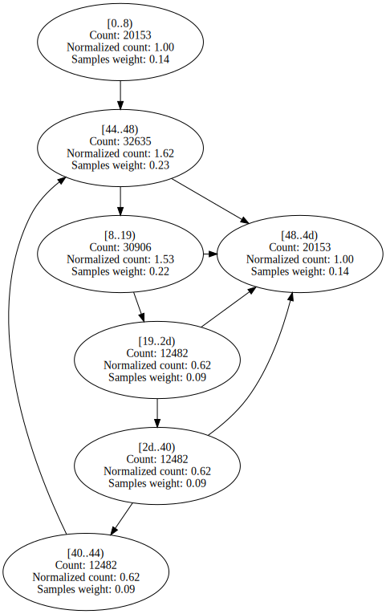

