Method | IL size | # BBs | # Samples | Raw overlap | Smoothed overlap | Instrumented graph | Smoothed graph
--- | --- | --- | --- | --- | --- | --- | ---
Benchstone.BenchI.Ackermann.Test | 50 | 5 | 56 | 62.50% | 50.00% | 

Expand
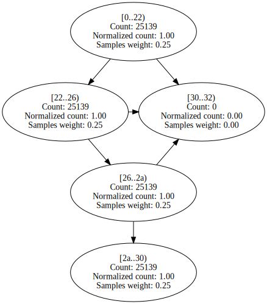
 | 

Expand
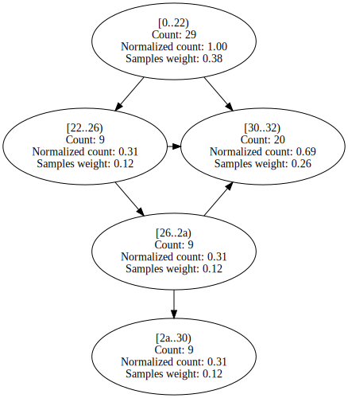

EMFloatClass.AddSubInternalFPF | 804 | 39 | 1908 | 74.51% | 61.08% | 

Expand

 | 

Expand

PgoBench.Program.Main | 1303 | 71 | 110 | 76.18% | 66.88% | 

Expand

 | 

Expand

EMFloat.AddSubInternalFPF | 800 | 39 | 9479 | 78.41% | 68.52% | 

Expand

 | 

Expand

Benchstone.BenchF.LLoops.Main1 | 4385 | 111 | 116769 | 70.78% | 69.99% | 

Expand

 | 

Expand

EMFloat.DivideInternalFPF | 631 | 37 | 227637 | 79.56% | 75.71% | 

Expand

 | 

Expand

EMFloatClass.DivideInternalFPF | 633 | 37 | 45852 | 79.29% | 75.74% | 

Expand

 | 

Expand

Benchstone.BenchF.DMath.Bench | 215 | 9 | 88680 | 75.65% | 75.81% | 

Expand

 | 

Expand

Benchstone.BenchF.MatInv4.Test | 340 | 22 | 208 | 77.88% | 76.89% | 

Expand

 | 

Expand

System.Text.ASCIIUtility.NarrowUtf16ToAscii | 530 | 31 | 292 | 63.93% | 79.77% | 

Expand

 | 

Expand

BenchmarksGame.KNucleotide_1.Bench | 267 | 16 | 95 | 73.15% | 80.11% | 

Expand

 | 

Expand

Benchstone.BenchF.FFT.FastFourierT | 254 | 15 | 23992 | 84.95% | 81.24% | 

Expand

 | 

Expand

EMFloatClass.MultiplyInternalFPF | 592 | 33 | 33413 | 77.95% | 81.64% | 

Expand

 | 

Expand

BenchmarksGame.Fasta_2.SelectRandom | 62 | 6 | 58457 | 88.40% | 81.68% | 

Expand

 | 

Expand

EMFloat.Sub16Bits | 38 | 4 | 51441 | 66.67% | 81.90% | 

Expand

 | 

Expand

EMFloatClass.Sub16Bits | 38 | 4 | 10671 | 66.67% | 81.93% | 

Expand

 | 

Expand

NumericSortRect.NumHeapSort | 79 | 7 | 22528 | 64.54% | 82.03% | 

Expand

 | 

Expand

BenchmarksGame.TreeNode.CreateTree | 36 | 3 | 27930 | 67.60% | 82.65% | 

Expand

 | 

Expand

StringSort.strsift | 75 | 9 | 242356 | 75.63% | 82.76% | 

Expand

 | 

Expand

Utility.sscanf | 383 | 25 | 212 | 75.57% | 82.89% | 

Expand

 | 

Expand

EMFloatClass.Add16Bits | 38 | 4 | 12554 | 66.67% | 83.09% | 

Expand

 | 

Expand

EMFloat.Add16Bits | 38 | 4 | 64510 | 66.67% | 83.17% | 

Expand

 | 

Expand

EMFloat.MultiplyInternalFPF | 584 | 33 | 167410 | 77.94% | 83.41% | 

Expand

 | 

Expand

BenchmarksGame.FannkuchRedux_5.countFlips | 100 | 14 | 866887 | 84.28% | 84.20% | 

Expand

 | 

Expand

BenchmarksGame.FannkuchRedux_9.CountFlips | 100 | 7 | 398033 | 84.45% | 84.81% | 

Expand
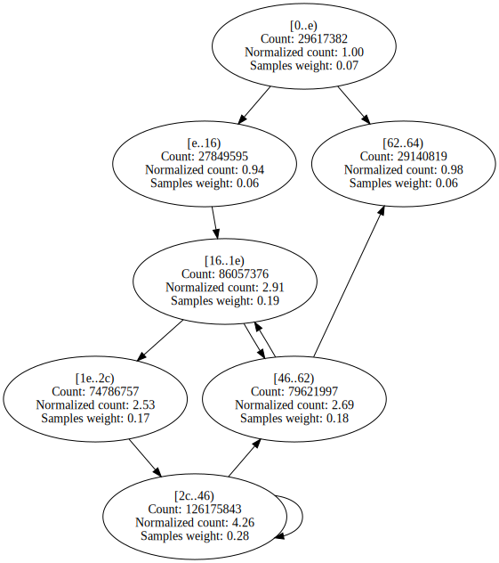
 | 

Expand

BenchmarksGame.NBodySystem.Advance | 370 | 7 | 59615 | 76.55% | 84.90% | 

Expand

 | 

Expand

IDEAEncryption.mul | 47 | 8 | 253392 | 60.00% | 84.93% | 

Expand

 | 

Expand

NumericSortRect.NumSift | 103 | 9 | 522360 | 70.58% | 85.23% | 

Expand

 | 

Expand

Benchstone.BenchI.BubbleSort.Test | 81 | 10 | 2036 | 76.31% | 85.45% | 

Expand

 | 

Expand

BenchmarksGame.MandelBrot_7.GetByte | 224 | 10 | 293234 | 83.10% | 85.56% | 

Expand

 | 

Expand

Neural.do_out_error | 132 | 9 | 2862 | 85.93% | 86.01% | 

Expand

 | 

Expand

BenchmarksGame.TreeNode.CountNodes | 46 | 3 | 24222 | 75.50% | 87.11% | 

Expand

 | 

Expand

SciMark2.MonteCarlo.integrate | 77 | 6 | 80007 | 73.85% | 87.13% | 

Expand

 | 

Expand

Benchstone.BenchF.LLoops.Init | 598 | 46 | 678782 | 87.54% | 87.28% | 

Expand

 | 

Expand

StringSort.StrHeapSort | 57 | 7 | 11995 | 73.36% | 87.65% | 

Expand

 | 

Expand

EMFloatClass.StickyShiftRightMant | 93 | 12 | 548 | 87.53% | 88.31% | 

Expand

 | 

Expand

Benchstone.BenchI.Fib.Fibonacci | 24 | 3 | 160204 | 74.59% | 88.35% | 

Expand

 | 

Expand

EMFloat.StickyShiftRightMant | 93 | 12 | 3069 | 87.50% | 88.38% | 

Expand

 | 

Expand

Neural.adjust_out_wts | 116 | 7 | 22317 | 67.76% | 88.92% | 

Expand

 | 

Expand

Benchstone.BenchI.BubbleSort2.Test | 139 | 8 | 107 | 95.98% | 89.08% | 

Expand

 | 

Expand

Benchstone.BenchI.EightQueens.Test | 79 | 11 | 4984 | 90.04% | 89.69% | 

Expand

 | 

Expand

EMFloatClass.normalize | 49 | 4 | 464 | 77.20% | 90.13% | 

Expand

 | 

Expand

NeuralJagged.do_out_forward | 99 | 7 | 18354 | 93.43% | 90.14% | 

Expand

 | 

Expand

LUDecomp.build_problem | 194 | 21 | 2066 | 88.45% | 90.17% | 

Expand

 | 

Expand

Neural.do_mid_error | 100 | 7 | 13545 | 79.23% | 90.30% | 

Expand

 | 

Expand

NumericSortJagged.NumHeapSort | 57 | 7 | 62263 | 82.00% | 90.53% | 

Expand

 | 

Expand

EMFloat.normalize | 46 | 4 | 2681 | 78.09% | 90.78% | 

Expand

 | 

Expand
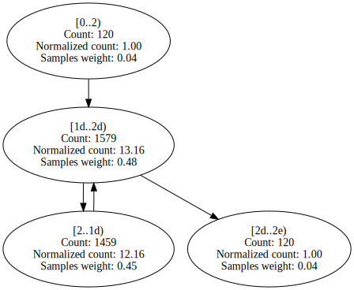

EMFloat.RoundInternalFPF | 85 | 6 | 2812 | 86.24% | 91.00% | 

Expand

 | 

Expand

Benchstone.BenchI.Ackermann.Acker | 38 | 5 | 49778 | 87.67% | 91.30% | 

Expand

 | 

Expand

EMFloatClass.LongToInternalFPF | 129 | 9 | 91 | 93.13% | 91.32% | 

Expand

 | 

Expand

ByteMark.abs_randwc | 17 | 3 | 6228 | 82.85% | 91.38% | 

Expand

 | 

Expand

Neural.DoNNetIteration | 154 | 9 | 273 | 65.83% | 91.75% | 

Expand

 | 

Expand

EMFloatClass.RoundInternalFPF | 85 | 6 | 580 | 87.07% | 91.77% | 

Expand

 | 

Expand

BenchmarksGame.KNucleotide_9.check | 61 | 5 | 56476 | 94.58% | 91.82% | 

Expand

 | 

Expand

AssignJagged.calc_minimum_costs | 156 | 24 | 2514 | 91.35% | 91.95% | 

Expand

 | 

Expand

Benchstone.BenchI.EightQueens.TryMe | 127 | 11 | 120273 | 96.23% | 92.55% | 

Expand

 | 

Expand

IDEAEncryption.Run | 346 | 19 | 165 | 81.92% | 92.66% | 

Expand

 | 

Expand

BenchmarksGame.KNucleotide_9.checkEnding | 79 | 8 | 102933 | 92.30% | 92.79% | 

Expand

 | 

Expand

AssignRect.second_assignments | 389 | 65 | 351321 | 85.54% | 93.04% | 

Expand

 | 

Expand

Benchstone.BenchI.Array1.Test | 95 | 9 | 6405 | 83.54% | 93.08% | 

Expand

 | 

Expand

EMFloat.Run | 300 | 16 | 107 | 61.15% | 93.32% | 

Expand

 | 

Expand

NeuralJagged.DoNNetIteration | 154 | 9 | 1135 | 68.79% | 93.53% | 

Expand

 | 

Expand

Benchstone.BenchF.Bisect.Inner | 122 | 10 | 138074 | 83.55% | 93.69% | 

Expand

 | 

Expand

AssignRect.LoadAssign | 55 | 7 | 72 | 74.02% | 93.84% | 

Expand

 | 

Expand

Benchstone.BenchI.Array1.Quick | 89 | 8 | 92537 | 95.55% | 93.95% | 

Expand

 | 

Expand

NeuralJagged.worst_pass_error | 84 | 6 | 353 | 94.95% | 94.22% | 

Expand

 | 

Expand

NeuralJagged.check_out_error | 91 | 10 | 804 | 97.47% | 94.56% | 

Expand

 | 

Expand

SciMark2.FFT.transform_internal | 450 | 17 | 888691 | 94.05% | 94.57% | 

Expand

 | 

Expand

Benchstone.BenchI.BubbleSort.SortArray | 48 | 7 | 432880 | 94.45% | 94.59% | 

Expand

 | 

Expand

Benchstone.BenchI.HeapSort.Inner | 123 | 17 | 358357 | 94.66% | 94.66% | 

Expand

 | 

Expand
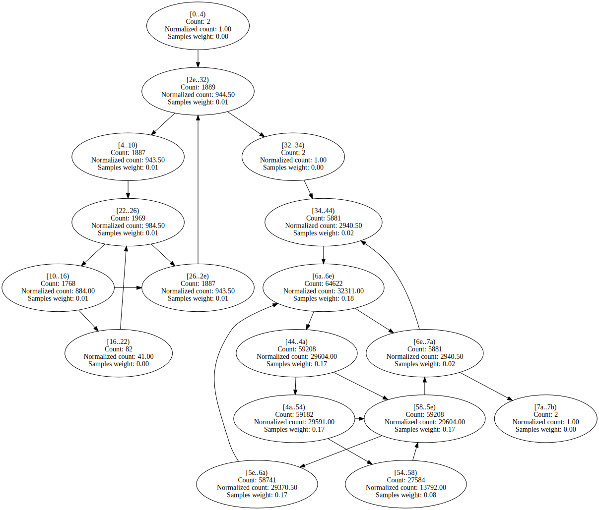

LUDecomp.ludcmp | 481 | 42 | 2094529 | 94.38% | 94.73% | 

Expand

 | 

Expand

Benchstone.BenchI.HeapSort.Test | 76 | 9 | 9336 | 93.72% | 94.75% | 

Expand

 | 

Expand

Benchstone.BenchI.Array1.VerifySort | 30 | 6 | 68 | 98.99% | 94.84% | 

Expand

 | 

Expand

Neural.move_wt_changes | 155 | 13 | 103624 | 69.58% | 94.96% | 

Expand

 | 

Expand

Benchstone.BenchF.FFT.Test | 122 | 7 | 10567 | 88.21% | 95.03% | 

Expand

 | 

Expand

StringSort.LoadStringArray | 131 | 13 | 14887 | 77.72% | 95.08% | 

Expand

 | 

Expand

AssignJagged.second_assignments | 376 | 65 | 403936 | 94.90% | 95.12% | 

Expand

 | 

Expand

BenchmarksGame.FannkuchRedux_9.Run | 174 | 12 | 72991 | 84.28% | 95.23% | 

Expand

 | 

Expand

BenchmarksGame.BinaryTrees_2.Bench | 206 | 13 | 175 | 68.85% | 95.34% | 

Expand

 | 

Expand

Benchstone.BenchF.MatInv4.MinV2 | 723 | 52 | 16465 | 88.87% | 95.39% | 

Expand

 | 

Expand

LUDecomp.Run | 478 | 34 | 483 | 76.92% | 95.44% | 

Expand
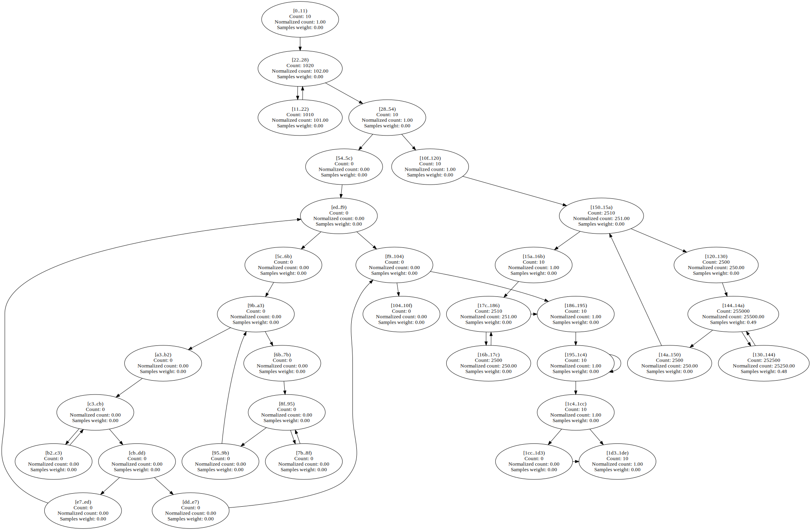
 | 

Expand

EMFloatClass.DoEmFloatIteration | 151 | 12 | 619 | 89.14% | 96.01% | 

Expand

 | 

Expand

Benchstone.BenchI.AddArray.Test | 231 | 7 | 128819 | 96.11% | 96.12% | 

Expand

 | 

Expand

BenchmarksGame.ByteString.GetHashCode | 132 | 10 | 38244 | 96.73% | 96.19% | 

Expand

 | 

Expand

Neural.adjust_mid_wts | 124 | 7 | 100338 | 64.81% | 96.43% | 

Expand

 | 

Expand

BenchmarksGame.FannkuchRedux_9.NextPermutation | 95 | 7 | 99256 | 97.02% | 96.49% | 

Expand

 | 

Expand

Neural.worst_pass_error | 84 | 6 | 251 | 95.61% | 96.50% | 

Expand

 | 

Expand

Benchstone.BenchI.Array2.Bench | 107 | 13 | 1639680 | 98.72% | 96.60% | 

Expand

 | 

Expand

BenchmarksGame.Fasta_1.SelectNucleotides | 114 | 9 | 15953 | 82.52% | 96.73% | 

Expand

 | 

Expand

IDEAEncryption.DoIDEAIteration | 128 | 15 | 6645 | 81.62% | 96.75% | 

Expand

 | 

Expand

AssignJagged.first_assignments | 421 | 65 | 961814 | 96.62% | 96.91% | 

Expand

 | 

Expand

IDEAEncryption.cipher_idea | 396 | 3 | 62398 | 91.53% | 96.91% | 

Expand

 | 

Expand

Benchstone.BenchI.CSieve.Test | 120 | 15 | 201872 | 96.59% | 96.93% | 

Expand

 | 

Expand
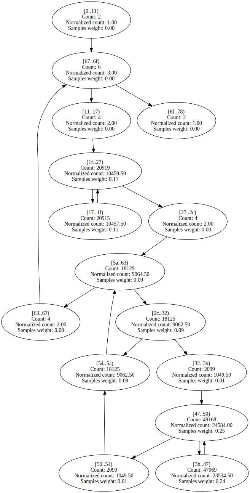

EMFloat.LongToInternalFPF | 129 | 9 | 497 | 95.27% | 96.93% | 

Expand

 | 

Expand

AssignRect.calc_minimum_costs | 166 | 24 | 2052 | 82.90% | 96.96% | 

Expand

 | 

Expand

NeuralJagged.move_wt_changes | 137 | 13 | 264124 | 96.61% | 97.08% | 

Expand

 | 

Expand

BenchmarksGame.FannkuchRedux_5.nextPermutation | 81 | 7 | 91272 | 96.55% | 97.16% | 

Expand

 | 

Expand

Benchstone.BenchI.Midpoint.Inner | 60 | 12 | 348533 | 97.59% | 97.17% | 

Expand
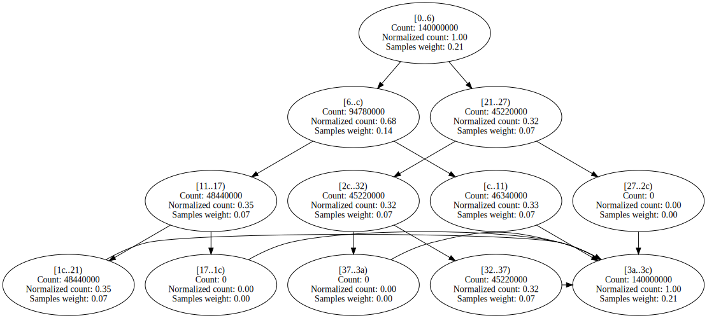
 | 

Expand

SciMark2.FFT.log2 | 52 | 6 | 437 | 98.49% | 97.30% | 

Expand

 | 

Expand

Benchstone.BenchI.BubbleSort2.Inner | 57 | 9 | 604483 | 97.25% | 97.32% | 

Expand

 | 

Expand

Benchstone.BenchI.LogicArray.Inner | 130 | 17 | 253282 | 97.31% | 97.32% | 

Expand

 | 

Expand

Neural.check_out_error | 91 | 10 | 269 | 97.63% | 97.35% | 

Expand

 | 

Expand

BenchmarksGame.Fasta_2.MakeRandomFasta | 221 | 14 | 26080 | 80.65% | 97.57% | 

Expand

 | 

Expand

EMFloat.DoEmFloatIteration | 211 | 12 | 2594 | 85.93% | 97.66% | 

Expand

 | 

Expand

BenchmarksGame.Fasta_1.SelectRandom | 62 | 6 | 32813 | 97.90% | 97.76% | 

Expand

 | 

Expand

Benchstone.BenchF.DMath.Power | 43 | 4 | 357254 | 98.80% | 97.86% | 

Expand

 | 

Expand

NeuralJagged.do_out_error | 129 | 9 | 6039 | 97.92% | 97.90% | 

Expand

 | 

Expand

EMFloat.ShiftMantRight1 | 47 | 6 | 623318 | 98.37% | 97.94% | 

Expand

 | 

Expand

EMFloatClass.ShiftMantRight1 | 47 | 6 | 125004 | 98.43% | 97.95% | 

Expand

 | 

Expand

Neural.do_out_forward | 102 | 7 | 13604 | 82.83% | 97.96% | 

Expand

 | 

Expand

Benchstone.BenchF.Bisect.Test | 238 | 13 | 666 | 88.45% | 98.07% | 

Expand

 | 

Expand

Benchstone.BenchF.MatInv4.MinV1 | 711 | 51 | 14725 | 90.33% | 98.11% | 

Expand

 | 

Expand

NumericSortJagged.NumSift | 63 | 9 | 1214707 | 97.35% | 98.15% | 

Expand

 | 

Expand

BenchmarksGame.FannkuchRedux_2.fannkuch | 366 | 28 | 341504 | 97.75% | 98.16% | 

Expand

 | 

Expand

Benchstone.BenchI.BenchE.Strsch | 96 | 12 | 733601 | 96.61% | 98.21% | 

Expand

 | 

Expand

EMFloat.SetupCPUEmFloatArrays | 116 | 4 | 125 | 63.58% | 98.23% | 

Expand

 | 

Expand

Neural.do_mid_forward | 107 | 7 | 64055 | 75.32% | 98.30% | 

Expand

 | 

Expand

AssignRect.first_assignments | 478 | 65 | 854739 | 83.20% | 98.51% | 

Expand

 | 

Expand

Benchstone.BenchF.DMath.Fact | 43 | 4 | 215604 | 99.20% | 98.57% | 

Expand

 | 

Expand

EMFloatClass.memmove | 65 | 4 | 2307 | 98.67% | 98.59% | 

Expand

 | 

Expand

Benchstone.BenchI.MulMatrix.Inner | 435 | 61 | 818869 | 98.50% | 98.62% | 

Expand

 | 

Expand

Benchstone.BenchI.IniArray.Test | 44 | 7 | 319864 | 98.78% | 98.63% | 

Expand

 | 

Expand

EMFloatClass.ShiftMantLeft1 | 47 | 6 | 179980 | 98.79% | 98.64% | 

Expand

 | 

Expand

BenchmarksGame.Mandelbrot_2.DoBench | 323 | 19 | 200385 | 96.98% | 98.71% | 

Expand

 | 

Expand

NeuralJagged.do_mid_error | 97 | 7 | 34192 | 98.36% | 98.74% | 

Expand

 | 

Expand

BenchmarksGame.NBody_3.Bench | 139 | 13 | 607 | 83.28% | 98.78% | 

Expand

 | 

Expand

EMFloat.memmove | 65 | 4 | 11028 | 98.67% | 98.84% | 

Expand

 | 

Expand

EMFloat.ShiftMantLeft1 | 47 | 6 | 904865 | 98.85% | 98.85% | 

Expand

 | 

Expand

Algorithms.VectorFloatRenderer.RenderSingleThreadedNoADT | 485 | 12 | 18765 | 99.50% | 98.87% | 

Expand

 | 

Expand

NeuralJagged.do_mid_forward | 101 | 7 | 138423 | 99.49% | 98.88% | 

Expand

 | 

Expand

BenchmarksGame.FannkuchRedux_9.Copy | 63 | 7 | 179524 | 99.01% | 98.93% | 

Expand

 | 

Expand

Benchstone.BenchF.Adams.Bench | 419 | 7 | 1601 | 84.99% | 98.98% | 

Expand

 | 

Expand

NeuralJagged.adjust_out_wts | 115 | 7 | 65036 | 99.18% | 99.01% | 

Expand

 | 

Expand

SciMark2.FFT.bitreverse | 115 | 8 | 172698 | 98.50% | 99.02% | 

Expand

 | 

Expand

SciMark2.SparseCompRow.matmult | 87 | 10 | 1172705 | 98.99% | 99.04% | 

Expand

 | 

Expand

AssignRect.CopyToAssign | 45 | 7 | 638 | 73.63% | 99.05% | 

Expand

 | 

Expand

SciMark2.Random.nextDouble | 161 | 11 | 209391 | 99.10% | 99.07% | 

Expand

 | 

Expand

SciMark2.kernel.CopyMatrix | 131 | 10 | 21531 | 99.47% | 99.08% | 

Expand

 | 

Expand

BenchmarksGame.Fasta_1.MakeRepeatFastaBuffer | 127 | 16 | 7859 | 96.91% | 99.18% | 

Expand

 | 

Expand
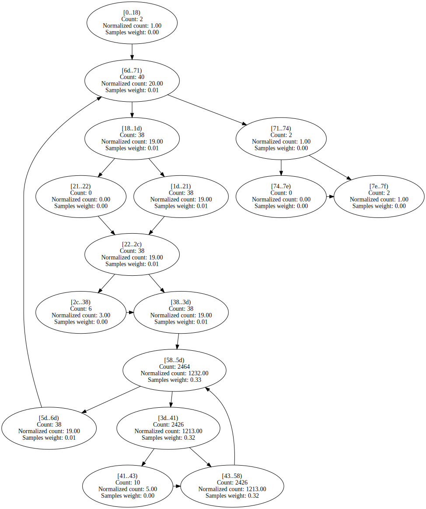

BenchmarksGame.ByteString.Equals | 69 | 8 | 49111 | 98.61% | 99.22% | 

Expand

 | 

Expand

Algorithms.VectorDoubleRenderer.RenderSingleThreadedNoADT | 504 | 12 | 17317 | 99.69% | 99.23% | 

Expand

 | 

Expand

EMFloat.IsMantissaZero | 25 | 4 | 16349 | 99.04% | 99.31% | 

Expand

 | 

Expand

Benchstone.BenchI.AddArray2.Bench | 62 | 7 | 780 | 99.25% | 99.37% | 

Expand

 | 

Expand

LUDecomp.DoLUIteration | 144 | 16 | 59056 | 99.42% | 99.47% | 

Expand

 | 

Expand

Benchstone.BenchF.InProd.InitMatrix | 52 | 7 | 906 | 79.99% | 99.51% | 

Expand

 | 

Expand

Algorithms.ScalarDoubleRenderer.RenderSingleThreadedNoADT | 206 | 11 | 230187 | 99.85% | 99.56% | 

Expand

 | 

Expand

SciMark2.LU.factor | 282 | 24 | 953837 | 99.02% | 99.57% | 

Expand

 | 

Expand

Algorithms.ScalarFloatRenderer.RenderSingleThreadedNoADT | 156 | 11 | 229789 | 99.85% | 99.58% | 

Expand

 | 

Expand

AssignJagged.CopyToAssign | 39 | 7 | 1140 | 99.58% | 99.61% | 

Expand

 | 

Expand

BenchmarksGame.Fasta_2.MakeRepeatFasta | 241 | 16 | 8546 | 97.58% | 99.62% | 

Expand

 | 

Expand
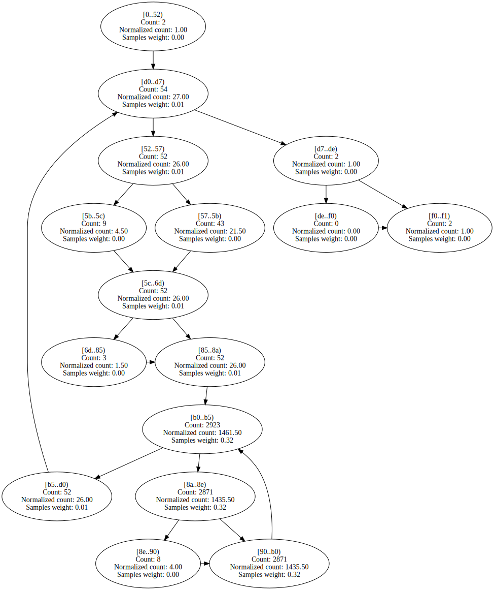

NeuralJagged.adjust_mid_wts | 120 | 7 | 302484 | 99.57% | 99.63% | 

Expand

 | 

Expand

Benchstone.BenchF.InProd.Inner | 68 | 7 | 1308 | 83.11% | 99.67% | 

Expand

 | 

Expand

BenchmarksGame.KNucleotide.KFrequency | 91 | 7 | 11729 | 80.97% | 99.68% | 

Expand

 | 

Expand

LUDecomp.lubksb | 146 | 18 | 48533 | 99.20% | 99.68% | 

Expand

 | 

Expand

NumericSortRect.LoadNumArrayWithRand | 78 | 9 | 11289 | 74.98% | 99.73% | 

Expand

 | 

Expand

Fourier.thefunction | 102 | 6 | 17244 | 73.44% | 99.74% | 

Expand

 | 

Expand
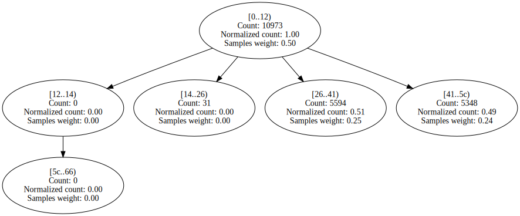

Algorithms.VectorFloatRenderer.RenderSingleThreadedWithADT | 421 | 12 | 38401 | 99.67% | 99.75% | 

Expand

 | 

Expand

Algorithms.VectorDoubleRenderer.RenderSingleThreadedWithADT | 440 | 12 | 69618 | 99.65% | 99.75% | 

Expand

 | 

Expand

BenchmarksGame.FannkuchRedux_5.run | 114 | 5 | 45529 | 74.93% | 99.79% | 

Expand

 | 

Expand

EMFloatClass.IsMantissaZero | 25 | 4 | 3946 | 99.20% | 99.84% | 

Expand

 | 

Expand

BitOps.Run | 187 | 10 | 322 | 72.77% | 99.86% | 

Expand

 | 

Expand

Benchstone.BenchI.AddArray2.BenchInner2 | 75 | 10 | 166139 | 99.96% | 99.88% | 

Expand

 | 

Expand

BenchmarksGame.KNucleotide_9.loadThreeData | 463 | 21 | 11670 | 100.00% | 99.88% | 

Expand

 | 

Expand

BenchmarksGame.KNucleotide_9.countEnding | 213 | 16 | 103557 | 84.67% | 99.89% | 

Expand

 | 

Expand

Fourier.TrapezoidIntegrate | 90 | 5 | 14976 | 83.86% | 99.89% | 

Expand

 | 

Expand

Benchstone.BenchI.BubbleSort.VerifySort | 26 | 6 | 1641 | 97.78% | 99.92% | 

Expand

 | 

Expand

NumericSortJagged.LoadNumArrayWithRand | 66 | 10 | 37111 | 99.87% | 99.93% | 

Expand

 | 

Expand

Algorithms.ScalarFloatRenderer.RenderSingleThreadedWithADT | 142 | 11 | 326819 | 70.03% | 99.93% | 

Expand

 | 

Expand

Burgers.GetCalculated0 | 288 | 7 | 55029 | 89.37% | 99.93% | 

Expand

 | 

Expand

Benchstone.BenchF.MatInv4.MProd | 107 | 10 | 13065 | 99.79% | 99.93% | 

Expand

 | 

Expand

Burgers.GetCalculated1 | 282 | 7 | 17036 | 94.28% | 99.94% | 

Expand

 | 

Expand

SciMark2.SOR.execute | 155 | 10 | 620789 | 99.91% | 99.95% | 

Expand

 | 

Expand

Benchstone.BenchI.Midpoint.Test | 195 | 10 | 230081 | 84.35% | 99.96% | 

Expand

 | 

Expand

Benchstone.BenchF.BenchMrk.Test | 239 | 4 | 6101 | 55.03% | 99.97% | 

Expand

 | 

Expand

Benchstone.BenchI.BenchE.Test | 71 | 4 | 10620 | 83.69% | 99.97% | 

Expand

 | 

Expand
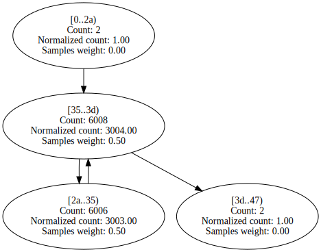

Benchstone.BenchF.BenchMk2.Test | 235 | 4 | 7808 | 55.19% | 99.97% | 

Expand

 | 

Expand

Algorithms.ScalarDoubleRenderer.RenderSingleThreadedWithADT | 183 | 11 | 326742 | 76.67% | 99.97% | 

Expand

 | 

Expand

SciMark2.FFT.inverse | 53 | 4 | 36184 | 99.98% | 99.98% | 

Expand

 | 

Expand

BenchmarksGame.Fasta_1.FillRandom | 51 | 4 | 12022 | 99.97% | 99.99% | 

Expand

 | 

Expand

Benchstone.BenchF.InProd.Test | 158 | 12 | 783317 | 99.97% | 99.99% | 

Expand

 | 

Expand

Burgers.GetCalculated3 | 353 | 7 | 206571 | 99.99% | 99.99% | 

Expand

 | 

Expand

Benchstone.BenchI.AddArray2.BenchInner1 | 75 | 10 | 166361 | 99.91% | 99.99% | 

Expand

 | 

Expand

Benchstone.BenchF.InProd.InnerProduct | 45 | 4 | 781237 | 99.97% | 100.00% | 

Expand

 | 

Expand

Burgers.GetCalculated2 | 258 | 7 | 412433 | 100.00% | 100.00% | 

Expand

 | 

Expand

Benchstone.BenchF.Lorenz.Test | 597 | 8 | 118469 | 50.54% | 100.00% | 

Expand

 | 

Expand

ByteMark.randnum | 80 | 3 | 4353 | 95.78% | 100.00% | 

Expand

 | 

Expand

BitOps.DoBitfieldIteration | 168 | 12 | 180 | 84.44% | 100.00% | 

Expand

 | 

Expand

EMFloat.denormalize | 79 | 7 | 2338 | 88.25% | 100.00% | 

Expand

 | 

Expand
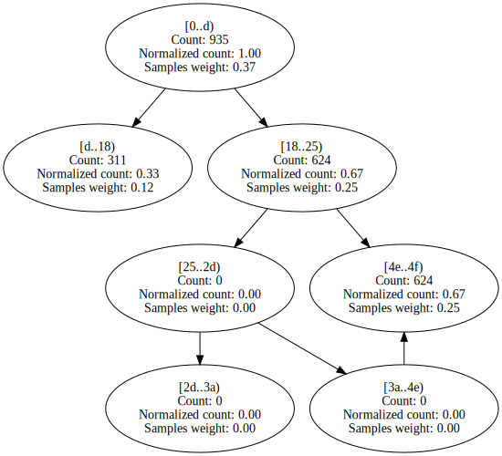

EMFloatClass.denormalize | 82 | 7 | 499 | 87.04% | 100.00% | 

Expand

 | 

Expand

