Method | IL size | # BBs | # Samples | Raw overlap | Smoothed overlap | Instrumented graph | Smoothed graph
--- | --- | --- | --- | --- | --- | --- | ---
BenchmarksGame.ByteString.GetHashCode | 132 | 10 | 112 | 13.39% | 17.82% | 

Expand

 | 

Expand

Benchstone.BenchF.Whetsto.Test | 1188 | 40 | 196 | 43.79% | 42.65% | 

Expand

 | 

Expand

Benchstone.BenchF.LLoops.Main1 | 4385 | 111 | 233 | 49.09% | 51.30% | 

Expand

 | 

Expand

Benchstone.BenchI.Ackermann.Acker | 38 | 5 | 518 | 39.81% | 59.25% | 

Expand

 | 

Expand

System.Text.RegularExpressions.RegexInterpreter.MatchString | 190 | 20 | 77 | 46.88% | 60.34% | 

Expand

 | 

Expand

Benchstone.BenchI.NDhrystone.Proc0 | 295 | 12 | 125 | 45.43% | 63.07% | 

Expand

 | 

Expand

BenchmarksGame.ByteString.Equals | 69 | 8 | 143 | 51.65% | 65.23% | 

Expand

 | 

Expand

AssignRect.second_assignments | 389 | 65 | 340 | 75.92% | 66.24% | 

Expand

 | 

Expand

BenchmarksGame.KNucleotide_9.checkEnding | 79 | 8 | 584 | 62.03% | 67.36% | 

Expand

 | 

Expand

EMFloatClass.DivideInternalFPF | 633 | 37 | 106 | 54.93% | 68.40% | 

Expand

 | 

Expand

Benchstone.BenchI.TreeSort.CheckTree | 94 | 9 | 59 | 68.81% | 68.57% | 

Expand

 | 

Expand

BenchmarksGame.MandelBrot_7.GetByte | 224 | 10 | 7517 | 35.61% | 69.54% | 

Expand

 | 

Expand

Benchstone.BenchI.NDhrystone.Proc8 | 77 | 4 | 113 | 43.62% | 69.54% | 

Expand

 | 

Expand

Benchstone.BenchI.TreeSort.Insert | 86 | 9 | 537 | 64.96% | 71.07% | 

Expand

 | 

Expand

System.Text.RegularExpressions.RegexInterpreter.FindFirstChar | 1628 | 109 | 107 | 61.35% | 71.73% | 

Expand

 | 

Expand

LUDecomp.lubksb | 146 | 18 | 66 | 54.87% | 71.78% | 

Expand

 | 

Expand

NumericSortJagged.NumHeapSort | 57 | 7 | 129 | 39.53% | 71.97% | 

Expand

 | 

Expand

Benchstone.BenchI.QuickSort.Test | 91 | 11 | 69 | 56.33% | 72.12% | 

Expand

 | 

Expand

BenchmarksGame.Fasta_2.SelectRandom | 62 | 6 | 309 | 59.73% | 72.58% | 

Expand

 | 

Expand

BenchmarksGame.NBodySystem.Advance | 370 | 7 | 1179 | 42.65% | 72.62% | 

Expand

 | 

Expand

BenchmarksGame.ReverseComplement_6.Reverse | 370 | 28 | 56 | 46.47% | 72.72% | 

Expand

 | 

Expand

EMFloat.DivideInternalFPF | 631 | 37 | 559 | 63.03% | 72.78% | 

Expand

 | 

Expand

SciMark2.Random.nextDouble | 161 | 11 | 907 | 50.34% | 73.50% | 

Expand

 | 

Expand

BenchmarksGame.FannkuchRedux_9.CountFlips | 100 | 7 | 4789 | 61.56% | 74.13% | 

Expand

 | 

Expand

Benchstone.BenchF.NewtE.Test | 586 | 19 | 172 | 26.21% | 74.75% | 

Expand

 | 

Expand

AssignJagged.first_assignments | 421 | 65 | 1590 | 54.04% | 74.87% | 

Expand

 | 

Expand

BenchmarksGame.TreeNode.CountNodes | 46 | 3 | 306 | 47.32% | 75.03% | 

Expand

 | 

Expand
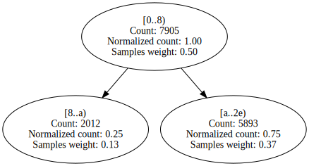

System.Text.RegularExpressions.RegexInterpreter.Go | 3653 | 181 | 276 | 64.36% | 75.20% | 

Expand

 | 

Expand

System.Text.RegularExpressions.RegexInterpreter.Backtrack | 91 | 5 | 107 | 58.36% | 75.73% | 

Expand

 | 

Expand

Benchmarks.SIMD.RayTracer.RayTracer.GetNaturalColor | 365 | 15 | 64 | 43.73% | 77.10% | 

Expand

 | 

Expand

Benchstone.BenchF.Romber.Test | 666 | 35 | 251 | 38.31% | 77.16% | 

Expand

 | 

Expand

BenchmarksGame.Fasta_1.SelectRandom | 62 | 6 | 215 | 67.74% | 77.35% | 

Expand

 | 

Expand

Benchstone.BenchF.FFT.FastFourierT | 254 | 15 | 187 | 51.19% | 78.52% | 

Expand

 | 

Expand

Benchstone.BenchF.Whetsto.PA | 108 | 3 | 106 | 75.00% | 78.57% | 

Expand

 | 

Expand

AssignRect.first_assignments | 478 | 65 | 660 | 82.78% | 78.67% | 

Expand

 | 

Expand

EMFloat.Sub16Bits | 38 | 4 | 362 | 49.91% | 78.69% | 

Expand
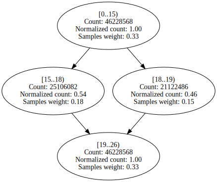
 | 

Expand

EMFloatClass.Sub16Bits | 38 | 4 | 70 | 51.90% | 79.16% | 

Expand
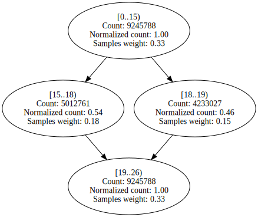
 | 

Expand

SciMark2.FFT.bitreverse | 115 | 8 | 257 | 46.71% | 79.21% | 

Expand

 | 

Expand

AssignJagged.second_assignments | 376 | 65 | 552 | 60.20% | 79.52% | 

Expand

 | 

Expand

Benchmarks.SIMD.RayTracer.Sphere.Intersect | 148 | 9 | 63 | 47.03% | 79.92% | 

Expand

 | 

Expand

BenchmarksGame.FannkuchRedux_5.countFlips | 100 | 14 | 3469 | 52.91% | 80.79% | 

Expand

 | 

Expand

BenchmarksGame.TreeNode.CreateTree | 36 | 3 | 216 | 67.07% | 80.95% | 

Expand

 | 

Expand

Benchstone.BenchI.HeapSort.Test | 76 | 9 | 50 | 55.99% | 81.38% | 

Expand

 | 

Expand

Benchstone.BenchF.Regula.Inner | 301 | 21 | 425 | 45.94% | 81.65% | 

Expand

 | 

Expand

Benchstone.BenchF.LLoops.Init | 598 | 46 | 1040 | 55.93% | 82.01% | 

Expand

 | 

Expand

Benchstone.BenchI.Fib.Fibonacci | 24 | 3 | 763 | 79.52% | 82.27% | 

Expand

 | 

Expand

SciMark2.MonteCarlo.integrate | 77 | 6 | 313 | 52.62% | 82.30% | 

Expand

 | 

Expand

NumericSortJagged.LoadNumArrayWithRand | 66 | 10 | 50 | 57.99% | 82.50% | 

Expand

 | 

Expand

Benchstone.BenchI.QuickSort.Quick | 103 | 16 | 520 | 70.50% | 83.18% | 

Expand

 | 

Expand

BenchmarksGame.FannkuchRedux_2.fannkuch | 366 | 28 | 1074 | 65.65% | 83.50% | 

Expand

 | 

Expand

EMFloatClass.MultiplyInternalFPF | 592 | 33 | 101 | 58.48% | 83.75% | 

Expand

 | 

Expand

SciMark2.FFT.transform_internal | 450 | 17 | 2397 | 42.48% | 83.95% | 

Expand

 | 

Expand

BenchmarksGame.KNucleotide_9.check | 61 | 5 | 238 | 67.51% | 84.30% | 

Expand

 | 

Expand

Benchstone.BenchI.Midpoint.Inner | 60 | 12 | 453 | 87.43% | 84.91% | 

Expand

 | 

Expand

EMFloatClass.Add16Bits | 38 | 4 | 112 | 53.87% | 85.26% | 

Expand

 | 

Expand

EMFloat.Add16Bits | 38 | 4 | 529 | 54.88% | 85.65% | 

Expand

 | 

Expand

NeuralJagged.adjust_out_wts | 115 | 7 | 119 | 42.63% | 86.75% | 

Expand

 | 

Expand

Benchstone.BenchI.Permutate.PermuteArray | 75 | 5 | 426 | 70.66% | 87.18% | 

Expand

 | 

Expand

Benchstone.BenchF.DMath.Power | 43 | 4 | 956 | 83.56% | 87.46% | 

Expand

 | 

Expand

BenchmarksGame.FannkuchRedux_5.nextPermutation | 81 | 7 | 652 | 66.10% | 87.80% | 

Expand

 | 

Expand

Benchstone.BenchI.Array2.Bench | 107 | 13 | 2180 | 48.84% | 87.82% | 

Expand

 | 

Expand

StringSort.strsift | 75 | 9 | 657 | 70.64% | 88.07% | 

Expand

 | 

Expand

IDEAEncryption.mul | 47 | 8 | 1848 | 53.44% | 88.59% | 

Expand

 | 

Expand

Benchstone.BenchI.LogicArray.Inner | 130 | 17 | 1397 | 86.17% | 88.85% | 

Expand

 | 

Expand

Benchstone.BenchI.BubbleSort2.Inner | 57 | 9 | 1016 | 64.94% | 88.89% | 

Expand

 | 

Expand

BenchmarksGame.FannkuchRedux_9.NextPermutation | 95 | 7 | 981 | 67.49% | 88.90% | 

Expand

 | 

Expand

Benchstone.BenchI.BubbleSort.SortArray | 48 | 7 | 785 | 60.22% | 89.12% | 

Expand

 | 

Expand

EMFloatClass.ShiftMantLeft1 | 47 | 6 | 498 | 61.87% | 89.21% | 

Expand

 | 

Expand

Neural.adjust_out_wts | 116 | 7 | 63 | 44.64% | 89.31% | 

Expand

 | 

Expand

BenchmarksGame.ReverseComplement_1.Reverse | 208 | 22 | 664 | 57.92% | 89.38% | 

Expand
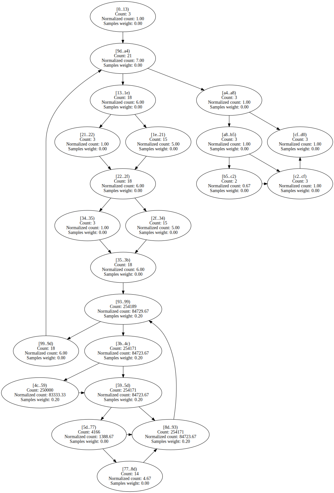
 | 

Expand

Benchstone.BenchI.Puzzle.Trial | 101 | 10 | 78 | 68.84% | 89.80% | 

Expand

 | 

Expand
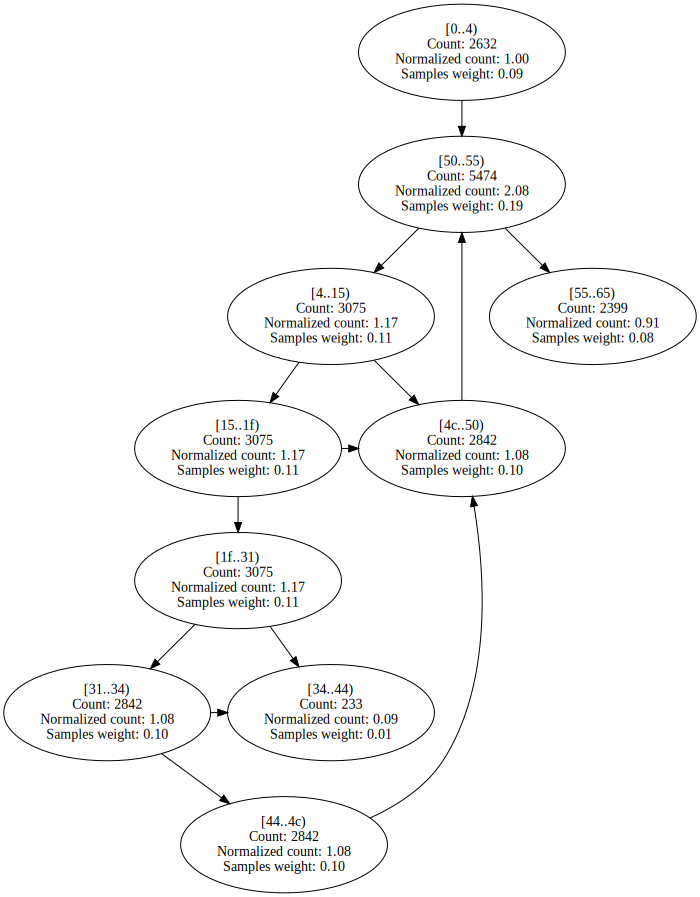

Benchstone.BenchI.Puzzle.Place | 104 | 11 | 186 | 64.61% | 89.90% | 

Expand

 | 

Expand

SciMark2.SparseCompRow.matmult | 87 | 10 | 1916 | 58.41% | 89.91% | 

Expand

 | 

Expand

LUDecomp.DoLUIteration | 144 | 16 | 79 | 57.10% | 90.08% | 

Expand

 | 

Expand

Benchstone.BenchF.Bisect.Inner | 122 | 10 | 778 | 61.89% | 90.24% | 

Expand

 | 

Expand

EMFloat.ShiftMantRight1 | 47 | 6 | 2089 | 63.14% | 90.47% | 

Expand

 | 

Expand

EMFloat.ShiftMantLeft1 | 47 | 6 | 2512 | 63.01% | 90.47% | 

Expand

 | 

Expand

Benchstone.BenchI.CSieve.Test | 120 | 15 | 1008 | 60.01% | 91.20% | 

Expand

 | 

Expand

SeekUnroll.FindByte | 70 | 5 | 37705 | 78.47% | 91.30% | 

Expand

 | 

Expand

Benchstone.BenchI.Array1.Quick | 89 | 8 | 834 | 86.21% | 91.66% | 

Expand
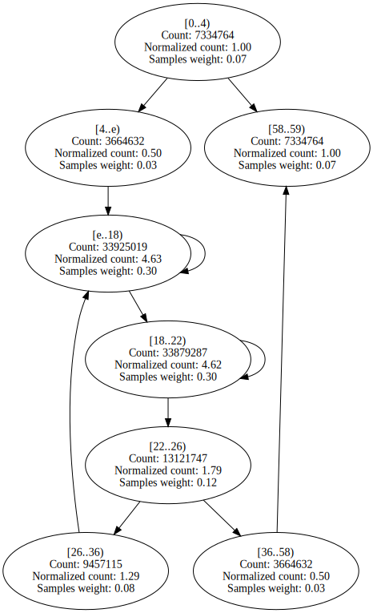
 | 

Expand

Benchstone.BenchI.EightQueens.TryMe | 127 | 11 | 298 | 67.37% | 91.79% | 

Expand

 | 

Expand

Benchstone.BenchI.HeapSort.Inner | 123 | 17 | 875 | 67.02% | 92.05% | 

Expand

 | 

Expand

Benchstone.BenchI.AddArray.Test | 231 | 7 | 583 | 53.25% | 92.19% | 

Expand

 | 

Expand

EMFloatClass.ShiftMantRight1 | 47 | 6 | 432 | 64.09% | 92.37% | 

Expand

 | 

Expand

SciMark2.LU.factor | 282 | 24 | 1885 | 58.36% | 92.40% | 

Expand

 | 

Expand

EMFloat.MultiplyInternalFPF | 584 | 33 | 412 | 60.58% | 92.56% | 

Expand

 | 

Expand

Benchstone.BenchI.MulMatrix.Inner | 435 | 61 | 1022 | 56.23% | 92.64% | 

Expand

 | 

Expand

Benchstone.BenchF.Adams.Bench | 419 | 7 | 63 | 46.79% | 92.89% | 

Expand

 | 

Expand

Neural.move_wt_changes | 155 | 13 | 140 | 57.37% | 93.25% | 

Expand

 | 

Expand

Benchstone.BenchI.TreeInsert.BenchInner | 282 | 9 | 919 | 68.85% | 93.41% | 

Expand
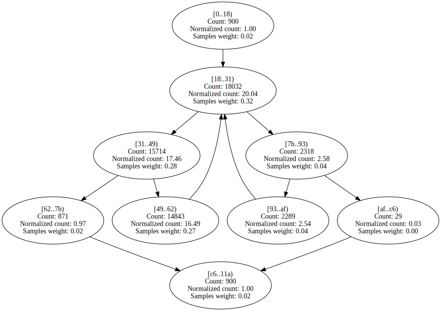
 | 

Expand

Benchstone.BenchI.IniArray.Test | 44 | 7 | 1021 | 61.49% | 93.51% | 

Expand

 | 

Expand

Benchstone.BenchF.Simpsn.Test | 310 | 11 | 50 | 41.22% | 93.51% | 

Expand

 | 

Expand
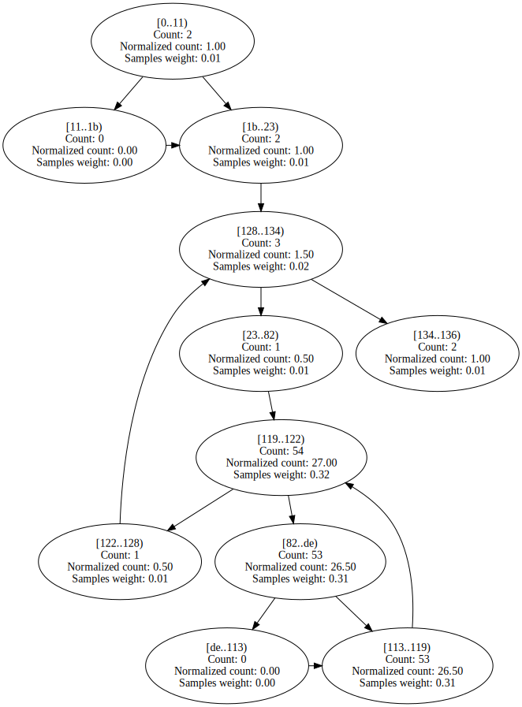

NumericSortRect.NumSift | 103 | 9 | 870 | 70.85% | 93.79% | 

Expand

 | 

Expand

Benchstone.BenchF.MatInv4.MProd | 107 | 10 | 73 | 49.99% | 93.81% | 

Expand

 | 

Expand

BenchmarksGame.Fasta_2.MakeRandomFasta | 221 | 14 | 102 | 53.55% | 93.95% | 

Expand

 | 

Expand

Benchstone.BenchI.Array1.Test | 95 | 9 | 73 | 62.00% | 94.05% | 

Expand

 | 

Expand

Benchstone.BenchI.BenchE.Strsch | 96 | 12 | 1131 | 59.51% | 94.38% | 

Expand

 | 

Expand

LUDecomp.ludcmp | 481 | 42 | 2913 | 56.09% | 94.51% | 

Expand

 | 

Expand

Benchstone.BenchI.Puzzle.RemoveLocal | 75 | 6 | 167 | 60.72% | 94.59% | 

Expand

 | 

Expand

Benchstone.BenchF.Secant.Inner | 105 | 9 | 232 | 48.29% | 94.68% | 

Expand

 | 

Expand

NeuralJagged.move_wt_changes | 137 | 13 | 377 | 54.19% | 95.16% | 

Expand

 | 

Expand

Benchstone.BenchF.DMath.Fact | 43 | 4 | 944 | 79.50% | 95.18% | 

Expand

 | 

Expand

BenchmarksGame.Fasta_1.SelectNucleotides | 114 | 9 | 119 | 55.70% | 95.20% | 

Expand

 | 

Expand

BenchmarksGame.FannkuchRedux_9.Copy | 63 | 7 | 599 | 54.12% | 95.54% | 

Expand

 | 

Expand

NeuralJagged.do_mid_forward | 101 | 7 | 200 | 57.90% | 95.99% | 

Expand

 | 

Expand

NeuralJagged.adjust_mid_wts | 120 | 7 | 534 | 50.99% | 96.28% | 

Expand

 | 

Expand

BenchmarksGame.KNucleotide.KFrequency | 91 | 7 | 80 | 53.75% | 96.60% | 

Expand

 | 

Expand
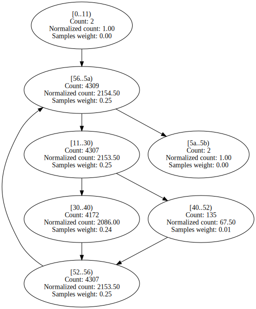

Benchstone.BenchI.NDhrystone.Func2 | 81 | 15 | 272 | 66.50% | 96.69% | 

Expand

 | 

Expand

System.Numerics.BigIntegerCalculator.Subtract | 87 | 7 | 122 | 58.03% | 96.85% | 

Expand

 | 

Expand

BenchmarksGame.Mandelbrot_2.DoBench | 323 | 19 | 2464 | 57.04% | 97.00% | 

Expand

 | 

Expand

System.Numerics.BigIntegerCalculator.Add | 97 | 7 | 144 | 60.94% | 97.27% | 

Expand

 | 

Expand

Algorithms.VectorFloatRenderer.RenderSingleThreadedWithADT | 421 | 12 | 479 | 99.47% | 97.50% | 

Expand

 | 

Expand

Benchstone.BenchF.InProd.Test | 158 | 12 | 1618 | 55.52% | 97.66% | 

Expand

 | 

Expand

SciMark2.FFT.inverse | 53 | 4 | 92 | 59.75% | 97.72% | 

Expand

 | 

Expand

BenchmarksGame.Approximate.MultiplyAv | 66 | 7 | 212 | 56.89% | 97.75% | 

Expand

 | 

Expand

Benchstone.BenchI.Puzzle.Fit | 47 | 7 | 649 | 65.32% | 97.77% | 

Expand

 | 

Expand

NumericSortJagged.NumSift | 63 | 9 | 2274 | 71.99% | 97.94% | 

Expand

 | 

Expand

Benchstone.BenchF.NewtR.Test | 144 | 7 | 96 | 67.71% | 97.95% | 

Expand

 | 

Expand
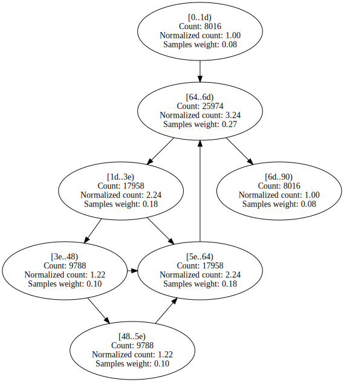

Neural.do_mid_forward | 107 | 7 | 107 | 64.46% | 98.12% | 

Expand

 | 

Expand

System.Numerics.BigIntegerCalculator.SubtractDivisor | 71 | 6 | 450 | 72.26% | 98.14% | 

Expand

 | 

Expand

BenchmarksGame.FannkuchRedux_9.Run | 174 | 12 | 222 | 60.36% | 98.20% | 

Expand
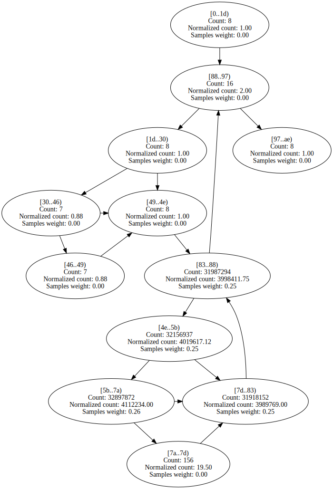
 | 

Expand

Benchstone.BenchI.AddArray2.BenchInner1 | 75 | 10 | 462 | 56.86% | 98.21% | 

Expand

 | 

Expand

BenchmarksGame.SpectralNorm_1.MultiplyAv | 60 | 7 | 160 | 56.51% | 98.22% | 

Expand

 | 

Expand

BenchmarksGame.SpectralNorm_1.MultiplyAtv | 60 | 7 | 164 | 54.39% | 98.32% | 

Expand

 | 

Expand

BenchmarksGame.FannkuchRedux_5.run | 114 | 5 | 138 | 64.38% | 98.35% | 

Expand

 | 

Expand

Algorithms.VectorDoubleRenderer.RenderSingleThreadedNoADT | 504 | 12 | 1205 | 99.66% | 98.35% | 

Expand

 | 

Expand

Benchstone.BenchF.SqMtx.Inner | 73 | 10 | 1544 | 54.61% | 98.37% | 

Expand

 | 

Expand

Benchstone.BenchI.XposMatrix.Test | 69 | 11 | 243 | 63.91% | 98.42% | 

Expand

 | 

Expand

Algorithms.VectorFloatRenderer.RenderSingleThreadedNoADT | 485 | 12 | 960 | 99.59% | 98.58% | 

Expand

 | 

Expand

BenchmarksGame.KNucleotide_9.countEnding | 213 | 16 | 683 | 66.59% | 98.62% | 

Expand

 | 

Expand

Algorithms.VectorDoubleRenderer.RenderSingleThreadedWithADT | 440 | 12 | 787 | 99.57% | 98.65% | 

Expand

 | 

Expand

SciMark2.SOR.execute | 155 | 10 | 1303 | 52.90% | 98.65% | 

Expand

 | 

Expand

BenchmarksGame.Approximate.MultiplyAtv | 66 | 7 | 244 | 61.40% | 98.83% | 

Expand

 | 

Expand

Benchstone.BenchF.DMath.Bench | 215 | 9 | 665 | 85.76% | 98.85% | 

Expand

 | 

Expand

Benchstone.BenchF.Lorenz.Test | 597 | 8 | 352 | 50.00% | 98.88% | 

Expand

 | 

Expand

Neural.adjust_mid_wts | 124 | 7 | 256 | 52.65% | 98.99% | 

Expand

 | 

Expand

BenchmarksGame.Fasta_1.FillRandom | 51 | 4 | 223 | 54.00% | 99.12% | 

Expand

 | 

Expand

Benchstone.BenchI.AddArray2.BenchInner2 | 75 | 10 | 544 | 53.36% | 99.16% | 

Expand

 | 

Expand

Benchstone.BenchI.Midpoint.Test | 195 | 10 | 784 | 54.82% | 99.21% | 

Expand

 | 

Expand

Burgers.GetCalculated0 | 288 | 7 | 593 | 53.19% | 99.24% | 

Expand

 | 

Expand

Algorithms.ScalarFloatRenderer.RenderSingleThreadedWithADT | 142 | 11 | 1213 | 54.92% | 99.25% | 

Expand

 | 

Expand

Burgers.GetCalculated1 | 282 | 7 | 626 | 55.26% | 99.26% | 

Expand

 | 

Expand

IDEAEncryption.cipher_idea | 396 | 3 | 996 | 93.01% | 99.27% | 

Expand

 | 

Expand

Algorithms.ScalarDoubleRenderer.RenderSingleThreadedWithADT | 183 | 11 | 1519 | 54.47% | 99.45% | 

Expand

 | 

Expand

Benchstone.BenchI.Pi.ComputePi | 200 | 10 | 999 | 53.98% | 99.47% | 

Expand

 | 

Expand

System.Text.RegularExpressions.RegexCharClass.CharInClass | 111 | 9 | 50 | 54.94% | 99.53% | 

Expand

 | 

Expand

Burgers.GetCalculated2 | 258 | 7 | 1346 | 54.52% | 99.67% | 

Expand

 | 

Expand

Algorithms.ScalarDoubleRenderer.RenderSingleThreadedNoADT | 206 | 11 | 1671 | 53.31% | 99.69% | 

Expand

 | 

Expand

Algorithms.ScalarFloatRenderer.RenderSingleThreadedNoADT | 156 | 11 | 1729 | 53.43% | 99.70% | 

Expand

 | 

Expand

Burgers.GetCalculated3 | 353 | 7 | 1357 | 53.00% | 99.72% | 

Expand

 | 

Expand

System.Numerics.BigIntegerCalculator.Add | 69 | 4 | 257 | 59.68% | 99.75% | 

Expand

 | 

Expand

SeekUnroll.InnerLoop | 25 | 4 | 3865 | 83.87% | 99.92% | 

Expand

 | 

Expand

System.Numerics.BigIntegerCalculator.Multiply | 55 | 4 | 607 | 61.31% | 99.95% | 

Expand

 | 

Expand

Benchstone.BenchF.InProd.InnerProduct | 45 | 4 | 1750 | 57.21% | 99.98% | 

Expand

 | 

Expand

ByteMark.randnum | 80 | 3 | 60 | 53.33% | 99.99% | 

Expand

 | 

Expand

Benchstone.BenchF.NewtR.Inner | 77 | 7 | 298 | 59.40% | 100.00% | 

Expand

 | 

Expand

Benchstone.BenchI.NDhrystone.Proc1 | 191 | 3 | 144 | 90.28% | 100.00% | 

Expand

 | 

Expand

